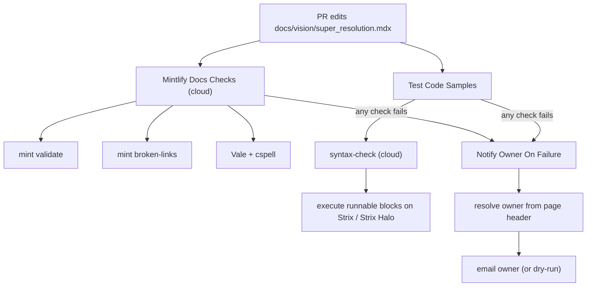

# CI Walkthrough: one real page, end to end

This traces exactly what happens to a single, real docs page when it changes:
`docs/vision/super_resolution.mdx` (owner: Benjamin Consolvo).

## 0. The page itself

The page is plain MDX with two things that matter to CI: a hidden **owner
header** and a runnable code block (which, by default, is **executed on real
hardware** - no tag required).

```mdx
---
title: "Super-Resolution on Ryzen AI"
description: "Run image super-resolution models (Real-ESRGAN, SESR) on the AMD Ryzen AI NPU."
---

{/* owner: bconsolvo */}   <-- owner (GitHub ID) lives in the page

...prose...

```python                                              <-- runs by default
import math
def psnr(mse, peak=255.0): ...
assert abs(psnr(mse=100.0) - 28.13) < 0.1
print(f"PSNR @ MSE=100 -> {psnr(100.0):.2f} dB")
```
```

Two facts drive everything below:
- **Ownership is in the file** (`{/* owner: ... */}`), so there is no spreadsheet to maintain.
- **Every runnable block executes by default**; add `notest` to skip a block, or a
  device tag (`cpu` / `gpu` / `npu`) to scope which hardware runs it.

## 1. Developer opens a PR that edits this page

The PR touches `docs/**`, which triggers two workflows in parallel:
`Mintlify Docs Checks` and `Test Code Samples`.



## 2. Mintlify Docs Checks (cloud, no hardware)

Runs `mint validate` (build is sound), `mint broken-links` (internal links
resolve), and Vale + cspell (prose/spelling). Real output from this repo:

```
$ npx mint broken-links
success no broken links found
```

If a link or build breaks, this job fails and hands off to step 5.

## 3. Test Code Samples — syntax stage (cloud)

`extract_code_blocks.py --syntax-only` parses every fenced block and
compiles each `python` block. No hardware needed; fast feedback.

```
$ python .github/scripts/extract_code_blocks.py --syntax-only --docs docs
Checked 252 blocks across docs (0 executed); 0 page(s) with failures.
```

## 4. Test Code Samples — hardware stage (self-hosted Strix / Strix Halo)

`extract_code_blocks.py --run` executes every runnable block (everything except
`notest`) on real AMD hardware. The PSNR block on this page runs and passes:

```
$ python .github/scripts/extract_code_blocks.py --run --docs docs
  pass  exec=True python [] -> PSNR @ MSE=100 -> 28.13 dB
```

This is the core "docs as code" guarantee: if the code on the page stops
working on hardware, the PR goes red.

## 5. What happens when it breaks -> the owner is notified

Suppose the PSNR assertion regresses (e.g. the expected value is wrong).
`extract_code_blocks.py --run` exits non-zero and writes the failing page to
`failed-pages.txt`. The `Notify Owner On Failure` workflow then:

1. reads the failing page,
2. resolves the owner (GitHub ID) from the page's hidden header,
3. opens a GitHub issue whose body @mentions the owner — GitHub emails them
   through its own system (no email addresses are stored anywhere).

Real output for this page:

```
$ python .github/scripts/notify_owner.py --file docs/vision/super_resolution.mdx
OWNER NOTIFICATION (GitHub-native) - 1 page(s)
  @bconsolvo: 1 page(s)
Assignees: bconsolvo
Title: [Docs CI] 1 page(s) failed checks - action needed
```

`@bconsolvo` is notified specifically because the header in *this* page says so.
A different page (e.g. `docs/getting-started/inst.mdx`) would route to its owner
(`@uday610`) instead.

## 6. CODEOWNERS stays in sync automatically

`.github/scripts/generate_codeowners.py` reads these same in-page headers to
produce CODEOWNERS, so GitHub PR review assignment and the CI notifier always
agree. The `CODEOWNERS & Page Ownership` workflow regenerates it on every PR and
fails if the committed file is stale:

```
/docs/vision/super_resolution.mdx               @bconsolvo
/docs/getting-started/inst.mdx                   @uday610
```

## Try it yourself

```bash
# normal run (passes)
python .github/scripts/extract_code_blocks.py --run --docs docs

# simulate the failure path for any page
python .github/scripts/notify_owner.py --file docs/vision/super_resolution.mdx

# preview the whole site
cd docs && npx mint dev      # http://localhost:3000
```
