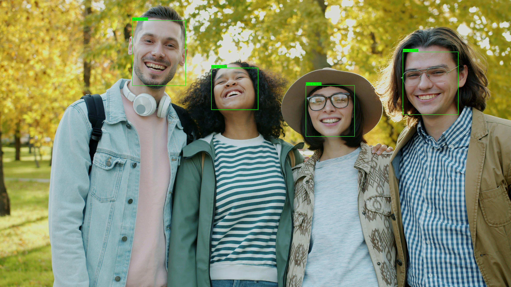

<table class="sphinxhide" width="100%">
 <tr width="100%">
    <td align="center"><h1> Ryzen™ AI Face Detection Tutorial </h1>
    </td>
 </tr>
</table>

# Introduction

This tutorial demonstrates how to use Windows Machine Learning (WinML) for ONNX model inference using Python. It covers setup, running models, and sample code for real-time face detection using RetinaFace with MobileNet or ResNet backbones. This tutorial uses Windows ML APIs to run face detection models optimized for edge devices and real-time applications.

## Quick Start

```sh
# 1. Setup environment (one-time)
conda create -n winml_face --clone winml_env
conda activate winml_face
cd <RyzenAI-SW>\WinML\CNN\FaceDetection\python
pip install --upgrade -r requirements.txt

# 2. Download and optimize model (one-time)
cd ..\model
python download_and_export.py  # Default: ResNet34
# OR for lightweight MobileNet model:
# python download_and_export.py --backbone mobilenet

# 3. Run inference
cd ..\python
python run_model.py --model ..\model\retinaface_resnet.onnx --image ..\images\face_detection_input.jpg --ep_policy NPU  # or CPU for testing
```

See sections below for detailed instructions and configuration options.

## Example Output

<table>
<tr>
<td align="center"><br/><b>Input Image</b></td>
<td align="center"><br/><b>NPU Output</b></td>
</tr>
</table>

The output shows detected faces with color-coded bounding boxes and confidence scores displayed as labels (e.g., "Face 1: 99.7%").

## Overview

This tutorial will help with the steps to deploy RetinaFace face detection models demonstrating:

- Setup instructions to create the python environment and install dependencies
- Download pre-exported RetinaFace ONNX models with MobileNet or ResNet backbones
- Convert models to Opset 21 with static shapes for optimal NPU performance
- Compile and run the model on NPU using ONNX Runtime with Vitis AI Execution Provider
- Real-time face detection with bounding boxes, landmarks, and confidence scores
- Visualize detections with resolution-adaptive bounding boxes and labels

## Setup Instructions

See **Quick Start** above for the environment setup, or the [Python Setup](../../README.md#python-setup) in the main README for full details.

### Model Download Dependencies

Download and optimize RetinaFace ONNX model in a single step:

### ResNet34 (Default - More Accurate)

```sh
cd <RyzenAI-SW>\WinML\CNN\FaceDetection\model
python download_and_export.py
```

The download script performs **all optimizations in a single pass**:

1. **Downloads** pre-exported ONNX model from [yakhyo/retinaface-pytorch releases](https://github.com/yakhyo/retinaface-pytorch/releases)
   - ResNet34: ~109 MB (more accurate, default)
   - MobileNet: ~6.5 MB (lightweight, optional)

2. **Converts to Opset 21** for latest ONNX features

3. **Sets static shapes**:
   - Input: `[1, 3, 640, 640]` (NCHW format)
   - Outputs: `loc [1, 16800, 4]`, `conf [1, 16800, 2]`, `landmarks [1, 16800, 10]`

4. **Replaces LeakyReLU with ReLU** for better NPU compatibility

5. **Simplifies graph** using `onnx-simplifier`:
   - Removes 125 nodes (253 → 128)
   - Eliminates all Shape-Gather-Reshape patterns
   - Constant folds dynamic operations

**Output:** `retinaface_resnet.onnx` - optimized and ready for NPU deployment or quantization.

No post-processing needed - all optimizations happen in one pass!

### Model Comparison

| Backbone | Size | Speed | Accuracy | Best For |
|----------|------|-------|----------|----------|
| **ResNet34** (default) | ~109 MB | Moderate | Better | High accuracy requirements |
| **MobileNetV1 0.50** (optional) | ~6.5 MB | Fast | Good | Lightweight, real-time apps |

Both models use the same input/output format and can be used interchangeably.

## Model Information

### Architecture Details

- **Input**: `[1, 3, 640, 640]` - NCHW format, static batch size
- **Outputs**:

| Output | Shape | Description |
|--------|-------|-------------|
| `loc` | `[1, 16800, 4]` | Bounding box coordinates (x, y, w, h) |
| `conf` | `[1, 16800, 2]` | Confidence scores (background, face) |
| `landms` | `[1, 16800, 10]` | Facial landmarks (5 points × 2 coords) |

### Post-processing

- Softmax normalization for confidence scores
- Anchor decoding for bounding boxes
- Non-Maximum Suppression (NMS) for duplicate removal
- Adaptive thresholding for FP32/INT8 models

## INT8 Quantization (Optional)

For improved NPU performance, you can quantize the FP32 model to INT8 using **Olive** with **AMD Quark** quantization library.

### Download Calibration Data (Required)

First, download face images for calibration:

```sh
cd <RyzenAI-SW>\WinML\CNN\FaceDetection\model
python download_calib_data.py  # Downloads WIDER FACE validation subset
```

### Quantize Model

```sh
python quantize_retinaface.py --model retinaface_resnet.onnx --output retinaface_resnet_int8.onnx --calib-dir calib_data
```

### Quantization Options

```sh
# Use custom calibration directory
python quantize_retinaface.py --calib-dir /path/to/calib_data

# Specify custom output name
python quantize_retinaface.py --output retinaface_resnet_i8.onnx
```

### Calibration Data

For optimal INT8 quantization, you need **face images**.

**Download WIDER FACE dataset (Recommended)**

```sh
cd <RyzenAI-SW>\WinML\CNN\FaceDetection\model
python download_calib_data.py  # Downloads WIDER FACE validation subset (~300 images)
```

The calibration data quality directly affects INT8 quantization accuracy.

### Run Quantized Model

After quantization, run inference with the INT8 model:

```sh
cd ..\python
python run_model.py --model ..\model\retinaface_resnet_i8.onnx --ep_policy NPU
```

### Quantization Benefits

| Model Type | Size | NPU Latency |
|------------|------|-------------|
| **FP32** (default) | ~6.5 MB | ~15-20 ms |
| **INT8** (quantized) | ~1.7 MB | ~8-12 ms |

**Benefits:**
- **3.8x smaller** model size
- **~40-50% faster** inference on NPU

### Quantization Configuration

The quantization uses the following AMD Quark settings (in `olive_config_retinaface.json`):

```json
{
  "activation": {
    "data_type": "UInt8",
    "symmetric": true,
    "calibration_method": "MinMSE",
    "scale_type": "PowerOf2"
  },
  "weight": {
    "data_type": "Int8",
    "symmetric": true,
    "calibration_method": "MinMSE",
    "scale_type": "PowerOf2"
  },
  "algo_config": [
    {"name": "cle", "cle_steps": 6},
    {"name": "adaround", "num_iterations": 200}
  ],
  "extra_options": {
    "EnableNPUCnn": true,
    "ConvertOpsetVersion": 21,
    "ReplaceClip6Relu": true
  }
}
```

**Key Settings:**
- **PowerOf2 scaling**: Optimized for NPU hardware accelerators
- **MinMSE calibration**: Minimizes quantization error
- **CLE**: Cross-layer equalization for better weight distribution
- **AdaRound**: Adaptive rounding for better accuracy
- **EnableNPUCnn**: NPU-specific optimizations

### Command-Line Arguments

- `--ep_policy <NPU|CPU>`: Execution provider policy (default: NPU)
  - `NPU`: Run on Neural Processing Unit for best performance
  - `CPU`: Run on CPU for testing/debugging

- `--model <path>`: Path to ONNX model (default: `../model/retinaface_resnet.onnx`)

- `--image <path>`: Path to input image (default: `../images/face_detection_input.jpg`)

- `--output_dir <path>`: Directory to save output images (default: `../images/`)

- `--verbose`: Enable verbose output including score statistics

### Example Output

```
Model: retinaface_resnet.onnx
Image: face_detection_input.jpg
EP Policy: NPU

Registered: VitisAIExecutionProvider
Creating inference session...
Execution Providers: ['VitisAIExecutionProvider', 'CPUExecutionProvider']
Input: input [1, 3, 640, 640]

Preprocessing image...
Warming up...
Benchmarking...

Performance:
  Average latency: 15.34 ms
  Throughput: 65.19 images/sec

Processing results...
Generated 16800 anchors

Score Statistics:
  Min: 0.000012, Max: 0.998745, Mean: 0.023456
  Scores > 0.5: 5
  Top 10 scores: [0.991, 0.992, 0.995, 0.997, 0.998, ...]
  Using standard threshold: 0.5

Detected 4 faces (after NMS), output saved to: ../images/face_detection_npu_output.png
```

### Output Files

- NPU output: `images/face_detection_npu_output.png`
- CPU output: `images/face_detection_cpu_output.png`


## Performance

Typical inference latency on AMD Ryzen AI (NPU):

| Backbone | NPU Latency | CPU Latency | NPU Speedup |
|----------|-------------|-------------|-------------|
| ResNet34 | ~25-35 ms | ~60-80 ms | 2.5x faster |
| MobileNetV1 0.50 | ~15-20 ms | ~30-40 ms | 2x faster |


The NPU provides significant speedup for real-time face detection applications with high accuracy on frontal and profile faces.

### Troubleshooting Quantization

**Low accuracy after quantization:**
- Provide more calibration images (100-300 recommended)
- Use diverse images covering different scenarios
- Check calibration data quality and diversity

**Quantization fails:**
- Ensure FP32 model exists: `retinaface_resnet.onnx`
- Check available disk space (needs ~1GB for intermediate files)
- Review logs in `olive_output/` directory

## Run Inference

Run inference on NPU (Neural Processing Unit):

```sh
cd <RyzenAI-SW>\WinML\CNN\FaceDetection\python
python run_model.py --model ..\model\retinaface_resnet.onnx --image ..\images\face_detection_input.jpg --ep_policy NPU
```

Or run with CPU for testing:

```sh
python run_model.py --model ..\model\retinaface_resnet.onnx --image ..\images\face_detection_input.jpg --ep_policy CPU
```

## References

- [RetinaFace PyTorch (yakhyo)](https://github.com/yakhyo/retinaface-pytorch)
- [RetinaFace Paper](https://arxiv.org/abs/1905.00641)
- [WinML Documentation](https://learn.microsoft.com/en-us/windows/ai/windows-ml/)
- [ONNX Runtime Python API](https://onnxruntime.ai/docs/api/python/)
- [Windows App SDK](https://learn.microsoft.com/en-us/windows/apps/windows-app-sdk/)
- [AMD Ryzen AI Documentation](https://ryzenai.docs.amd.com/)
