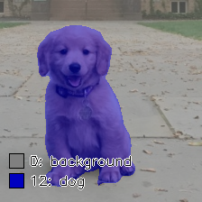

<table class="sphinxhide" width="100%">
 <tr width="100%">
    <td align="center"><h1> Ryzen™ AI Semantic Image Segmentation Tutorial </h1>
    </td>
 </tr>
</table>

# Introduction

This tutorial demonstrates how to use Windows Machine Learning (WinML) for semantic image segmentation using **DeepLabV3 with ResNet50 backbone**. It covers setup, model download, and running pixel-level scene understanding on NPU using Windows ML APIs.

DeepLabV3 classifies every pixel in an image into one of **21 PASCAL VOC semantic categories** (people, vehicles, animals, furniture, background, etc.) and produces a color-coded segmentation overlay.

## Quick Start

```sh
# 1. Setup environment (one-time)
conda create -n winml_seg --clone winml_env
conda activate winml_seg
cd <RyzenAI-SW>\WinML\CNN\ImageSegmentation\python
pip install --upgrade -r requirements.txt

# 2. Download model (one-time, ~167 MB)
cd ..\model
python download_model.py

# 3. Run inference
cd ..\python
python run_model.py --model ..\model\deeplabv3_resnet50.onnx --ep_policy NPU
```

## Example Output

<table>
<tr>
<td align="center"><br/><b>Input Image</b></td>
<td align="center"><br/><b>NPU Segmentation Output</b></td>
</tr>
</table>

The output is a blended overlay showing each pixel color-coded by its predicted semantic class, with a legend listing all detected categories.

## Overview

This tutorial demonstrates:

- Setup instructions to create the Python environment and install dependencies
- Download pretrained DeepLabV3 ResNet50 ONNX model from torchvision
- Compile and run the model on NPU using ONNX Runtime with Vitis AI Execution Provider
- Pixel-level semantic segmentation with 21 PASCAL VOC classes
- Color-coded segmentation overlay with an on-image class legend

## Setup Instructions

See **Quick Start** above for the environment setup, or the [Python Setup](../../README.md#python-setup) in the main README for full details.

## Model Download

Download and export the DeepLabV3 ResNet50 model in one step:

```sh
cd <RyzenAI-SW>\WinML\CNN\ImageSegmentation\model
python download_model.py
```

**Output:** `model/deeplabv3_resnet50.onnx` (~167 MB) — ready for NPU deployment.

## Model Information

### Architecture Details

| Property | Value |
|----------|-------|
| **Backbone** | ResNet50 |
| **Head** | ASPP (Atrous Spatial Pyramid Pooling) |
| **Training data** | COCO + PASCAL VOC 2012 |
| **Input shape** | `[1, 3, 520, 520]` NCHW |
| **Output shape** | `[1, 21, 520, 520]` class logits |
| **Input normalization** | ImageNet mean/std |
| **ONNX opset** | 17 |

### Post-processing

1. **Argmax** over 21 class channels → per-pixel class index map `[H, W]`
2. **Color mapping** using the PASCAL VOC color palette
3. **Resize** segmentation mask back to original image resolution (nearest-neighbor)
4. **Blend** color mask with original image (`alpha=0.55`)
5. **Legend** rendered directly on the image showing all detected classes

## INT8 Quantization (Optional)

For improved NPU performance, you can quantize the FP32 model to INT8 using **Olive** with **AMD Quark** quantization library.

### Download Calibration Data (Required)

First, download PASCAL VOC 2012 images for calibration:

```sh
cd <RyzenAI-SW>\WinML\CNN\ImageSegmentation\model
python download_calib_data.py  # Downloads PASCAL VOC 2012 validation subset
```

### Quantize Model

```sh
python quantize_deeplabv3.py
```

### Quantization Options

```sh
# Use custom calibration directory
python quantize_deeplabv3.py --calib-dir /path/to/calib_data

# Specify custom output name
python quantize_deeplabv3.py --output deeplabv3_i8.onnx

# Specify input model explicitly
python quantize_deeplabv3.py --model deeplabv3_resnet50.onnx --output deeplabv3_resnet50_i8.onnx
```

### Calibration Data

For optimal INT8 quantization, you need **scene images matching the PASCAL VOC classes** the model was trained on.

**Download PASCAL VOC 2012 dataset (Recommended)**

```sh
cd <RyzenAI-SW>\WinML\CNN\ImageSegmentation\model
python download_calib_data.py  # Downloads VOC 2012 validation subset (~200 images)
```

The calibration data quality directly affects INT8 quantization accuracy. Use diverse images covering people, vehicles, animals, and outdoor scenes for best results.

### Run Quantized Model

After quantization, run inference with the INT8 model:

```sh
cd ..\python
python run_model.py --model ..\model\deeplabv3_resnet50_i8.onnx --ep_policy NPU
```

### Quantization Benefits

| Model Type | Size | NPU Latency |
|------------|------|-------------|
| **FP32** (default) | ~167 MB | ~25-35 ms |
| **INT8** (quantized) | ~42 MB | ~12-18 ms |

**Benefits:**
- **~4x smaller** model size
- **~40-50% faster** inference on NPU

### Quantization Configuration

The quantization uses the following AMD Quark settings (in `olive_config_deeplabv3.json`):

```json
{
  "activation": {
    "data_type": "UInt8",
    "symmetric": true,
    "calibration_method": "MinMax",
    "scale_type": "PowerOf2"
  },
  "weight": {
    "data_type": "Int8",
    "symmetric": true,
    "calibration_method": "MinMax",
    "scale_type": "PowerOf2"
  },
  "algo_config": [
    {"name": "cle", "cle_steps": 6}
  ],
  "extra_options": {
    "EnableNPUCnn": true,
    "ConvertOpsetVersion": 21,
    "ReplaceClip6Relu": true
  }
}
```

**Key Settings:**
- **PowerOf2 scaling**: Optimized for NPU hardware accelerators
- **MinMax calibration**: Captures full activation range across calibration images
- **CLE**: Cross-layer equalization for better weight distribution
- **EnableNPUCnn**: NPU-specific optimizations
- **Static shape fix**: Quark-quantized models have symbolic dims re-pinned to `[1,3,520,520]` / `[1,21,520,520]`

## Run Inference

Run inference on NPU:

```sh
cd <RyzenAI-SW>\WinML\CNN\ImageSegmentation\python
python run_model.py --model ..\model\deeplabv3_resnet50.onnx --image ..\images\segmentation_input.jpg --ep_policy NPU
```

Run on CPU (for testing/debugging):

```sh
python run_model.py --ep_policy CPU
```

### Command-Line Arguments

| Argument | Default | Description |
|----------|---------|-------------|
| `--model` | `../model/deeplabv3_resnet50.onnx` | Path to ONNX model |
| `--image` | `../images/segmentation_input.jpg` | Path to input image |
| `--ep_policy` | `NPU` | `NPU` or `CPU` |
| `--output_dir` | `../images` | Directory to save output |
| `--verbose` | off | Show raw output statistics |

### Example Console Output

```
Model:     deeplabv3_resnet50.onnx
Image:     segmentation_input.jpg
EP Policy: NPU

Registered: VitisAIExecutionProvider
Creating inference session (first run compiles model for NPU ~1-3 min)...
Execution Providers: ['VitisAIExecutionProvider', 'CPUExecutionProvider']
Input:  input [1, 3, 520, 520]
Output: output [1, 21, 520, 520]

Preprocessing image...
  Original size: 800x600
  Input tensor:  (1, 3, 520, 520)

Warming up (3 iterations)...
Benchmarking (20 iterations)...

Performance:
  Average latency: 28.45 ms
  Throughput:      35.15 images/sec

Generating segmentation visualization...
Segmentation output saved to: ../images/segmentation_npu_output.png

Detected 4 classes:
  [ 0] background
  [12] dog
```

### Output Files

| File | Description |
|------|-------------|
| `images/segmentation_npu_output.png` | NPU segmentation overlay |
| `images/segmentation_cpu_output.png` | CPU segmentation overlay |

## Best Images for Segmentation

DeepLabV3 is trained on PASCAL VOC 2012. For realistic results, use images containing:

- **People** (class 15): pedestrians, cyclists, crowds
- **Vehicles** (classes 1-7, 14, 19): cars, buses, bicycles, trains
- **Animals** (classes 3, 8, 10, 12, 13, 17): cats, dogs, horses, birds
- **Indoor objects** (classes 9, 11, 16, 18, 20): chairs, sofas, TVs, plants
- **Outdoor scenes**: street views, parks, farms

Avoid abstract or highly textured images — the model segments recognizable semantic objects.

## Performance

Typical inference latency on AMD Ryzen AI NPU:

| Model | Input Size | NPU Latency | CPU Latency | NPU Speedup |
|-------|-----------|-------------|-------------|-------------|
| DeepLabV3 ResNet50 (FP32→BF16) | 520×520 | ~25-35 ms | ~80-120 ms | 3-4x faster |
| DeepLabV3 ResNet50 (INT8) | 520×520 | ~12-18 ms | ~40-60 ms | 3-4x faster |

> **Note:** First inference compiles the model for NPU (1-3 minutes). Subsequent runs use the cached compiled model and start immediately.


### Troubleshooting Quantization

**Low accuracy after quantization:**
- Provide more calibration images (100-200 recommended)
- Use diverse images covering all 21 PASCAL VOC categories
- Check calibration data quality and diversity

**Quantization fails:**
- Ensure FP32 model exists: `deeplabv3_resnet50.onnx`
- Run `python download_model.py` first if not present
- Check available disk space (needs ~1 GB for intermediate files)
- Review logs in `olive_output/` directory

## References

- [DeepLabV3 Paper](https://arxiv.org/abs/1706.05587)
- [torchvision DeepLabV3](https://pytorch.org/vision/stable/models/deeplabv3.html)
- [PASCAL VOC 2012 Dataset](http://host.robots.ox.ac.uk/pascal/VOC/voc2012/)
- [WinML Documentation](https://learn.microsoft.com/en-us/windows/ai/windows-ml/)
- [ONNX Runtime Python API](https://onnxruntime.ai/docs/api/python/)
- [AMD Ryzen AI Documentation](https://ryzenai.docs.amd.com/)
