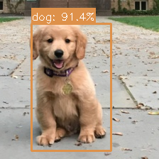

<table class="sphinxhide" width="100%">
 <tr width="100%">
    <td align="center"><h1> Ryzen™ AI Object Detection Tutorial </h1>
    </td>
 </tr>
</table>

# Introduction

This tutorial demonstrates how to use Windows Machine Learning (WinML) for ONNX model inference using Python for real-time object detection. It covers setup, running models, and sample code for detecting objects using YOLOv8 models optimized for edge devices. This tutorial uses Windows ML APIs to run object detection models accelerated on AMD Ryzen AI NPU.

## Quick Start

```sh
# 1. Setup environment (one-time) - Python 3.12 REQUIRED
conda create -n winml_objdet --clone winml_env
conda activate winml_objdet
cd <RyzenAI-SW>\WinML\CNN\ObjectDetection\python
pip install --upgrade -r requirements.txt

# 2. Download model (one-time)
cd ..\model
python download_yolov8.py  # Default: YOLOv8m

# 3. Run inference
cd ..\python
python run_model.py --model ..\model\yolov8m.onnx --image ..\images\object_detection_input.jpg --ep_policy NPU  # or CPU for testing
```

See sections below for detailed instructions and configuration options.

## Example Output

<table>
<tr>
<td align="center"><br/><b>Input Image</b></td>
<td align="center"><br/><b>NPU Output</b></td>
</tr>
</table>

The output shows detected objects with color-coded bounding boxes, class labels, and confidence scores (e.g., "person: 95.3%").

## Overview

This tutorial will help with the steps to deploy YOLOv8 object detection models demonstrating:

- Setup instructions to create the python environment and install dependencies
- Download YOLOv8 ONNX models (YOLOv8n, YOLOv8s, YOLOv8m, YOLOv8l)
- Export models with static shapes and opset 21 for optimal NPU performance
- Compile and run the model on NPU using ONNX Runtime with Vitis AI Execution Provider
- Real-time object detection on 80 COCO classes with bounding boxes and confidence scores
- Visualize detections with color-coded bounding boxes and class labels

## Setup Instructions

See **Quick Start** above for the environment setup, or the [Python Setup](../../README.md#python-setup) in the main README for full details.

## Model Download

Download YOLOv8 ONNX model in a single step:

### YOLOv8m (Default - Recommended)

```sh
cd <RyzenAI-SW>\WinML\CNN\ObjectDetection\model
python download_yolov8.py
```

The download script performs the following steps:

1. **Installs Ultralytics** package if not already installed

2. **Downloads** YOLOv8 PyTorch weights from Ultralytics
   - YOLOv8n (nano): ~6 MB (fastest, lightweight)
   - YOLOv8s (small): ~22 MB (balanced)
   - YOLOv8m (medium): ~52 MB (default, more accurate)
   - YOLOv8l (large): ~87 MB (highest accuracy)

3. **Exports to ONNX** with optimal settings:
   - Static input shape: `[1, 3, 640, 640]` (NCHW format)
   - Opset version: 21
   - Graph simplification enabled
   - Dynamic axes disabled for NPU compatibility

4. **Output**: `yolov8m.onnx` - optimized and ready for NPU deployment or quantization.

### Model Comparison

| Model | Size | Speed | mAP | Best For |
|-------|------|-------|-----|----------|
| **YOLOv8n** | ~6 MB | Fastest | 37.3 | Real-time, resource-constrained |
| **YOLOv8s** | ~22 MB | Fast | 44.9 | Balanced speed/accuracy |
| **YOLOv8m** (default) | ~52 MB | Moderate | 50.2 | General purpose, good accuracy |
| **YOLOv8l** | ~87 MB | Slower | 52.9 | High accuracy requirements |

All models detect 80 COCO object classes and use the same input/output format.

### Download Other Model Sizes

```sh
# YOLOv8n (nano - fastest)
python download_yolov8.py -s n

# YOLOv8s (small - balanced)
python download_yolov8.py -s s

# YOLOv8l (large - most accurate)
python download_yolov8.py -s l
```

## Model Information

### Architecture Details

- **Input**: `[1, 3, 640, 640]` - NCHW format, static batch size
- **Outputs**:

| Output | Shape | Description |
|--------|-------|-------------|
| `output0` | `[1, 84, 8400]` | Detections: 4 bbox coords + 80 class scores |

- **Output Format**:
  - First 4 values per detection: x_center, y_center, width, height (in pixels, relative to 640x640)
  - Next 80 values: confidence scores for each COCO class
  - 8400 predictions from multiple feature map scales

### Post-processing

- Confidence thresholding (default: 0.25)
- Non-Maximum Suppression (NMS) for duplicate removal (IoU threshold: 0.45)
- Coordinate transformation from 640x640 to original image size
- Color-coded visualization per class

## INT8 Quantization (Optional)

For improved NPU performance, you can quantize the FP32 model to INT8 using **Olive** with **AMD Quark** quantization library.

### Download Calibration Data (Required)

First, download COCO images for calibration:

```sh
cd <RyzenAI-SW>\WinML\CNN\ObjectDetection\model
python download_calib_data.py  # Downloads COCO128 subset (~200 images)
```

### Quantize Model

```sh
python quantize_yolov8.py --model yolov8m.onnx --output yolov8m_int8.onnx --calib-dir calib_data
```

### Quantization Options

```sh
# Use custom calibration directory
python quantize_yolov8.py --calib-dir /path/to/calib_data

# Specify custom output name
python quantize_yolov8.py --output yolov8m_quantized.onnx

# Quantize different YOLOv8 variant
python quantize_yolov8.py --model yolov8s.onnx
```

### Calibration Data

For optimal INT8 quantization, you need **representative object detection images**.

**Download COCO subset (Recommended)**

```sh
cd <RyzenAI-SW>\WinML\CNN\ObjectDetection\model
python download_calib_data.py  # Downloads COCO128 subset (~200 images)
```

The calibration data quality and diversity directly affect INT8 quantization accuracy. Use images similar to your deployment scenario.

### Run Quantized Model

After quantization, run inference with the INT8 model:

```sh
cd ..\python
python run_model.py --model ..\model\yolov8m_int8.onnx --ep_policy NPU
```

### Quantization Benefits

| Model Type | Size | NPU Latency | Accuracy Impact |
|------------|------|-------------|-----------------|
| **FP32** (default) | ~52 MB | ~35-45 ms | Baseline |
| **INT8** (quantized) | ~14 MB | ~18-25 ms | <1% mAP drop |

**Benefits:**
- **~3.7x smaller** model size
- **~40-50% faster** inference on NPU
- Minimal accuracy loss with proper calibration

### Quantization Configuration

The quantization uses the following AMD Quark settings (in `olive_config_yolov8.json`):

```json
{
  "activation": {
    "data_type": "UInt8",
    "symmetric": true,
    "calibration_method": "MinMSE",
    "scale_type": "PowerOf2"
  },
  "weight": {
    "data_type": "Int8",
    "symmetric": true,
    "calibration_method": "MinMax",
    "scale_type": "PowerOf2"
  },
  "algo_config": [
    {"name": "cle", "cle_steps": 6}
  ],
  "extra_options": {
    "EnableNPUCnn": true,
    "ConvertOpsetVersion": 21,
    "ReplaceClip6Relu": true
  }
}
```

**Key Settings:**
- **PowerOf2 scaling**: Optimized for NPU hardware accelerators
- **MinMSE calibration**: Minimizes quantization error for activations
- **CLE**: Cross-layer equalization for better weight distribution
- **EnableNPUCnn**: NPU-specific optimizations

## Run Inference

Run inference on NPU (Neural Processing Unit):

```sh
cd <RyzenAI-SW>\WinML\CNN\ObjectDetection\python
python run_model.py --model ..\model\yolov8m.onnx --image ..\images\object_detection_input.jpg --ep_policy NPU
```

Or run with CPU for testing:

```sh
python run_model.py --model ..\model\yolov8m.onnx --image ..\images\object_detection_input.jpg --ep_policy CPU
```

### Command-Line Arguments

- `--ep_policy <NPU|CPU>`: Execution provider policy (default: NPU)
  - `NPU`: Run on Neural Processing Unit for best performance
  - `CPU`: Run on CPU for testing/debugging

- `--model <path>`: Path to ONNX model (default: `../model/yolov8m.onnx`)

- `--image <path>`: Path to input image (default: `../images/object_detection_input.jpg`)

- `--output_dir <path>`: Directory to save output images (default: `../images/`)

- `--verbose`: Enable verbose output

### Example Output

```
Model: yolov8m.onnx
Image: object_detection_input.jpg
EP Policy: NPU

Registered: VitisAIExecutionProvider
Creating inference session...
Execution Providers: ['VitisAIExecutionProvider', 'CPUExecutionProvider']
Input: images [1, 3, 640, 640]

Preprocessing image...
Warming up...
Benchmarking...

Performance:
  Average latency: 37.29 ms
  Throughput: 26.82 images/sec

Processing results...

Detected 1 objects, output saved to: ../images\object_detection_npu_output.png

Detections:
  - dog: 1
```

### Output Files

- NPU output: `images/object_detection_npu_output.png`
- CPU output: `images/object_detection_cpu_output.png`

## Performance

Typical inference latency on AMD Ryzen AI (NPU):

| Model | NPU Latency (FP32) | NPU Latency (INT8) | CPU Latency | NPU Speedup |
|-------|-------------------|-------------------|-------------|-------------|
| YOLOv8m | ~35-45 ms | ~18-25 ms | ~100-130 ms | 3-5x faster |

### Troubleshooting Quantization

**Low accuracy after quantization:**
- Provide more calibration images (100-300 recommended)
- Use diverse images covering different object types, scales, and lighting
- Check calibration data quality and ensure it's representative

**Quantization fails:**
- Ensure FP32 model exists: `yolov8m.onnx`
- Check available disk space (needs ~2GB for intermediate files)
- Review logs in `olive_output/` directory


## References

- [YOLOv8 (Ultralytics)](https://github.com/ultralytics/ultralytics)
- [YOLOv8 Paper](https://arxiv.org/abs/2305.09972)
- [COCO Dataset](https://cocodataset.org/)
- [WinML Documentation](https://learn.microsoft.com/en-us/windows/ai/windows-ml/)
- [ONNX Runtime Python API](https://onnxruntime.ai/docs/api/python/)
- [Windows App SDK](https://learn.microsoft.com/en-us/windows/apps/windows-app-sdk/)
- [AMD Ryzen AI Documentation](https://ryzenai.docs.amd.com/)
- [AMD Quark Quantization](https://github.com/amd/quark)
