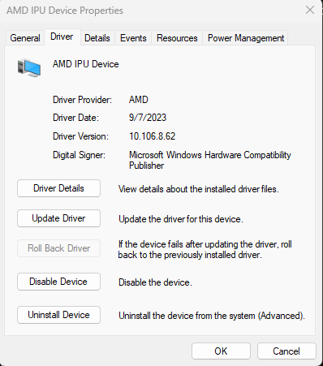

# Ryzen™ AI cloud-to-client demo

## Introduction

The demo showcases the search and sort the images for a quick and easy viewing experience on your AMD Ryzen™ AI based PC with two AI models - Yolov5 and Retinaface.

It features searching images locally when the cloud is not available due to lost or no connectivity. With AMD XDNA™ dedicated AI accelerator hardware seamlessly integrated on-chip and software that intelligently optimizes tasks and workloads, freeing up CPU and GPU resources, it makes new user experiences possible.

<p align="center">
    
<p>

Please note the demo is for functional demonstration purposes only and does not represent the highest possible performance or accuracy.
    
## Setup

To run this demo, you need a AMD Ryzen™ 7040HS Series mobile processor powered laptop with Windows 11 OS.  
    
Please make sure the IPU driver (tested with >=10.106.8.62) has been installed as shown below. 

<p align="center">
    
<p>


Please make sure [Visual C++ Redistributable](https://aka.ms/vs/17/release/vc_redist.x64.exe) and conda ([Miniconda](https://repo.anaconda.com/miniconda/Miniconda3-latest-Windows-x86_64.exe) or [Anaconda](https://www.anaconda.com/download/)) has been installed on Windows.

### Client setup

Start a conda command prompt and run:

```
setup.bat
```

### Azure cloud setup on Windows

> Please refer to [this page](https://learn.microsoft.com/en-us/azure/machine-learning/how-to-deploy-with-triton?view=azureml-api-2&tabs=python%2Cendpoint) for more detailed setup instructions.

Note that Azure cloud setup is needed only for running the application with Azure cloud and it requires an Azure account and subscription. If you only need to run the application locally, you can skip the Azure cloud setup step.

1. Install azure python sdk
    ```
    pip install azure-ai-ml azure-identity
    ```
1. Create your workspace [here](https://portal.azure.com/#view/HubsExtension/BrowseResource/resourceType/Microsoft.MachineLearningServices%2Fworkspaces)
2. After the workspace is created, navigate to your workspace's dashboard and click `Download config.json`
3. Create Azure endpoint.
    ```
    python models/setup_azure_ep.py --prefix <custom_endpoint_prefix> --config <config_json_path> -m [retinaface/yolov5] --step endpoint
    ```
    After this step you should see a newly generated `azure_config.yaml` file under `models/<model>/` directory with your `auth_key` and endpoint `uri`. If `uri` is none, wait for a short while and run the same command again.
4. Deploy the model
    ```
    python models/setup_azure_ep.py --prefix <custom_endpoint_prefix> --config <config_json_path> -m [retinaface/yolov5] --step deployment
    ```
    The cloud deployment will take a long time. Please go to your [Azure portal](http://portal.azure.com/) to check the deployment status (Azure portal -> your workspace -> launch studio -> endpoints -> your_endpoint).
5. Set the endpoint traffic. In your Azure portal's endpoint status page, click on `Update traffic` and set the traffic to 100

There are 3 ways to run the demo:
1. Use QT GUI in python
2. Use web brower
3. Use GUI exe

## 1. run QT GUI
Execute the batch script:
```
run_pyapp.bat
```

Both 2 and 3 need to start the server as below:

## start server

```
cd webapp
python server.py
```

## 2. visit GUI in browser

```
http://localhost:8998
```
or

## 3. build and run GUI exe
```
cd electron-quick-start
npm install electron-packager
npx electron-packager . ms-build-demo --platform=win32 --arch=x64 --overwrite
npm install
npm start
```
    

## Run your own models with ONNXRuntime on Ryzen AI
    
The demo uses Yolov5 and Retinaface models. To know how to run your own models with ONNXRuntime on Ryzen AI, please find more details on 
the [Ryzen AI Software Developer Guide](https://ryzenai.docs.amd.com/en/latest/index.html) page.
