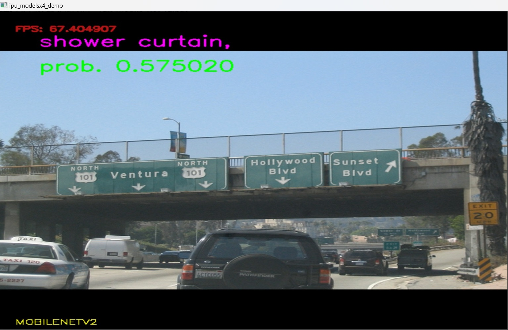
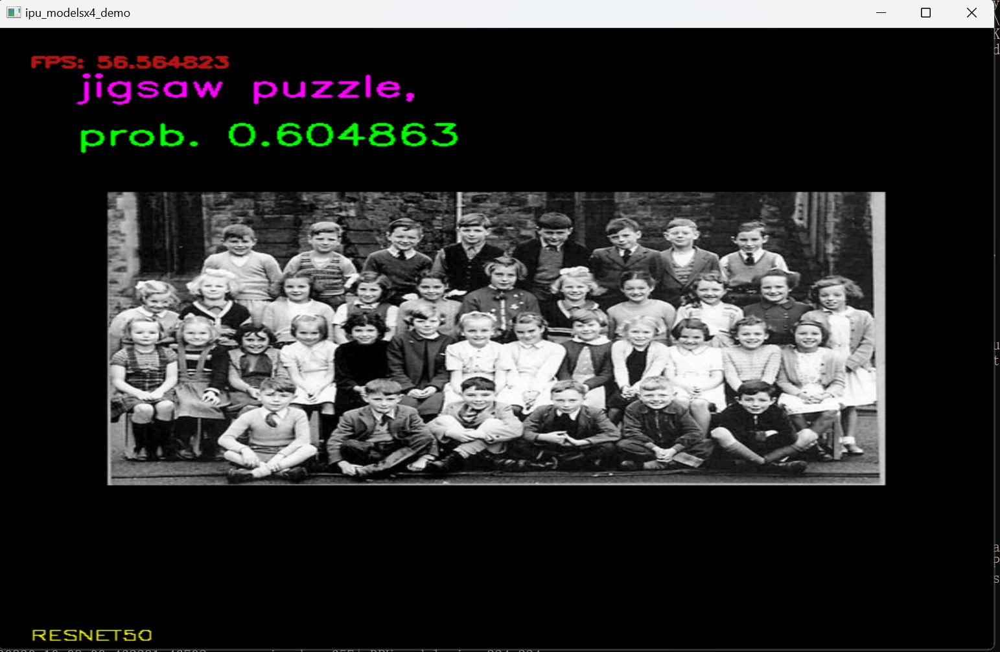
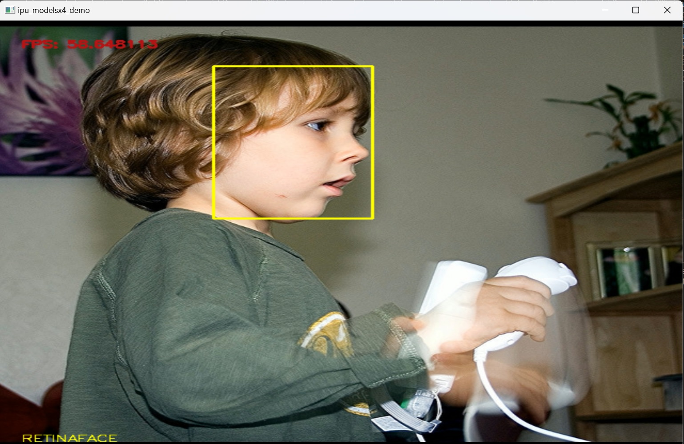
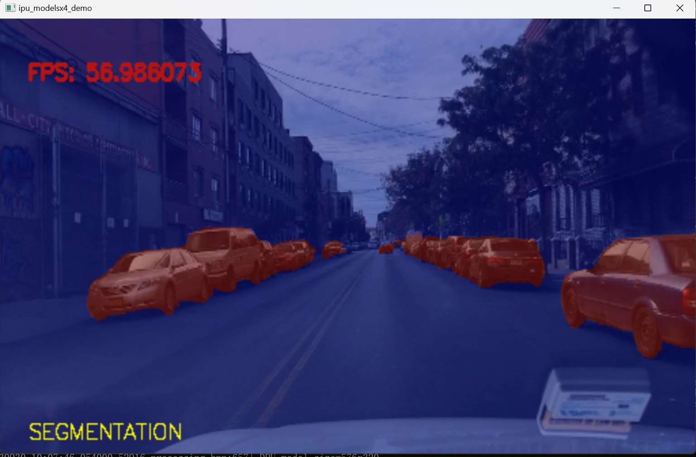
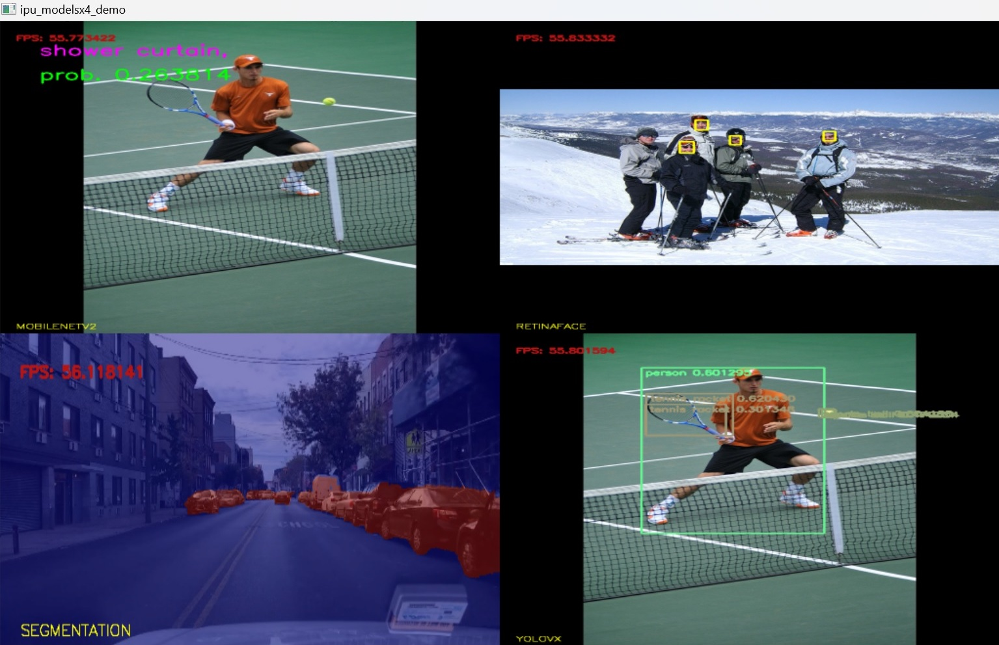

<table style="width:100%">
  <tr>

<th width="100%" colspan="6"><h1>Multi Model Exec</h1>

</tr>

</table>


## Table of Contents

- [1 Introduction](#1-Introduction)
- [2 Design Files](#2-Design-Files)
- [3 Demo Setup](#3-Demo-Setup)
- [4 Run The Demo](#4-Run-The-Demo)
- [5 Know Issues](#5-Know-Issues)

## 1 Introduction

This is the demo of showing multiple AI models running concurrently on Ryzen AI. Please note that all the steps mentioned here need to be performed in ***Windows CMD Prompt***, if you perform this demo in ***Windows Powershell***, some errors will occur. The following models are used:
- MobileNet_v2
- ResNet50
- Retinaface
- Segmentation
- Yolox

------

## 2 Design Files
<a name="2-Design-Files"></a>


```
│  README.md
│
├─bin
│      npu_multi_models.exe
│      onnxruntime.dll
│      onnxruntime_providers_shared.dll
│      onnxruntime_providers_vitisai.dll
│      onnxruntime_vitisai_ep.dll
│      DirectML.dll
│      vaip_config.json
│
├─images
│      mobilenet_V2.jpg
│      modelsx4.jpg
│      resnet50.jpg
│      retina.jpg
│      segmentation.jpg
│      yolox.jpg
│
└─npu_modelsx4_demo
    │  run_mobile_net_v2.bat
    │  run_modelx4.bat
    │  run_modelx4_with_camera_on.bat
    │  run_resnet50.bat
    │  run_retinaface.bat
    │  run_segmentation.bat
    │  run_yolovx.bat
    │
    └─config
            mobile_net_v2.json
            modelx4.json
            modelx4_with_camera_on.json
            resnet50.json
            retinaface.json
            segmentation.json
            yolovx.json
```

## 3 Demo Setup

Make sure you have met all the requirements by following the [Installation Instructions](https://ryzenai.docs.amd.com/en/latest/inst.html#).

Download the onnx models and test image/video package, and unzip it under **<path_to_RyzenAI-SW>/demo/multi-model-exec/npu_modelsx4_demo/**


  [Download Resource Package](https://www.xilinx.com/bin/public/openDownload?filename=resource_multi_model_demo.zip)

 You should have the directory like this: 
 ```bash
├── bin
│   ├── DirectML.dll
│   ├── npu_multi_models.exe
│   ├── onnxruntime.dll
│   ├── onnxruntime_providers_shared.dll
│   ├── onnxruntime_providers_vitisai.dll
│   ├── onnxruntime_vitisai_ep.dll
│   └── vaip_config.json
├── images
│   ├── mobilenet_V2.jpg
│   ├── modelsx4.jpg
│   ├── resnet50.jpg
│   ├── retina.jpg
│   ├── segmentation.jpg
│   └── yolox.jpg
├── npu_modelsx4_demo
│   ├── config
│   │   ├── mobile_net_v2.json
│   │   ├── modelx4.json
│   │   ├── modelx4_with_camera_on.json
│   │   ├── resnet50.json
│   │   ├── retinaface.json
│   │   ├── segmentation.json
│   │   └── yolovx.json
│   ├── resource
│   │   ├── detection
│   │   ├── face
│   │   ├── mobilenetv2_1.4_int.onnx
│   │   ├── nano-YOLOX_int.onnx
│   │   ├── pointpainting-nus-FPN_int.onnx
│   │   ├── resnet50_pt.onnx
│   │   ├── RetinaFace_int.onnx
│   │   └── seg_512_288.avi
│   ├── run_mobile_net_v2.bat
│   ├── run_modelx4.bat
│   ├── run_modelx4_with_camera_on.bat
│   ├── run_resnet50.bat
│   ├── run_retinaface.bat
│   ├── run_segmentation.bat
│   └── run_yolovx.bat
└── README.md

```


## 4 Run The Demo

Please note that all the steps mentioned here need to be performed in ***Windows CMD Prompt***. You can load and run the models one by one: 
run_mobile_net_v2.bat



run_resnet50.bat

run_retinaface.bat

run_segmentation.bat


run_yolovx.bat


or you can load and run multiple models at the same time: 

run_modelx4.bat


## 5 Know Issues

- Python version version 3.10 is required if not "The code execution cannot proceed because python39.dll was not found. Reinstalling he programm may fix this problem"
- If you find an exclamation mark on the icon of the AMD NPU device in the System Devices list in your Device Manager, it indicates that there is an issue with your driver installation, and the program may not function correctly.
- If this demo aborted with the 'glog.dll cannot be found' error, you need to use the command 'set PATH=C:<path-to-conda-glog>;%PATH%' to explicitly export the path to 'glog.dll'. 'glog.dll' is installed along with ANACONDA3. The recommended ANACONDA3 installer is 'Anaconda3-2023.07-2-Windows-x86_64'.
