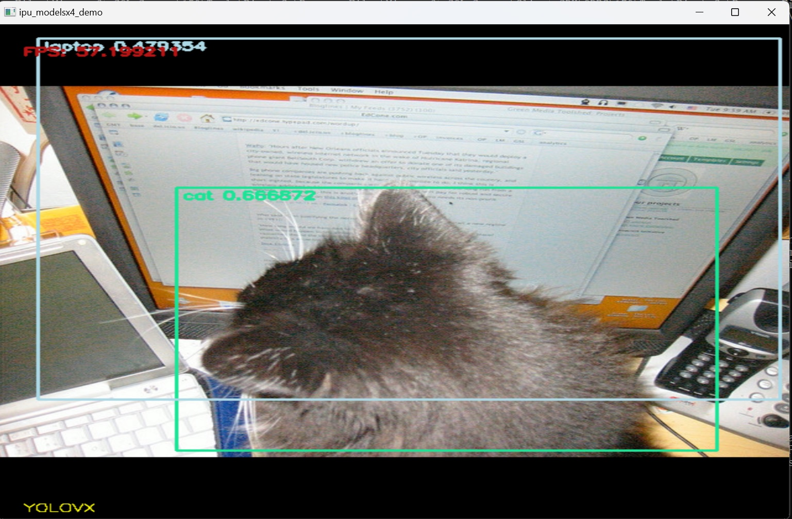

<table class="sphinxhide" width="100%">
 <tr width="100%">
    <td align="center"><h1> Ryzen™ AI  Multi Model Exec </h1>
    </td>
 </tr>
</table>

# AMD Multi Model Exec

## Table of Contents

- [1 Introduction](#1-Introduction)
- [2 Design Files](#2-Design-Files)
- [3 Demo Setup](#3-Demo-Setup)
- [4 Run The Demo](#4-Run-The-Demo)
- [5 Know Issues](#5-Know-Issues)

## 1. Introduction

This demo showcases multiple AI models running concurrently on **Ryzen AI**. It demonstrates how various deep learning models can efficiently run in parallel on the Ryzen AI platform.

**Note:** This demo should be run only on **Anaconda Prompt** by activating the ryzen-ai environment using the following command after successfully installing Ryzen AI by following the [Installation Instructions](https://ryzenai.docs.amd.com/en/latest/inst.html) from the Section 3(Demo Setup).

```sh
conda activate ryzen-ai-(Version)
```
Models Used:
- MobileNet_v2
- ResNet50
- RetinaFace
- Segmentation
- YOLOX

## 2 Design Files

```
├── README.md
├── bin
│    ├── npu_multi_models.exe
├── images
│    ├── mobilenet_v2.jpg
│    ├── modelsx4.jpg
│    ├── resnet50.jpg
│    ├── retina.jpg
│    ├── segmentation.jpg
│    ├── yolox.jpg
│
├── npu_modelsx4_demo
│    ├── run_mobile_net_v2.bat
│    ├── run_modelx4.bat
│    ├── run_modelx4_with_camera_on.bat
│    ├── run_resnet50.bat
│    ├── run_retinaface.bat
│    ├── run_segmentation.bat
│    ├── run_yolox.bat
│    ├── update_dll.py
│    ├── config
│        ├── mobile_net_v2.json
│        ├── modelx4.json
│        ├── modelx4_with_camera_on.json
│        ├── resnet50.json
│        ├── retinaface.json
│        ├── segmentation.json
│        ├── yolox.json

```

## 3 Demo Setup

Make sure you have met all the requirements by following the [Installation Instructions](https://ryzenai.docs.amd.com/en/latest/inst.html).  

For step-by-step procedure for installing dependencies and building the demo from the source code following the  
[Multi Model instructions](https://github.com/amd/RyzenAI-SW/blob/1.2.0/example/multi-model/README.md).  

Download the onnx models and test image/video package, and unzip it under:  
`<path_to_RyzenAI-SW>/demo/multi-model-exec/npu_modelsx4_demo/`  

[Download Resource Package](https://www.xilinx.com/bin/public/openDownload?filename=resource_multi_model_demo.zip)  
#### **Important Notes**
1. ***Download the `image_list.txt` files***:
   - [image_list_face.txt](image_list_face) → **Download it and place it inside**:
     ```
     npu_modelsx4_demo/resource/face/
     ```
   - [image_list_detection.txt](image_list_detection) → **Download it and place it inside**:
     ```
     npu_modelsx4_demo/resource/detection/
     ```
> **Note:** Ensure the name of the file in both detection and face directories is "image_list.txt" containing their respective data from image_list_detection and image_list_face 

You should have the directory like this:

```
├── bin
│    ├── npu_multi_models.exe
├── images
│    ├── mobilenet_v2.jpg
│    ├── modelsx4.jpg
│    ├── resnet50.jpg
│    ├── retina.jpg
│    ├── segmentation.jpg
│    ├── yolox.jpg
├── npu_modelsx4_demo
│    ├── config
│    |    ├── mobile_net_v2.json
│    |    ├── modelx4.json
│    |    ├── modelx4_with_camera_on.json
│    |    ├── resnet50.json
│    |    ├── retinaface.json
│    |    ├── segmentation.json
│    |    ├── yolox.json
│    |
│    ├── resource
│    |    ├── detection
│    |    |    ├── image_list.txt
│    |    ├── face
│    |    |    ├── image_list.txt
│    |    ├── mobilenetv2_1.4_int.onnx
│    |    ├── nano-YOLOX_int.onnx
│    |    ├── pointpainting-nus-FPN_int.onnx
│    |    ├── resnet50_pt.onnx
│    |    ├── RetinaFace_int.onnx
│    |    ├── seg_512_288.avi
│    |
│    ├── run_mobile_net_v2.bat
│    ├── run_modelx4.bat
│    ├── run_modelx4_with_camera_on.bat
│    ├── run_resnet50.bat
│    ├── run_retinaface.bat
│    ├── run_segmentation.bat
│    ├── run_yolox.bat
│    ├── update_dll.py
│
├── README.md

```
## 4 Run The Demo

Please note that all the steps mentioned here need to be performed in *Anaconda prompt*.  
Activate the ryzen-ai environment
```sh
conda activate ryzen-ai-(Version)
```
Mention the latest version of ryzen-ai. For instance, if the latest version is ryzen-ai-1.3.1 then the command will be
```sh
conda activate ryzen-ai-1.3.1
```

### Step 1: Navigate to the correct directory and update DLL files  
Before running any models, first, update the DLL files from the latest Ryzen-AI software:

```sh
cd npu_modelsx4_demo
python update_dll.py  # Updates the DLL files
```

### Step 2: Run the models one by one
Run the MobileNetV2 model:

```sh
run_mobile_net_v2.bat
```
The following image shows the classification output of the MobileNetV2 model:


### Run the ResNet50 model:

```sh
run_resnet50.bat
```
The following image shows the classification output of the ResNet50 model:


### Run the RetinaFace model for face detection:

```sh
run_retinaface.bat
```
The following image shows the output of the RetinaFace model:


### Run the segmentation model:

```sh
run_segmentation.bat
```
The following image shows the output of the segmentation model:


### Run the YOLO based object detection model:

```sh
run_yolovx.bat
```
The following image shows the output of the YOLO model:



### or you can load and run multiple models at the same time:
```sh
run_resnet50.bat
```
The following image shows the output of the multi-model:


## 5 Know Issues

- Python version 3.10 is required. If not installed, you may see the error:  
  *"The code execution cannot proceed because python39.dll was not found. Reinstalling the program may fix this problem."*
  
- If you find an exclamation mark on the AMD NPU device in the **System Devices list** of **Device Manager**, it indicates a driver installation issue. The program may not function correctly.

- If this demo aborted with the 'glog.dll cannot be found' error, you need to use the command 'set PATH=C:;%PATH%' to explicitly export the path to 'glog.dll'. 'glog.dll' is installed along with ANACONDA3. The recommended ANACONDA3 installer is 'Anaconda3-2023.07-2-Windows-x86_64'.
