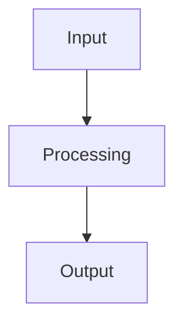

{/* Copy this template for conceptual/architecture pages. Delete these instructions when done. */}

# Concept Title

## Overview

{/* 2-3 sentence overview of the concept. */}

## Architecture

{/* Use a Mermaid diagram to illustrate the architecture or data flow. */}

## Key Concepts

### Concept A

{/* Explain concept A in 2-4 sentences. Use tables for structured information. */}

| Property | Value |
|----------|-------|
| Example  | Value |

### Concept B

{/* Explain concept B. */}

## Related Tutorials

- **[Tutorial](/models-tutorials/llms/supported-models)** -- Hands-on guide
- **[API Reference](/reference)** -- Technical details
