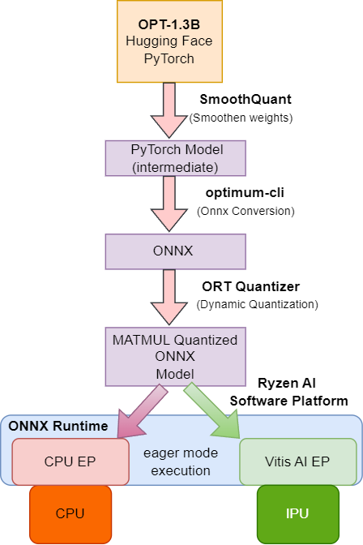

<table align="center" class="sphinxhide" width="100%">
 <tr width="100%">
    <td align="center"><h1>Generative AI on Ryzen AI Software Platform</h1>
    </td>
 </tr>
</table>


<h1 align="center">OPT1.3B - ONNX Runtime Flow</h1>


## Overview

This repo demonstrates the OPT model generating text in **eager mode** execution flow with ONNX Runtime on the Ryzen AI software platform. 

The flow consists of the sequence of steps enumerated below.

<br/><br/>

<div align="center">

<p>OPT Eager Mode Flow</p>
</div>

<br/><br/>

**Quantization Process**

  1. Load pretrained Hugging Face OPT large language model and perform SmoothQuant to condition the weights
  2. Export saved PyTorch model to ONNX using Optimum
  3. Quantize the MATMUL ops in the model using ONNX Runtime (ORT) quantizer

**Text Generation**

  4. Load the model and run inference using Vitis AI Execution Provider

<br/><br/>
**Here are the steps that you can follow to run the OPT-1.3b model on the Ryzen AI software platform**
<br/><br/>

## Step 1: Prerequisites

### Prereq 1 - Create and activate a conda environment 

```
conda create --name opt-onnx python=3.9
conda activate opt-onnx
```

### Prereq 2 - Install dependencies

In this example we will be using some popular packages such as Hugging Face's transformers and optimum. The following commands will install the dependencies in your conda environment.

```
cd opt-onnx
pip install -r requirements.txt 
```

### Prereq 3 - Install onnxruntime and Vitis AI Execution Provider:
Install Vitis AI Execution Provider in the conda environment by following the installation instructions in the official [Ryzen AI Documentation](https://ryzenai.docs.amd.com/en/latest/manual_installation.html#install-vitis-ai-execution-provider).

### Prereq 4 - Set environment variables 

```
.\setup_onnx.bat
```  

This sets three environment variables: 
* `PYTHONPATH`: We use a post-training technique called SmoothQuant prior to ORT quantization. We added this library to the PYTHONPATH.  
* `XLNX_VART_FIRMWARE`: This variable points to the IPU binary. Ryzen AI Software platform provides multiple IPU binaries using different configurations on the IPU device. This repository contains the binary that is best suited for transformer models. 
* `TVM_MODULE_PATH`: We will be running the MATMUL ops in the model on the IPU device. This variable points to the pre-compiled GEMM instructions (DLL files) that help achieve this execution.


## Step 2 - Quantization 

### 2a. Load pretrained model and prepare for quantization 
We load the pretrained model from Hugging Face. We then perform SmoothQuant, an accurate and efficient post-training quantization solution on the model. SmoothQuant performs a per-channel scaling transformation that smooths the magnitude across channels, making the model quantization-friendly. 

We then save this model using Hugging Face's [save_pretrained](https://huggingface.co/docs/transformers/v4.34.0/en/main_classes/model#transformers.PreTrainedModel.save_pretrained) API. 


The script below performs the aforementioned operations.
```
python prepare_model.py --model_name opt-1.3b --save
```
The PyTorch model (.bin) and config files are saved in the directory `opt-1.3b_smoothquant/pytorch/`

To learn more about SmoothQuant, refer to the [SmoothQuant paper](https://arxiv.org/pdf/2211.10438.pdf). 

### 2b. Use Optimum to export the saved PyTorch model to ONNX. 
[Optimum](https://huggingface.co/docs/optimum/index) is an extension of Hugging Face's Transformers that provides tools for efficient deployment of models on targeted hardware. Optimum's [command-line interface](https://huggingface.co/docs/optimum/exporters/onnx/usage_guides/export_a_model) supports ONNX conversion, which we will use to export the PyTorch model saved in the previous step to ONNX format.
```
optimum-cli export onnx -m opt-1.3b_smoothquant\pytorch --task text-generation-with-past opt-1.3b_smoothquant\onnx  --framework pt --no-post-process
```
The flag `text-generation-with-past` will also enable the export of the decoder model with precomputed past key/value pairs. This allows the reuse of computed values and thus efficient sequential decoding. The exported ONNX models are saved to `opt-1.3b_smoothquant/onnx`. 


### 2c. Quantize the MATMUL ops in the saved ONNX model using ORT Quantizer

The [ORT Quantizer](https://huggingface.co/docs/optimum/onnxruntime/usage_guides/quantization#creating-an-ortquantizer) class is used to quantize ONNX models. It supports a variety of quantization configurations, such as static/dynamic, per-channel quantization, etc. In static quantization, the quantization parameters (scale/offset) are computed in advance using a calibration dataset. In dynamic quantization, they are computed on-the-fly during inference. Dynamic quantization is well-suited for RNNs and transformers since they handle variable-length sequences, and the quantization parameters can be tailored to the input data distribution. 

This snippet shows how we perform dynamic quantization on MATMUL ops in the ONNX model. 
```
dqconfig = AutoQuantizationConfig.avx512_vnni(is_static=False, per_channel=False, use_symmetric_activations=True, 
                                                operators_to_quantize=["MatMul"],
                                                )
```
The following script performs the quantization mentioned above. The `--use_cache` flag additionally quantizes the decoder model with precomputed key/value pairs saved in step 2b. 
```
python prepare_model.py --model_name opt-1.3b --quantize --use_cache
```
This script saves the ORT quantized models in the directory `opt-1.3b_ortquantized`.


### 2d. Place the generation config with the ORT quantized model

Copy the generation config generated by `optimum-cli` to the folder containing the ORT quantized model

```
xcopy opt-1.3b_smoothquant\onnx\generation_config.json opt-1.3b_ortquantized
```

## Step 3 - Text Generation

The script `run.py` gives options to do the following:
* Execute the model on a given target (CPU/IPU)
* Measure time/token latency
* Decode a set of prompts to show model liveliness
* Calculate perplexity score


**Note**: The script implementation deploys operators on IPU using ``--target aie``. 

```
python run.py --help
usage: run.py [-h] [--local_path LOCAL_PATH] [--target {cpu,aie}] [--use_cache] [--perplexity]
              [--model_name {opt-1.3b}] [--dataset {non-raw,raw}]

options:
  -h, --help            show this help message and exit
  --local_path LOCAL_PATH
                        Local directory path to ONNX model
  --target {cpu,aie}    cpu, aie
  --disable_cache       Disable caching support
  --perplexity          Calculate perplexity on wikitext2 instead of decoding prompts
  --model_name {opt-1.3b}
                        Different OPT model sizes
  --dataset {non-raw,raw}
                        wikitext2-raw-v1, wikitext2-v1
```
Each run generates a log directory `log_<model_name>` and all logs are within this directory. 

### Decode prompts
Use the following commands to execute the quantized ONNX models on the CPU and IPU. 


```
python run.py --model_name opt-1.3b --target cpu --local_path ./opt-1.3b_ortquantized 
python run.py --model_name opt-1.3b --target aie --local_path ./opt-1.3b_ortquantized 
```

Adding the --disable_cache flag will prevent re-use of previously generated key values. This may slow down decoding.
```
python run.py --model_name opt-1.3b --target cpu --disable_cache --local_path ./opt-1.3b_ortquantized
python run.py --model_name opt-1.3b --target aie --disable_cache --local_path ./opt-1.3b_ortquantized 
```

One example of an answer is shown below.
```
Prompt: Who is Gilgamesh?
Response: 

Gilgamesh is a character from the epic poem Gilgamesh. He is the son of the god
```
### Perplexity on wikitext2-raw dataset
[Perplexity](https://huggingface.co/docs/transformers/perplexity) is a metric commonly used to evaluate language models. It represents the model's ability to generate uniformly among the set of specified tokens in the corpus. Specifically, it quantifies how surprised or uncertain the model is when trying to predict the next word in a sequence based on the context of the previous words. A lower perplexity indicates that the model is better at predicting the next word, while a higher perplexity suggests that the model struggles with the prediction.

Use the following commands to measure the perplexity of the OPT model:

**Perplexity of OPT model after SmoothQuant:**

```
python run.py --model_name opt-1.3b --target cpu --local_path ./opt-1.3b_smoothquant/onnx --perplexity
```

Measured perplexity: 14.6239013671875

**Perplexity of OPT model after SmoothQuant and ORT Quantization:**

```
python run.py --model_name opt-1.3b --target cpu --local_path ./opt-1.3b_ortquantized --perplexity
```
Measured Perplexity: 15.468740463256836

