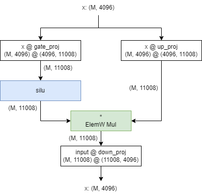
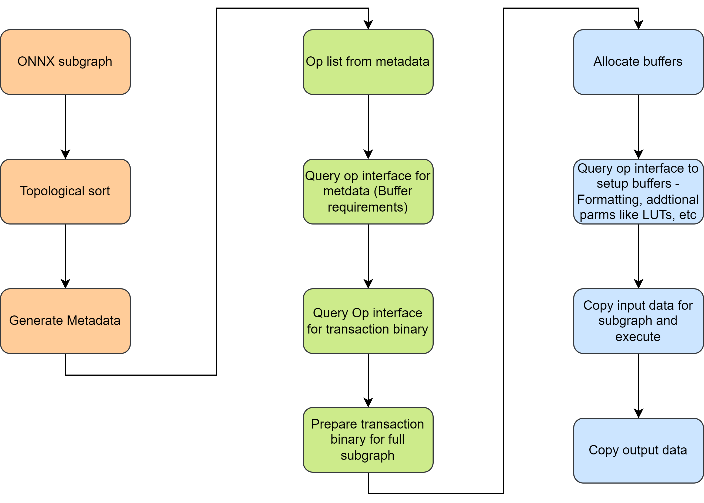

# Dynamic Dispatch

## Overview

Dynamic dispatch aims to merge BD schedules for multiple operators into a single BD schedule for execution on NPU.

Dynamic dispatch supports executing ML models on NPU if individual operators required for the model are implemented and available. For illustration, let us take the example of MLP block from llama2.



If all the operators required for MLP are available, dynamic dispatch merges the instructions from individual operators and issues one NPU execution kernel call. For llama2-mlp to be supported, following operator support is required.
1. Matmul shapes - 1x4096x11008, 1x11008x4096
2. Silu - 1x11008
3. Elementwise mul - 1x11008

To execute an operator on NPU, buffers must be allocated, copied with the correct data, setup instruction buffers, issue a NPU kernel run (XRT run), wait for completion of kernel execution and read data from the output buffer.

### Transction binary control code

Dynamic dispatch uses transaction binary control code to merge and execute operators on NPU. Individual operators are expected to provide transaction binaries for all the shapes supported.

For more details on transcation binary control code, please see the specification [here](https://confluence.amd.com/display/AIE/AIE+Transaction+Specification).

## Dynamic Dispatch flow



Dynamic dispatch takes a ONNX subgraph as an input. This is a three phase flow:

### Metadata generation
In phase 1, dynamic dispatch metadata is generated. Input ONNX subgraph is topologically sorted and metadata containing the opertor list, buffer mappings, data types, sizes for each buffer is generated. This is the input to phase-2.

### Transaction binary preparation
Using the metadata generated, each operator is queried for various operator requirements like buffer size for each operand, transaction binary, runtime/super kernel parameters, if any. Using the operator requirements(operator metadata), a single transaction binary is generated with correct offsets required for subgraph execution.

### Subgraph execution
In this phase, memory is allocated for input & output activations, weights for each node in the subgraph and scratch memory intermediate results. Each operator has the flexibility to format constant parameters for better performance on IPU.
Once the buffers are prepared, NPU kernel call is issued with the transaction binary generated in phase-2.


## Features
This repository supports the following features.
* Operator library with C++ interface

    * Transacation binaries for all operators for each shape supported
    * APIs to provide metadata for each operator
    * APIs to format constant inputs to the operator. For ex: weight formatting for matmul

* Graph parser and metadata generator
* Transaction fuser
* Runtime to dispatch multiple operators after transaction fusion

The runtime code to execute the generated transaction binary to IPU is triggered from ONNX RT as a custom op.

## Current assumptions
* Each shape and operator required by the sub-graph will be available as a transaction binary
* There is no fall back to CPU incase the operator or transaction binary is missing. There will be exception issued
* A hardcoded padding feature for terminal nodes in the sub-graph is provided. Converting this to a full feature is being discussed.

## Operator interface

Please see op_interface documentation [here](docs/op_interface.md).

## Pre-requisites

Currently, this stack is supported on STX only.
* Request or get access to a STRIX B0 board
* Install Anaconda
* Install Visual Studio 2022
* Install git
* Install IPU-MCDM Driver

## Clone repo
```powershell
git clone --recursive https://gitenterprise.xilinx.com/VitisAI/DynamicDispatch.git -b main
```

## Compile source code (Windows)

Create and activate conda env
```powershell
conda env create -f env.yml
conda activate dynamic_op_dispatch
```

Install ext tools
```powershell
pip install -e ext\dd_helper
```

Set XRT Dir and Setup environment (run below commands based on the shell you're using)
```powershell
## On Command Prompt
# (Ex: set XRT_DIR=C:\Users\tejuss\Desktop\ipu_stack_rel_silicon\xrt-ipu)
set XRT_DIR=<path/to/xrt>
## Run setup script
.\setup.bat

## On PowerShell
# (Ex: $env:XRT_DIR="C:\Users\tejuss\Desktop\ipu_stack_rel_silicon\xrt-ipu")
$env:XRT_DIR="<path/to/xrt>"
## Run setup script
.\setup.ps1
```

Install Python library
```
pip install -e .
```

Note: for VSCode Python intellisense, you need to either install it in non-editable mode (without `-e`) or add the Python directory to the `python.analysis.extra_paths` setting.

Build

Use `build.bat` to compile. See the usage below.

```powershell
# Check usage
.\build.bat --help

- Build Dynamic Dispatch : 1.0

USAGE:
  build.bat [Options]

  -- [Options] ------------------------------------------------------------
  /?, -?, --help       Shows this help
  /v, -v, --verbose    Shows detailed compile log
  /f, -f, --fresh      Reconfigure build, Must use if build configs has changed
  /b, -b, --build      Build type [Release, Debug] (Default: Release)
  /c, -c, --clean      Clean first then build
  /t, -t, --en-tests   Enable tests
  /p, -p, --en-perf    Enable unit test performance profiling
  -------------------------------------------------------------------------

## Default build command
.\build.bat

## Enable building tests (optional)
.\build.bat --fresh --en-tests

## Enable profiling of unit tests (optional)
.\build.bat --fresh --en-tests --en-perf
```

Use commands directly
```powershell
## Default build command
cmake -S . -B build -DCMAKE_INSTALL_PREFIX=build\Release --fresh
## Optional build flag: Unit test profiling can be enabled using -DUNIT_TEST_PERF_EN=ON
## Optional build flag: Build unit tests -DENABLE_DD_TESTS=ON
cmake -S . -B build -DCMAKE_INSTALL_PREFIX=build\Release -DENABLE_DD_TESTS=ON -DUNIT_TEST_PERF_EN=ON --fresh

cmake --build build --config=Release --target install
```

Useful build flags
```
- Trace: -DLOGGING_EN=ON (will write to file in logs directory)
- Performance logging: -DPERF_LOGGING_EN=ON
```

## Compile source code (Linux)
Linux compilation does not use conda environment.
All third party libraries are compiled locally.

### OS requirements
The build steps have been verified on a CentOS.

source toolchain
```sh
scl enable devtoolset-9 bash
```

source XRT and setup local env variables
```sh
source /proj/xbuilds/IPU-TA/9999.0_integration_verified/settings.sh
source setup.sh
```

Build
```sh
cmake -S . -B build -DCMAKE_INSTALL_PREFIX=build/Release
cmake --build build --config=Release --target install --parallel
```

:pushpin: Linux does not support executing tests yet!

## Running tests
```powershell
# Run unittests
build\Release\tests\cpp_tests.exe --gtest_filter=*PSF*
build\Release\tests\cpp_tests.exe --gtest_filter=*PSJ*
build\Release\tests\cpp_tests.exe --gtest_filter=*PSH*
build\Release\tests\cpp_tests.exe --gtest_filter=*MLADF*
build\Release\tests\cpp_tests.exe --gtest_filter=*EXPTL*


# Run single matmul through Fusion Interface
python tests\cpp\single_matmul\model.py  --dtype a16w8 # Generates Meta JSON
build\Release\tests\test_single.exe test_matmul\model_matmul1_meta.json

# To run all the tests, do
pushpin: run_tests.bat is not actively maintained
run_tests.bat build\Release
```

## HW Profiling

Please see documentation [here](./docs/profile.md) to use HW profiling feature.

## Code Contribution

### General guidelines

* Developers are required to use a fork of this repository to develop features and use it to create pull requests.
* Developers are required to add meaningful commit messages/PR titles.
* Code-checkin must happen at every low level submodule first before the check-ins to upper module is submitted.
* The PR should have the CI details from submodule to ensure traceability.
* Developers are required to add unit tests for each operator and feature developed
* Do not use CI pipelines for dev testing. CI resources are limited.
* Avoid adding input/golden data binary files to the repo. The repository size gets bloated.

### Code formatting

To maintain consistency in coding style, `pre-commit` hooks are provided to format the code automatically

* After cloning the repository, run `pre-commit install` to let it run the linting steps prior to every commit
* You can also run it manually with `pre-commit run --from-ref origin/main --to-ref HEAD`
