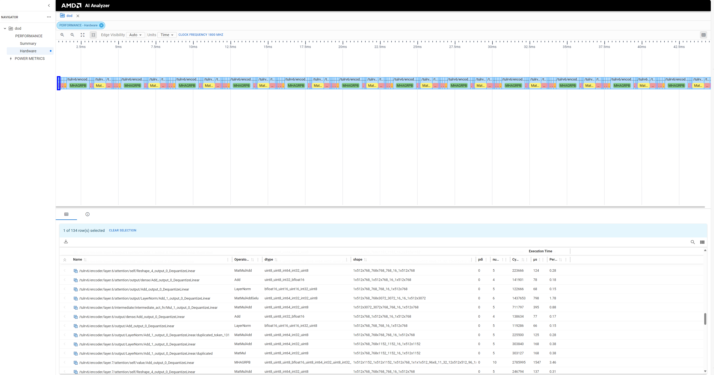

# Profiling using AI Visualizer

NOTE: This is a new experimental feature. Please report any issues you encounter.

DD supports profiling of subgraph execution using AI Visualization tool.
Following steps need to be followed to get op level performance breakdown. This feature in DD uses underlying infrastructure from XRT, NPU Driver and AI Visualizer.

## Configure DD in profiling mode
This requires enabling timer_op pass in DD to insert timer ops at the beginning and end of each operator. This pass can be enabled by setting `profile=true` in `DDConfig`.

Profiling can be enabled by setting env variable `DD_ENABLE_PROFILE`. This environment variable can be set to profile at different levels.
1. Subgraph level profiling : `set DD_ENABLE_PROFILE=1`
2. PDI partition level profiling : `set DD_ENABLE_PROFILE=2`
3. All ops : `set DD_ENABLE_PROFILE=3`

Profile level 3 is the highest profiling level supported.


## Driver
This feature has been validated with [this driver.](https://xcoartifactory/ui/native/xrt-mcdm-prod-local/com/amd/mcdm/main/mcdm_stack_rel-run1250/)

## XDP kernel in xclbin
Follow instructions [here](https://confluence.xilinx.com/pages/viewpage.action?spaceKey=XSW&title=Layer-by-Layer+Visualization#LayerbyLayerVisualization-FlexMLStyleApplications:IPUTransactionFlow) to add XDP kernel to xclbin. Without this profiling will not work. Search for `Add XDP_KERNEL` in the confluence page.

## Create xrt.ini file
Create a xrt.ini file in your working directory with the below contents
```
[Debug]
ml_timeline=true
```

This is also documented in the confluence page linked above.

## Run application
Run the application from your working directory. For ex:
```
build\tests\cpp\matmul6\RelWithDebInfo\test_matmul6.exe "C:\temp\tsiddaga\vaip\.cache\e09099812e8c1dfd8028bbd1311dd60a\fused.onnx.subgr
aph_5.json" 100 xclbin\stx\release\4x2_psf_model_a8w8_qdq.xclbin
```

If everything works as expected, following two files will be generated in the working directory.
1. dd_timestamp_info.json
2. record_timer_ts.json

## Install AI Visualizer
Install the wheel package from this [link](https://xcoartifactory.xilinx.com/artifactory/api/pypi/dlanalyzer-wheel/2024.06/aianalyzer-2024.6+d202406121136.g3b1aaf-py3-none-any.whl)

## Run AI Visualizer
Run AI visualizer for performance visualization
`aianalyzer.exe <work_dir>`
Work directory is the location where `dd_timestamp_info.json` and `record_timer_ts.json` is saved.

This will open a browser with visualization. There will be options to configure the clock frequency, please enter the clock freq of AIE based on your experiment setup.

Snapshot of visualization for reference:


