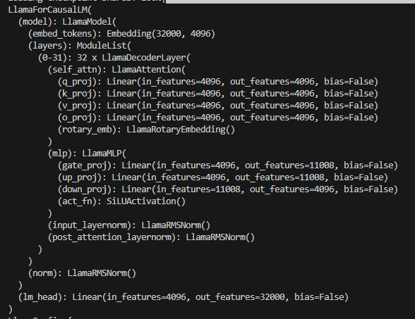
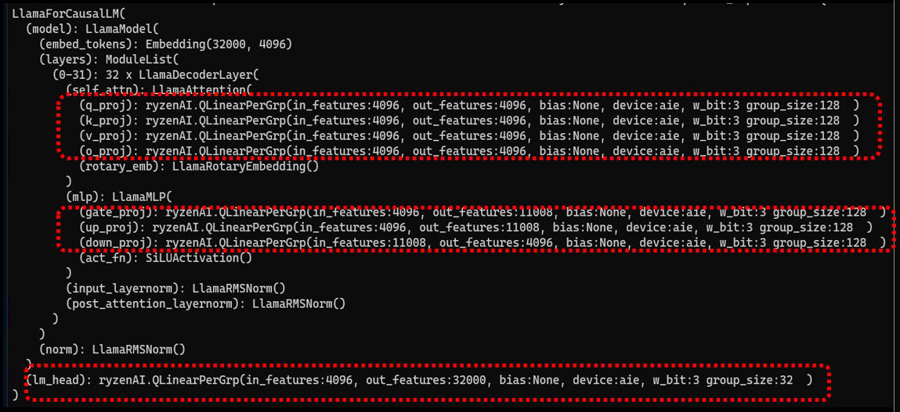
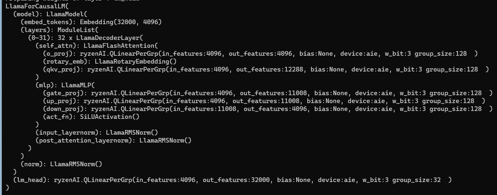

# Llama 2 - Pytorch

**_NOTE:_**  Please ensure that you followed the environment setup instructions from the [Transformer folder readme](../../README.md) before following the steps here.

Llama 2 model was proposed by Meta, [Llama 2: Open Foundation and Fine-Tuned Chat Models](https://ai.meta.com/research/publications/llama-2-open-foundation-and-fine-tuned-chat-models/).


### Features
1. w4a16: AWQ on CPU, AIE **(AWQ for Llama2 his from MIT-Han-lab)**
4. Static memory allocation for token phase speed up
5. Matmul grouping for Llama2Attn
6. Model save and load from checkpoints
7. Profiling instrumentation to measure prefill/token times during mission mode

### Model Variants
Ryzen-AI supports Llama2-7B up to a sequence length of 4096 tokens. 

### Model Structure 

#### llama-2-7b , llama-2-7b-chat 
This image shows model structure - both have same structure



### Support modes on NPU

Currently the supported precision on NPU is "w4abf16" and "w4abf16 + FA". **w4abf16** uses **AWQ** PerGrp quantization


### Prepare Llama2 Weights to use with HF

The weights of Llama-2 models can be obtained by requesting permission with Meta. Check this [Huggingface page](https://huggingface.co/docs/transformers/main/model_doc/llama2) on Llama-2 for details. 

Once weights are obtained, use Huggingface's converter to convert the weights to be compatible to be loaded with HF interface. 

```
# Directory structure of llama-2 weights
$ls -ltrh llama-2-wts
total 536K
-rw-r--r-- 1 user user 489K Jul 13 15:27 tokenizer.model
-rw-r--r-- 1 user user   50 Jul 13 15:27 tokenizer_checklist.chk
-rw-r--r-- 1 user user 6.9K Jul 14 17:06 LICENSE
-rw-r--r-- 1 user user 4.7K Jul 14 17:06 USE_POLICY.md
drwxr-sr-x 2 user user 4.0K Aug 31 11:12 llama-2-7b
drwxr-sr-x 2 user user 4.0K Aug 31 11:15 llama-2-13b
drwxr-sr-x 2 user user 4.0K Aug 31 11:17 llama-2-70b
drwxr-sr-x 2 user user 4.0K Aug 31 11:17 llama-2-7b-chat
drwxr-sr-x 2 user user 4.0K Aug 31 11:17 llama-2-13b-chat
drwxr-sr-x 2 user user 4.0K Aug 31 11:17 llama-2-70b-chat

# rename llama-2-7b as 7B

$ ls -ltrh llama-2-wts
total 500K
drwxr-sr-x 2 user user 4.0K Sep 28 12:44 7B
-rw-r--r-- 1 user user   50 Sep 28 12:45 tokenizer_checklist.chk
-rw-r--r-- 1 user user 489K Sep 28 12:45 tokenizer.model

# Run the converter
$ python <condainstall>/envs/ryzenai-transformers/lib/python3.9/site-packages/transformers/models/llama/convert_llama_weights_to_hf.py --input_dir ./llama-2-wts/ --model_size 7B --output_dir ./llama-2-wts-hf/7B

# you want to convert llama-2-7b-chat, rename the llama-2-7b-chat to 7B and rerun the converter again as follows

$ python <condainstall>/envs/ryzenai-transformers/lib/python3.9/site-packages/transformers/models/llama/convert_llama_weights_to_hf.py --input_dir ./llama-2-wts/ --model_size 7B --output_dir ./llama-2-wts-hf/7B_chat
```

Go to the llama2 folder

```
cd models/llama2/
```

Ensure the folder `llama-2-wts-hf` at the current location containing subfolders `7B` and `7B_chat`

## Quantization

### w4abf16 with AWQ + PerGrp Quantization

AWQ enables 3-bit and 4-bit weights for LLMs. This reduces model size of Llama2 7B from 52-58% of int8 model depending on group size and whether the last layer is quantized. 

AWQ scales are obtained from MIT-Han-Lab. THe script also contains hooks to calculate scales instead of using precomputed scales. All layers other than "lm_head" are quantized using AWQ. This software stack of RyzenAI can also quantize lm_head layer using per group quantization scheme, with group sizes varying from 32-256. 

Linear layers are replaced with QLinearPerGrp custom int4 compute layer afetr AWQ.


Matmul grouping in done when flash attention is enabled, which reduces number of dispatches to AIE by grouping matmuls of QKV matrices into a single grouped matmul.
This in addition to static memory allocation in token phases provides 8-10% better performance than vanilla attention.



#### Save AWQ checkpoints
4-bit AWQ has higher perplexity than 3-bit AWQ with same performance.

##### 4-bit AWQ
```
AWQ - lm_head runs in BF16 
python run_awq.py --w_bit 4 --task quantize 

AWQ - lm_head runs in BF16 
python run_awq.py --w_bit 4 --task quantize --flash_attention

AWQ + Quantize lm_head 
python run_awq.py --w_bit 4 --task quantize --lm_head

AWQ + Quantize lm_head
python run_awq.py --w_bit 4 --task quantize --lm_head --flash_attention
```

##### 3-bit AWQ
```
AWQ - lm_head runs in BF16 
python run_awq.py --w_bit 3 --task quantize 

AWQ - lm_head runs in BF16 
python run_awq.py --w_bit 3 --task quantize --flash_attention

AWQ + Quantize lm_head 
python run_awq.py --w_bit 3 --task quantize --lm_head

AWQ + Quantize lm_head
python run_awq.py --w_bit 3 --task quantize --lm_head --flash_attention
```


## Deployment

```
python run_awq.py --task decode --target aie --w_bit 4

****************************************
prompt: What is the meaning of life?
Setting `pad_token_id` to `eos_token_id`:2 for open-end generation.
response: What is the meaning of life? This is a question that has puzzled philosophers, theologians, scientists, and many others for
****************************************
prompt: Tell me something you don't know.
Setting `pad_token_id` to `eos_token_id`:2 for open-end generation.
response: Tell me something you don't know.
The only thing I can think of is that I don't know how to make you disappear
****************************************
*
```

## Results

#### Latency : Ryzen9 7945HS
```
python run_awq.py --target aie --task benchmark --flash_attention --w_bit 4
...

python run_awq.py --target aie --task benchmark_long --flash_attention --w_bit 4
...

python run_awq.py --target aie --task benchmark --flash_attention --w_bit 4 --lm_head
...

python run_awq.py --target aie --task benchmark_long --flash_attention --w_bit 4 --lm_head
...

python run_awq.py --target aie --task benchmark --flash_attention --w_bit 3
```

#### Perplexity scores
Perplexity is measured using negative log likelihood scores.
***Perplexity ios measured on wikitext2-raw dataset***
***Perplexity measurement takes several hours on both CPU and NPU***
***Lower value is better***

On RyzenAI, it takes ~5mins to calculate perplexity on 2 samples with seqlen of 2048. To calculate it on entire testset (84) samples with sequence length of 4096, it takes ~7 hrs.

| **Precision+Config**                                     | **Device** | **2 samples/seq=2048** | **All(84) samples/seq=4096**
|----------------------------------------------------------|------------|------------------------|------------------------------
FP32                                                       | CPU        |  5.092                 |
**BF16**                                                   | **V100**   |  **6.718**             | **6.859**
FP32 + SmoothQuant                                         | CPU        |  5.092                 |
FP32 + Flash Attention v2                                  | CPU        |  5.092                 |
w4abf16 (AWQ, 3-bit, group size: 128)                      | CPU        |  7.807                 |
w4abf16 (AWQ, 3-bit, group size: 128)                      | **NPU**    |  **7.809**             | 
w4abf16 (AWQ, 4-bit, group size: 128)                      | **NPU**    |  **6.925**             | 
