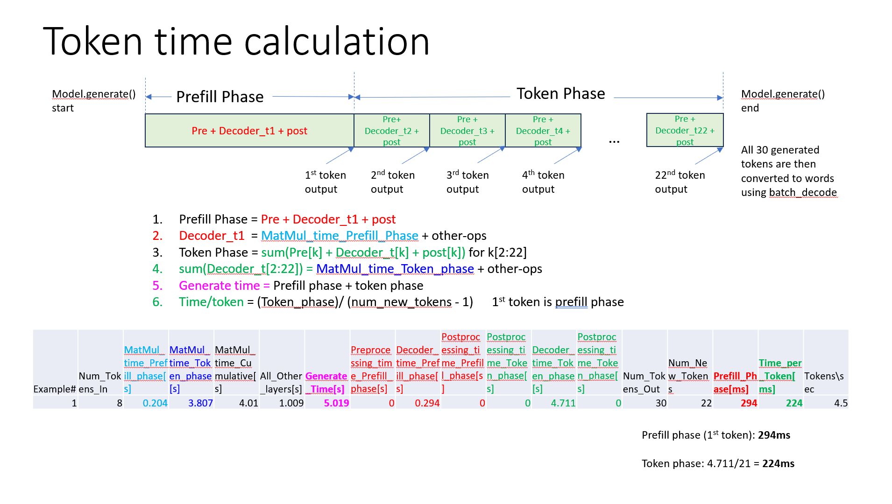

# LLMs on RyzenAI with Pytorch

This page describes the flow for running LLMs on an AMD NPU using PyTorch. This is a general-purpose flow providing functional support for a broad set of LLMs. It is intended for prototyping and early development activities. This flow is not optimized for performance and should not be used for benchmarking purposes.

For benchmarking and deployment purposes, a set of performance-optimized models is available upon request on the AMD secure download site: [Optimized LLMs on RyzenAI](https://account.amd.com/en/member/ryzenai-sw-ea.html)

## Models supported with Pytorch flow

The following models are supported on RyzenAI with the 4 quantization recipes described in here.

| Model Name                   | SmoothQuant |   AWQ   | AWQPlus | PerGroup | Quant Model Size
|------------------------------|-------------|---------|---------|----------|-----------------
| facebook/opt-125m            | &check;     | &check; | &check; | &check;  | 0.07
| facebook/opt-1.3b            | &check;     | &check; | &check; | &check;  | 0.8
| facebook/opt-2.7b            | &check;     | &check; | &check; | &check;  | 1.4
| facebook/opt-6.7b            | &check;     | &check; | &check; | &check;  | 3.8
| facebook/opt-13b             |             | &check; | &check; | &check;  | 7.5
| llama-2-7b*                  | &check;     |         |         | &check;  | 3.9
| llama-2-7b-chat*             | &check;     | &check; | &check; | &check;  | 3.9
| llama-2-13b*                 |             |         |         | &check;  | 7.2
| llama-2-13b-chat*            |             | &check; | &check; | &check;  | 7.2
| Meta-Llama-3-8B-Instruct  *  |             |         |         | &check;  | 4.8
| bigcode/starcoder            |             | &check; | &check; | &check;  | 8.0
| code-llama-2-7b*             |             | &check; | &check; | &check;  | 3.9
| codellama/CodeLlama-7b-hf    |             | &check; | &check; | &check;  | 3.9
| codellama/CodeLlama-7b-instruct-hf     |             | &check; | &check; | &check;  | 3.9
| google/gemma-2b  **          |             | &check; | &check; | &check;  | 1.2
| google/gemma-7b  **          |             | &check; | &check; | &check;  | 4.0
| THUDM/chatglm-6b             |             |         |         | &check;  | 3.3
| THUDM/chatglm3-6b            |             | &check; | &check; | &check;  | 4.1

The above list is a just representative collection of models supported using the transformers.  

:pushpin: **Important**
> \* Need local weights for these models.

> \** Needs transformers==4.39.1 ; ```pip install transformers==4.39.1``` and follow same `run_awq.py` commands.

### Step 1: Setup conda environment

Create conda environment:
```powershell
cd <transformers>
set TRANSFORMERS_ROOT=%CD%
conda env create --file=env.yaml
conda activate ryzenai-transformers
build_dependencies.bat
```

AWQ Model zoo has precomputed scales, clips and zeros for various LLMs including OPT, Llama. Get the precomputed results:
```powershell
git lfs install
cd %TRANSFORMERS_ROOT%\ext
git clone https://huggingface.co/datasets/mit-han-lab/awq-model-zoo awq_cache
```

⚠️ **Warning:** Windows has a path length limit that you may hit when building the project or installing the wheels, resulting in cryptic errors.
To work around it, use a virtual drive to shorten the path the repository is cloned to:

*On Command Prompt*
```batch
@REM use any unused drive letter, Z: for example
subst Z: %cd%
@REM switch to the Z: drive
Z:
```

You can remove the virtual drive with:

*On Command Prompt*
```batch
subst /d Z:
```

### Step 2: Setup target environment

*On Anaconda Command Prompt*
```
## For PHX
.\setup_phx.bat

## For STX
.\setup_stx.bat
```

*On Anaconda PowerShell*
```powershell
## For PHX
.\setup_phx.ps1

## For STX
.\setup_stx.ps1
```

Remember to setup the target environment again if you switch to or from a virtual drive!

### Step 3: Build dependencies

```powershell
pip install ops\cpp --force-reinstall
pip install ops\torch_cpp --force-reinstall
```

## Steps to run the models
When using locally downloaded weights, pass the model directory name as the argument to model_name. Only certain model names are supported by default, make sure the model directory name matches the supported model name.

```powershell
cd  %TRANSFORMERS_ROOT%\models\llm
```

### Recipe 1: Smoothquant with w8a8/w8a16

:pushpin: `w8a16` only supported on STX

```python run_smoothquant.py --help```

```powershell
# CPU - bf16
python run_smoothquant.py --model_name llama-2-7b --task benchmark --target cpu --precision bf16

# AIE (w8a16 only supported on STX)
python run_smoothquant.py --model_name llama-2-7b --task quantize
python run_smoothquant.py --model_name llama-2-7b --task benchmark --target aie --precision w8a8
python run_smoothquant.py --model_name llama-2-7b --task benchmark --target aie --precision w8a16
python run_smoothquant.py --model_name llama-2-7b --task benchmark_long --target aie
python run_smoothquant.py --model_name llama-2-7b --task decode --target aie
python run_smoothquant.py --model_name llama-2-7b --task perplexity --target aie
```

### Recipe 2: AWQ with w4abf16

```python run_awq.py --help```

```powershell
# CPU
python run_awq.py --model_name llama-2-7b-chat --task benchmark --target cpu --precision bf16

# AIE
python run_awq.py --model_name llama-2-7b-chat --task quantize
python run_awq.py --model_name llama-2-7b-chat --task benchmark --target aie
python run_awq.py --model_name llama-2-7b-chat --task benchmark --target aie --flash_attention
python run_awq.py --model_name llama-2-7b-chat --task benchmark --target aie --flash_attention --fast_mlp

python run_awq.py --model_name llama-2-7b-chat --task quantize
python run_awq.py --model_name llama-2-7b-chat --task decode --target aie

python run_awq.py --model_name llama-2-7b-chat --task quantize
python run_awq.py --model_name llama-2-7b-chat --task decode --target aie
```
**Note:** Know issue related to kernel driver shows up when using --fast_mlp.

### Recipe 3: AWQ + lm_head with w4abf16

```powershell
python run_awq.py --model_name llama-2-7b-chat --task quantize --algorithm awqplus
python run_awq.py --model_name llama-2-7b-chat --task decode --algorithm awqplus
```

### Recipe 4: All Linear layers with w4abf16

```powershell
python run_awq.py --model_name llama-2-7b-chat --task quantize --algorithm pergrp
python run_awq.py --model_name llama-2-7b-chat --task decode --algorithm pergrp
```

### Recipe 5: Layers profiling with w4abf16

```powershell
xcopy /f /y  %CONDA_PREFIX%\Lib\site-packages\transformers\models\llama\modeling_llama.py modeling_llama_bak.py
xcopy /f /y modeling_llama.py %CONDA_PREFIX%\Lib\site-packages\transformers\models\llama
python run_awq.py --model_name llama-2-7b --task profilemodel --fast_attention  --profile_layer True
xcopy /f /y modeling_llama_bak.py %CONDA_PREFIX%\Lib\site-packages\transformers\models\llama\modeling_llama.py
```

**Note:** Each run generates a log file in `./logs` directory with name `log_<model_name>.log`.


## Profiling

The time-to-first-token and token-time calculation is described in the below figure.


