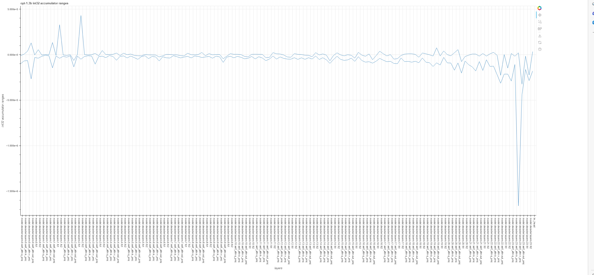
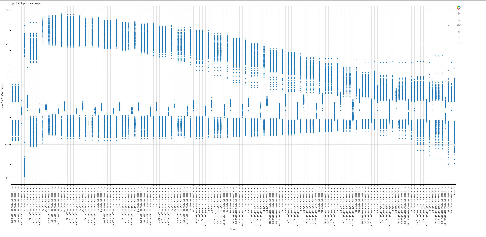

# Caliration & Static Quantization

This document describes how Static Quantization and Calibration are done in VitisAI/transformers software stack.

## Calibration : int32 -> int16 in AIE
AIE accumulator converts int32 to int16 before transmitting data to DDR. This scale factor is calculated via calibration process described below.

1. SmoothQuant + Quantize the model.
2. Insert custom linear node that represents compute in AIE as described in this 
3. Steps 6 and 7 are emulated in CPU in custom linear node.
4. Capture data after step 6 and collect statistics.
5. Statistics are collected for OPT1.3B model on wikitext2-raw dataset.
6. Min, max of this int32 across all layers represents the extent to which int32 accumulator overflows. Based on this, a scale factor is calculated as ```max(abs(data))/2**16```. It is ceiled to nearest ```2**k``` and ***k*** is used as ```requantize_out_scale```.
7. This process is achieved by using PyTorch hooks as described in [utils.py](../../../tools/utils.py).

The image below shows int32 data distribution on OPT1.3b.



```
python model_calibrate.py --model_name opt1.3b
```
This generates all Bokeh plots and logs under **calibration_<model_name>** directory within current working directory.

## Shape inference
Same script is used to collect shapes of all Linear layers using hooks. This is is in the log file in calibration directory.

## Static Quantization
Same script also collects data ranges of activations (both, inputs and outputs), that are used to find the activation scale factor.
An example graph is shown below that shows distributions of data to calculate scales per layer.


## Weight distribution analysis
```
python analyze_weights_distributions.py --model_name opt-1.3b
```
