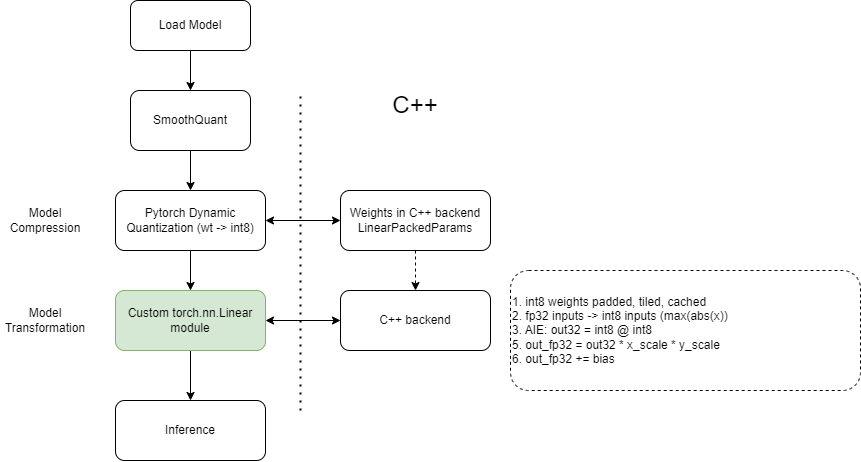
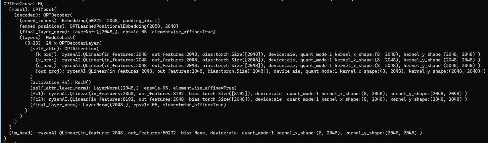
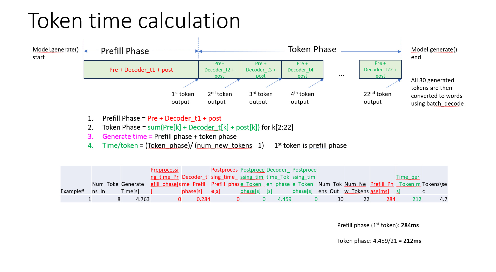

<table align="center" class="sphinxhide" width="100%">
 <tr width="100%">
    <td align="center"><h1>Generative AI on Ryzen AI Software</h1>
    </td>
 </tr>
</table>


<h1 align="center">OPT1.3B - PyTorch Flow</h1>

## Overview

This example shows how to deploy OPT models on IPU using custom IPU+CPU backend in **eager mode**. The flow consists of the sequence of steps enumerated below.
1. Load FP32 or BFloat16 OPT model
2. Perform state-of-the-art [SmoothQuant](https://arxiv.org/pdf/2211.10438.pdf) to condition weights before quantization.
3. Quantize the model using PyTorch's dynamic quantization
4. Identify quantized linear nodes in the model
5. Replace each quantized linear node with a custom Linear node (QLinear)
6. Initialize weights through Torch's PackedParams
7. Pad, tile and cache weights as initialization step
8. Run inference - benchmark, decode or measure perplexity

In this flow, compute primitives are choses to optimize prompt/prefill phase and token phase, both independently.
<br/><br/>

<div align="center">

<p>OPT PyTorch Eager Mode Flow</p>
</div>

<br/><br/>

**Model Structure**

This image shows model structure after quantizing and replacing Linear node with IPU custom linear node.


**Model Variants**

OPT has several variants: **opt-125m, opt-350m, opt-1.3b, opt-2.7b, opt-6.7b, opt-13b, etc.**. The user can select any model variant for this example but the upper limit is dependent on the system memory capacity. ***For Ryzen-AI, limit to opt1.3b***. 

Max. sequence length of model is 2048  (max. position embeddings), i.e. maximum number of tokens in input prompt. 

## Step 1- Quantize and save model weights
```
python save_weights.py --action save --model_name opt-1.3b
```
This saves 3 sets of weights. 

1. "quantized_<model_name>_float32.pth" - All linear ops are int8 dynamic quantized, while all other ops are in float32
2. "quantized_<model_name>_bfloat16.pth" - All linear ops are int8 dynamic quantized, while all other ops are in bfloat16
3. "weights_<model_name>" directory for onnx

## Step 2 - Run using run.py
This script gives option to do the following:
* Benchmark code - measure time/token latency
* Calculate perplexity score
* Profile code using PyTorch profiler
* Decode a set of prompts to show model liveliness

```
python run.py --help
run.py [-h] [--model_name {opt-125m,opt-350m,opt-1.3b,opt-2.7b,opt-6.7b,opt-13b,opt-30b}] [--target {cpu,aie}] [--dtype {bfloat16,float32}]
              [--quant_mode {none,ptdq}] [--smoothquant] [--amdopt] [--dataset {non-raw,raw}] [--load] [--flash_attention]
              [--num_torch_threads {1,2,3,4,5,6,7,8}] [--task {decode,benchmark,benchmark_long,perplexity,torchprofile}] [--impl {v0,v1}]

optional arguments:
  -h, --help            show this help message and exit
  --model_name {opt-125m,opt-350m,opt-1.3b,opt-2.7b,opt-6.7b,opt-13b,opt-30b}
                        Different OPT model sizes
  --target {cpu,aie}    cpu, aie
  --dtype {bfloat16,float32}
                        All ops other than linear ops in bfloat16 or float32
  --quant_mode {none,ptdq}
                        Quantization mode - none, dynamic or static quant
  --smoothquant         Enable smoothquant
  --amdopt              Use OPT from local folder - with profile instrumentation: use without --load
  --dataset {non-raw,raw}
                        Dataset - wikitext2-raw-v1, wikitext2-v1
  --load                Load quantized weights from checkpoint
  --flash_attention     Enable flash attention
  --num_torch_threads {1,2,3,4,5,6,7,8}
                        Number of torch threads
  --task {decode,benchmark,benchmark_long,perplexity,torchprofile}
                        perplexity: Measure perplexity on wikitext2 dataset; benchmark: Benchmark latency w.r.t prompt length; benchmark_long: Benchmark long
                        sequences (compare with flash attn); decode: Decode set of prompts; torchprofile: profile using torch profiler for decode
  --impl {v0,v1}        Choose between different implementations for aie target
```

## Logifles
Each run generates a log directory "log_<model_name>" and all logs are within this directory. 

Each run generatses 2 log files in the "log_<model_name>" directory

For example:
```
logs_opt-1.3b\log_opt-1.3b_aie_ptdq_float32.log
logs_opt-1.3b\log_opt-1.3b_aie_ptdq_float32_profile.log
```
*_profile.log file has details about time/token latency. 

### Decode prompts example
```
python run.py --model_name opt-1.3b --load --smoothquant --quant_mode ptdq --target aie --task decode
...
...

****************************************
prompt: What is the meaning of life?
response: What is the meaning of life?

The meaning of life is the question that is asked by many people. The meaning of life is the
****************************************
prompt: What does Xilinx do?
response: What does Xilinx do?

Xilinx is a global leader in the design and manufacture of integrated circuits, software, and services
****************************************
prompt: What is recursion?
response: What is recursion?

Recursion is a mathematical concept that describes the relationship between two or more mathematical operations. It is a mathematical concept
****************************************
```

### Perplexity scores#
Perplexity is measured using negative log likelihood scores.
***Perplexity measurement takes 3-4hrs to coimplete on wikitext2-raw test set***
***Lower value is better***
* Max. sequence length of model = 2048  (max. position embeddings of opt-1.3b)

Baseline: V100 (FP32) : **14.6240**

The following numbers are on RyzenAI
| **Precision+Config** | **opt-1.3b CPU** | **opt-1.3b AIE**
|---------------|----------|---------|
FP32                                                                 |  14.2637 | na
FP32, Flash Attention v2                                             |  14.9346 | na
BF16, Flash Attention v2                                             |  14.9772 | na
int8 GEMM (PTDQ), other ops FP32                                     | 231.6443 | 16.1019
int8 GEMM (SmoothQuant + PTDQ), other ops FP32                       |  15.5526 | 15.0677
int8 GEMM (SmoothQuant + PTDQ), other ops FP32, Flash Attention v2   |  15.4157 | 15.2020
int8 GEMM (SmoothQuant + PTDQ), other ops BF16                       |    na    | 14.9346
int8 GEMM (SmoothQuant + PTDQ), other ops BF16, Flash Attention v2   |    na    | 15.0854

### Profiling
To get these numbers with timer instrumented in the model use "--amdopt" option.

The token time is calculation is explained as follows:




### Example decode with short prompt 

First example in this test was used to explain the profiling distribution in the above figure.

```
python run.py --model_name opt-1.3b --target aie --quant_mode ptdq --task decode --smoothquant --amdopt

Example#:1      Prompt-len:8    New-tokens-generated:22 Total-time:4.718s       Prefill-phase:286.788ms Time/token:210ms        Tokens/sec:4.8
Example#:2      Prompt-len:9    New-tokens-generated:21 Total-time:4.669s       Prefill-phase:447.838ms Time/token:210ms        Tokens/sec:4.8
Example#:3      Prompt-len:8    New-tokens-generated:22 Total-time:4.814s       Prefill-phase:291.587ms Time/token:214ms        Tokens/sec:4.7
Example#:4      Prompt-len:8    New-tokens-generated:22 Total-time:4.842s       Prefill-phase:295.349ms Time/token:216ms        Tokens/sec:4.6
Example#:5      Prompt-len:6    New-tokens-generated:24 Total-time:5.166s       Prefill-phase:283.443ms Time/token:211ms        Tokens/sec:4.7
Example#:6      Prompt-len:6    New-tokens-generated:24 Total-time:5.139s       Prefill-phase:270.482ms Time/token:210ms        Tokens/sec:4.8
Example#:7      Prompt-len:8    New-tokens-generated:22 Total-time:4.708s       Prefill-phase:283.991ms Time/token:210ms        Tokens/sec:4.8
Example#:8      Prompt-len:7    New-tokens-generated:23 Total-time:4.973s       Prefill-phase:260.300ms Time/token:214ms        Tokens/sec:4.7
Example#:9      Prompt-len:7    New-tokens-generated:23 Total-time:4.977s       Prefill-phase:281.081ms Time/token:212ms        Tokens/sec:4.7
Example#:10     Prompt-len:7    New-tokens-generated:23 Total-time:4.979s       Prefill-phase:277.971ms Time/token:213ms        Tokens/sec:4.7
```

### Profiling with shorter prompt lengths - (8-256)

```
python run.py --model_name opt-1.3b --target aie --quant_mode ptdq --task benchmark --smoothquant --amdopt

Example#:1      Prompt-len:8    New-tokens-generated:11 Total-time:2.347s       Prefill-phase:285.537ms         Time/token:202ms        Tokens/sec:5.0
Example#:2      Prompt-len:16   New-tokens-generated:11 Total-time:2.675s       Prefill-phase:527.203ms         Time/token:211ms        Tokens/sec:4.7
Example#:3      Prompt-len:32   New-tokens-generated:11 Total-time:3.071s       Prefill-phase:966.752ms         Time/token:210ms        Tokens/sec:4.8
Example#:4      Prompt-len:64   New-tokens-generated:11 Total-time:4.078s       Prefill-phase:1914.224ms        Time/token:212ms        Tokens/sec:4.7
Example#:5      Prompt-len:128  New-tokens-generated:11 Total-time:6.156s       Prefill-phase:3967.312ms        Time/token:217ms        Tokens/sec:4.6
Example#:6      Prompt-len:256  New-tokens-generated:11 Total-time:10.425s      Prefill-phase:8171.777ms        Time/token:224ms        Tokens/sec:4.5
```

```
python run.py --model_name opt-1.3b --target aie --quant_mode ptdq --task benchmark --smoothquant --amdopt --impl v1

Example#:1      Prompt-len:8    New-tokens-generated:11 Total-time:1.687s       Prefill-phase:249.785ms         Time/token:144ms        Tokens/sec:7.0
Example#:2      Prompt-len:16   New-tokens-generated:11 Total-time:1.762s       Prefill-phase:317.857ms         Time/token:144ms        Tokens/sec:7.0
Example#:3      Prompt-len:32   New-tokens-generated:11 Total-time:1.925s       Prefill-phase:458.341ms         Time/token:147ms        Tokens/sec:6.8
Example#:4      Prompt-len:64   New-tokens-generated:11 Total-time:2.360s       Prefill-phase:885.597ms         Time/token:147ms        Tokens/sec:6.8
Example#:5      Prompt-len:128  New-tokens-generated:11 Total-time:3.413s       Prefill-phase:1890.364ms        Time/token:152ms        Tokens/sec:6.6
Example#:6      Prompt-len:256  New-tokens-generated:11 Total-time:5.797s       Prefill-phase:4192.664ms        Time/token:159ms        Tokens/sec:6.3
```


### Profiling with larger prompt lengths (512-2000)
```
python run.py --model_name opt-1.3b --target aie --quant_mode ptdq --task benchmark_long --smoothquant --amdopt

Example#:1      Prompt-len:512  New-tokens-generated:11 Total-time:20.888s      Prefill-phase:18388.562ms       Time/token:249ms        Tokens/sec:4.0
Example#:2      Prompt-len:1024 New-tokens-generated:11 Total-time:48.576s      Prefill-phase:45742.353ms       Time/token:281ms        Tokens/sec:3.6
Example#:3      Prompt-len:1536 New-tokens-generated:11 Total-time:83.542s      Prefill-phase:80370.530ms       Time/token:312ms        Tokens/sec:3.2
Example#:4      Prompt-len:2000 New-tokens-generated:11 Total-time:123.326s     Prefill-phase:119817.801ms      Time/token:345ms        Tokens/sec:2.9
```

```
python run.py --model_name opt-1.3b --target aie --quant_mode ptdq --task benchmark_long --smoothquant --amdopt --impl v1

Example#:1      Prompt-len:512  New-tokens-generated:11 Total-time:12.125s      Prefill-phase:10327.900ms       Time/token:180ms        Tokens/sec:5.6
Example#:2      Prompt-len:1024 New-tokens-generated:11 Total-time:31.001s      Prefill-phase:28789.845ms       Time/token:218ms        Tokens/sec:4.6
Example#:3      Prompt-len:1536 New-tokens-generated:11 Total-time:58.502s      Prefill-phase:55960.940ms       Time/token:249ms        Tokens/sec:4.0
Example#:4      Prompt-len:2000 New-tokens-generated:11 Total-time:90.674s      Prefill-phase:87868.308ms       Time/token:275ms        Tokens/sec:3.6
```


### Profiling with larger prompt lengths (512-2000) - with flash attention v2

With Flash Attention, prompt phase improves by ~30%.

```
python run.py --model_name opt-1.3b --target aie --quant_mode ptdq --task benchmark_long --smoothquant --amdopt --flash_attention

Example#:1      Prompt-len:512  New-tokens-generated:11 Total-time:17.986s      Prefill-phase:15513.299ms       Time/token:246ms        Tokens/sec:4.1
Example#:2      Prompt-len:1024 New-tokens-generated:11 Total-time:36.215s      Prefill-phase:33353.406ms       Time/token:284ms        Tokens/sec:3.5
Example#:3      Prompt-len:1536 New-tokens-generated:11 Total-time:57.491s      Prefill-phase:54343.358ms       Time/token:312ms        Tokens/sec:3.2
Example#:4      Prompt-len:2000 New-tokens-generated:11 Total-time:79.551s      Prefill-phase:76172.897ms       Time/token:334ms        Tokens/sec:3.0
```

```
python run.py --model_name opt-1.3b --target aie --quant_mode ptdq --task benchmark_long --smoothquant --amdopt --flash_attention --impl v1

Example#:1      Prompt-len:512  New-tokens-generated:11 Total-time:9.542s       Prefill-phase:7692.367ms        Time/token:184ms        Tokens/sec:5.4
Example#:2      Prompt-len:1024 New-tokens-generated:11 Total-time:19.462s      Prefill-phase:17301.233ms       Time/token:214ms        Tokens/sec:4.7
Example#:3      Prompt-len:1536 New-tokens-generated:11 Total-time:33.995s      Prefill-phase:31474.297ms       Time/token:247ms        Tokens/sec:4.1
Example#:4      Prompt-len:2000 New-tokens-generated:11 Total-time:48.890s      Prefill-phase:46040.540ms       Time/token:278ms        Tokens/sec:3.6
```

# Run OPT Model demo using opt_demo.py
This script gives user option to run the model on any set or prompts with 3 search strategies
```
python opt_demo.py --help
usage: opt_demo.py [-h] [--model_name {opt-125m,opt-350m,opt-1.3b,opt-2.7b,opt-6.7b}] [--target {cpu,aie}] [--quant_mode {none,ptdq}] [--load]

optional arguments:
  -h, --help            show this help message and exit
  --model_name {opt-125m,opt-350m,opt-1.3b,opt-2.7b,opt-6.7b}
                        Different OPT model sizes
  --target {cpu,aie}    cpu, aie
  --quant_mode {none,ptdq}
                        Quantization mode - none, or smoothquant+pytorch dynamic-quant
  --load                Load quantized weights from checkpoint
```

The demo gives user flexibility to provide any prompts, with different search options and output token lengths.
Three search options are provided: ***greedy, stochastic and contrastive***. These search options provide different level of quality to text generation process. User can modify the strengths of parameters in this file. 

***This feature is available without --load option only.***

This is optional, to see individual tokens as they print to the screen in greedy search mode, open the 

```installationfolder\anaconda3\envs\ryzenai-transformers\lib\site-packages\transformers\generation\utils.py```

In ```def greedy_search(...)``` function,  

after ```next_tokens = torch.argmax(next_tokens_scores, dim=-1)```, 

add this new line: ```print(self.tokenizer.decode(next_tokens)) ```

This prints each new token to the screen as the text-generation process unfolds. 

```
python opt_demo.py  --quant_mode ptdq --target aie --load
python opt_demo.py  --quant_mode ptdq --target cpu --load
python opt_demo.py  --quant_mode none --target cpu
```

Here are examples for 3 search options for the same prompt and token length on AIE with SmoothQuant + Pytorch Dynamic Quantization:

```
********************
Enter prompt or 'exit': San Francisco is a city of
Enter response length (1-1000): 30
Enter 0(greedy search) 1(stochastic search) or 2(contrastive search): 0
Setting search to:  Greedy search
San Francisco is a city of contrasts. It’s a city of the arts, of the food, of the people, of the history
********************
Enter prompt or 'exit': San Francisco is a city of
Enter response length (1-1000): 30
Enter 0(greedy search) 1(stochastic search) or 2(contrastive search): 1
Setting search to:  Stochastic search
San Francisco is a city of incredible contrasts. It has the highest concentration of Jews of any city in the world, and it is known as a
********************
Enter prompt or 'exit': San Francisco is a city of
Enter response length (1-1000): 30
Enter 0(greedy search) 1(stochastic search) or 2(contrastive search): 2
Setting search to:  Contrastive search
San Francisco is a city of many cultures.

The city has a long history of immigration and is home to the largest number of immigrants in
********************
```
