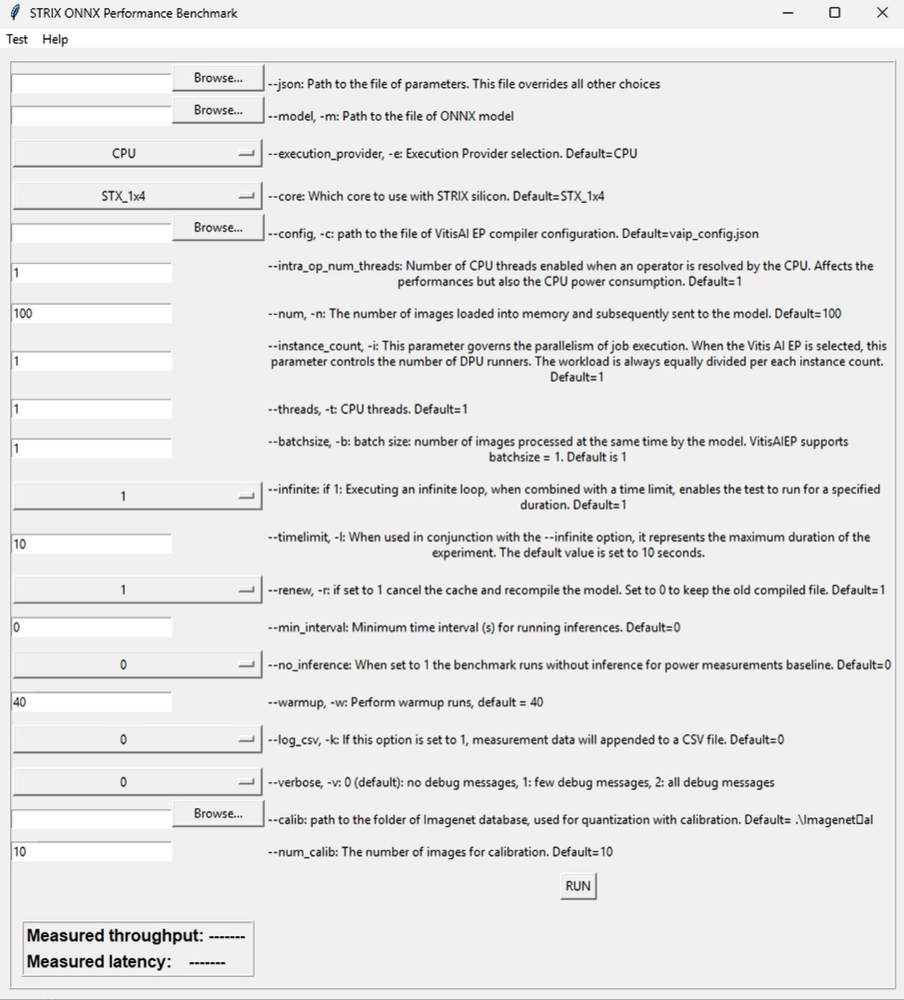

<!--
Copyright © 2023 Advanced Micro Devices, Inc. All rights reserved.
SPDX-License-Identifier: MIT

Author: AMD-Xilinx
-->

<table class="sphinxhide" width="100%">
 <tr width="100%">
    <td align="center"><h1> NPU Benchmark Tool with ONNXRT for Windows OS </h1>
    </td>
 </tr>
</table>

## Table of Contents

<!-- TOC -->

- [RYZENAI-ONNX-CNNs-BENCHMARK](#ryzenai-onnx-cnns-benchmark)
- [1 Introduction](#1-introduction)
  - [1.1 Notes for this release](#11-notes-for-this-release)
- [2 Setup](#2-setup)
  - [2.1 Install Procedure](#21-install-procedure)
- [3 ONNX Benchmark](#3-onnx-benchmark)
  - [3.1 Parameters](#31-parameters)
  - [3.2 Measurement Report](#32-measurement-report)
  - [3.3 Example Usage](#33-example-usage)
    - [3.3.1 GUI for performance benchmarking](#331-gui-for-performance-benchmarking)
    - [3.3.2 Performance with a single instance using a CPU](#332-performance-with-a-single-instance-using-a-cpu)
    - [3.3.3 Performance with a single instance utilizing NPU and model quantization:](#333-performance-with-a-single-instance-utilizing-npu-and-model-quantization)
    - [3.3.4 Performance with single instance with NPU](#334-performance-with-single-instance-with-npu)
    - [3.3.5 Best Throughput: performance with eight instances of 1x4 core](#335-best-throughput-performance-with-eight-instances-of-1x4-core)
    - [3.3.6 Best Latency: performance with one instance of 4x4 core](#336-best-latency-performance-with-one-instance-of-4x4-core)
    - [3.3.7 Performance with single instance with CPU at 30fps fixed rate](#337-performance-with-single-instance-with-cpu-at-30fps-fixed-rate)
    - [3.3.8 File of parameters](#338-file-of-parameters)
- [4 Additional features](#4-additional-features)
  - [4.1 Auto quantization](#41-auto-quantization)
  - [4.2 Tricks](#42-tricks)


# <a name='Title'></a>RYZENAI-ONNX-CNNs-BENCHMARK

# 1 <a name='Introduction'></a>Introduction
The NPU benchmark tool is designed to measure the performance of ONNX-based Convolutional Neural Network (CNN) inference models. Ryzen AI processors combine Ryzen processor cores (CPU) with an AMD Radeon™ graphics engine (GPU) and a dedicated AI engine (NPU).

The 'performance_benchmark.py' tool is capable of reporting:
1. Throughput, measured in frames per second
2. Latency, measured in milliseconds

## 1.1 <a name='Notesforthisrelease'></a>Notes for this release
Windows release supporting PHOENIX and STRIX devices.


# 2 <a name='Setup'></a>Setup
##  2.1 <a name='InstallProcedure'></a>Install Procedure
Pre requisite: have [Anaconda](https://docs.anaconda.com/free/anaconda/install/index.html) or Miniconda installed. 
It is advisable to create two separate Conda environments, one for the external GPU EP (if you have one) and another for the VitisAI EP. The following guideline allows for the creation of a Conda environment with  CPU and VitisAI Execution Providers only.

Follow the instructions from the official [RyzenAI 1.2 Installation](https://ryzenai.docs.amd.com/en/latest/inst.html).

In the command below, please change the Conda environment name and installation path if you have altered them from the default settings.

When the installation is completed, assuming that the generated Conda environment is named `ryzen-ai-1.2.0`, the following packages are needed for the benchmark:

Assumes Anaconda prompt for these instructions.

```
conda activate ryzen-ai-1.2.0
pip install pandas pyarrow matplotlib psutil keyboard pyperclip importlib-metadata
```
Finally, set some permanent variables. Assuming that the installation path is `C:\Program Files\RyzenAI\1.2.0\`:

In case of STRIX device:
```
conda env config vars set XCLBINHOME="C:\Program Files\RyzenAI\1.2.0\voe-4.0-win_amd64\xclbins\strix"
conda env config vars set XLNX_VART_FIRMWARE="C:\Program Files\RyzenAI\1.2.0\voe-4.0-win_amd64\xclbins\strix\AMD_AIE2P_Nx4_Overlay.xclbin"
conda env config vars set XLNX_TARGET_NAME=AMD_AIE2P_Nx4_Overlay
conda env config vars set VAIP_CONFIG_HOME="C:\Program Files\RyzenAI\1.2.0\voe-4.0-win_amd64"
conda deactivate
conda activate ryzen-ai-1.2.0
conda env config vars list
```

In case of PHOENIX device:
```
conda env config vars set XCLBINHOME="C:\Program Files\RyzenAI\1.2.0\voe-4.0-win_amd64\xclbins\phoenix"
conda env config vars set XLNX_VART_FIRMWARE="C:\Program Files\RyzenAI\1.2.0\voe-4.0-win_amd64\xclbins\phoenix\1x4.xclbin"
conda env config vars set XLNX_TARGET_NAME=AMD_AIE2_Nx4_Overlay
conda env config vars set VAIP_CONFIG_HOME="C:\Program Files\RyzenAI\1.2.0\voe-4.0-win_amd64"
conda deactivate
conda activate ryzen-ai-1.2.0
conda env config vars list
```

Downgrade onnx to 1.16.1 to resolve an issue with the 1.16.2 release
https://github.com/onnx/onnx/issues/6267 
```
pip install onnx==1.16.1
```

In case of PHOENIX device:
```
conda env config vars set XCLBINHOME="C:\Program Files\RyzenAI\1.2.0\voe-4.0-win_amd64\xclbins\phoenix"
conda env config vars set XLNX_VART_FIRMWARE="C:\Program Files\RyzenAI\1.2.0\voe-4.0-win_amd64\xclbins\phoenix\1x4.xclbin"
conda env config vars set XLNX_TARGET_NAME=AMD_AIE2_Nx4_Overlay
conda env config vars set VAIP_CONFIG_HOME="C:\Program Files\RyzenAI\1.2.0\voe-4.0-win_amd64"
conda deactivate
conda activate ryzen-ai-1.2.0
conda env config vars list
```

Downgrade onnx to 1.16.1 to resolve an issue with the 1.16.2 release
https://github.com/onnx/onnx/issues/6267 
```
pip install onnx==1.16.1
```


---

#  3 <a name='ONNXBenchmark'></a>ONNX Benchmark
The [performance_benchmark.py](performance_benchmark.py) script can measure the performance and the throughput of ONNX-based CNN inference models running on the Ryzen AI device.

##  3.1 <a name='Parameters'></a>Parameters

The syntax to call the [performance_benchmark.py](performance_benchmark.py) script is the  following:

```
usage: performance_benchmark.py 
[-h] 
[--batchsize BATCHSIZE] 
[--calib CALIB] 
[--config CONFIG] 
[--core PHOENIX: {PHX_1x4,PHX_4x4}, STRIX:{STX_1x4,STX_4x4}] 
[--execution_provider {CPU,VitisAIEP}] 
[--infinite {0,1}]
[--instance_count INSTANCE_COUNT] 
[--intra_op_num_threads INTRA_OP_NUM_THREADS] 
[--json JSON] 
[--log_csv LOG_CSV] 
[--min_interval MIN_INTERVAL] 
[--model MODEL] 
[--no_inference {0,1}] 
[--num NUM] 
[--num_calib NUM_CALIB] 
[--renew {0,1}] 
[--timelimit TIMELIMIT]     
[--threads THREADS] 
[--verbose {0,1,2}] 
[--warmup WARMUP]
```

where all the parameters are checked in the [utilities.py](utilities.py) script:


```
  -h, --help            show this help message and exit
  --batchsize BATCHSIZE, -b BATCHSIZE
                        batch size: number of images processed at the same time by the model. VitisAIEP supports batchsize = 1. Default is 1
  --calib CALIB         path to Imagenet database, used for quantization with calibration. Default= .\Imagenet al
  --config CONFIG, -c CONFIG
                        path to config json file. Default= <release>\vaip_config.json
  --core PHOENIX: {PHX_1x4,PHX_4x4}, STRIX:{STX_1x4,STX_4x4}
                        Which core to use on PHOENIX or STRIX silicon. Possible values are 1x4 and 4x4. Default=STX_1x4
  --execution_provider {CPU,VitisAIEP}, -e {CPU,VitisAIEP}
                        Execution Provider selection. Default=CPU
  --infinite {0,1}      if 1: Executing an infinite loop, when combined with a time limit, enables the test to run for a specified duration. Default=1
  --instance_count INSTANCE_COUNT, -i INSTANCE_COUNT
                        This parameter governs the parallelism of job execution. When the Vitis AI EP is selected, this parameter controls the number of DPU runners. The workload is always
                        equally divided per each instance count. Default=1
  --intra_op_num_threads INTRA_OP_NUM_THREADS
                        In general this parameter controls the total number of INTRA threads to use to run the model. INTRA = parallelize computation inside each operator. Specific for VitisAI     
                        EP: number of CPU threads enabled when an operator is resolved by the CPU. Affects the performances but also the CPU power consumption. For best performance: set
                        intra_op_num_threads to 0: INTRA Threads Total = Number of physical CPU Cores. For best power efficiency: set intra_op_num_threads to smallest number (>0) that sustains     
                        the close to optimal performance (likely 1 for most cases of models running on DPU). Default=1
  --json JSON           Path to the file of parameters.
  --log_csv LOG_CSV, -k LOG_CSV
                        If this option is set to 1, measurement data will appended to a CSV file. Default=0
  --min_interval MIN_INTERVAL
                        Minimum time interval (s) for running inferences. Default=0
  --model MODEL, -m MODEL
                        Path to the ONNX model
  --no_inference {0,1}  When set to 1 the benchmark runs without inference for power measurements baseline. Default=0
  --num NUM, -n NUM     The number of images loaded into memory and subsequently sent to the model. Default=100
  --num_calib NUM_CALIB
                        The number of images for calibration. Default=10
  --renew {0,1}, -r {0,1}
                        if set to 1 cancel the cache and recompile the model. Set to 0 to keep the old compiled file. Default=1
  --timelimit TIMELIMIT, -l TIMELIMIT
                        When used in conjunction with the --infinite option, it represents the maximum duration of the experiment. The default value is set to 10 seconds.
  --threads THREADS, -t THREADS
                        CPU threads. Default=1
  --verbose {0,1,2}, -v {0,1,2}
                        0 (default): no debug messages, 1: few debug messages, 2: all debug messages
  --warmup WARMUP, -w WARMUP
                        Perform warmup runs, default = 40

```

## 3.2 <a name='MeasurementReport'></a>Measurement Report
The report consolidates performance measurements along with system, resources, and environmental snapshots into either a JSON or CSV file. 
Each measurement is automatically saved in the file `report_performance.json`, along with the testing configuration. Each measurement can be appended to a CSV file with the option ```--log_csv``` or ```-k```.

## 3.3 <a name='ExampleUsage'></a>Example Usage

###  3.3.1 <a name='AGUIforperformancebenchmarking'></a>GUI for performance benchmarking
This user-friendly graphical interface is designed to assist users in composing command lines and launching programs with all parameters preset. All option defaults are preloaded. The GUI adapts and automatically updates the available options based on the detected processor (PHOENIX or STRIX).
```
python gui_pb.py
```



###  3.3.2 <a name='PerformancewithasingleinstanceusingaCPU'></a>Performance with a single instance using a CPU
This experiment involves repeatedly performing inferences on a batch of 100 images ```-n 100```, sending one image at a time to the CPU ```-e CPU```, where a FP32 Resnet50 model is used ```-m .\models\resnet50\resnet50_fp32.onnx```
```
python performance_benchmark.py -m .\models\resnet50\resnet50_fp32.onnx -n 100 -e CPU
```
###  3.3.3 <a name='PerformancewithasingleinstanceutilizingNPUandmodelquantization:'></a>Performance with a single instance utilizing NPU and model quantization:
To ensure smooth execution of this example, it is advisable to download a set of Imagenet pictures in advance, typically around 100 images should suffice. When the VitisAI EP is chosen and the model is in FP32 format, the tool endeavors to quantize the model before conducting tests. It is imperative to specify the path to a folder containing images using the ```--calib ...``` parameter. Additionally, ```--num_images 10``` randomly selects and copies ten images from the dataset into a calibration folder.

```
python performance_benchmark.py -m .\models\resnet50\resnet50_fp32.onnx -n 100 -e VitisAIEP --calib .\<images folder> --num_calib 10
```

Please be aware that a new model with the suffix ```_int8``` will be generated in the same folder as the original FP32 model.

###  3.3.4 <a name='PerformancewithsingleinstancewithNPU'></a>Performance with single instance with NPU
This experiment involves repeatedly performing inferences on a batch of 100 images ```-n 100```, sending one image at a time to the NPU ```-e VitisAIEP```: most operators are processed by the NPU. When the NPU is used  a configuration file is loaded from the installation folder by default, or a custom configuration can be assigned if available: ```--config .\models\resnet50\vaip_config_custom.json```. The compiler will load the quantized model ```-m .\models\resnet50\resnet50_fp32_qdq.onnx```, and store the compiled model in a cache folder. Finally, the images are sent to the compiled model to be processed. The provided information includes the ratio of operators assigned to the CPU and those assigned to the NPU.
```
python performance_benchmark.py -m .\models\resnet50\resnet50_fp32_qdq.onnx -n 100 -e VitisAIEP
```


###  3.3.5 <a name='PerformancewithfourinstanceswithNPUandforcerecompiling'></a>Best Throughput: performance with eight instances of 1x4 core 
The NPU four rows x four columns core is optimized for latency. The one row x four columns core is optimized for throughput and flexibility.
The best throughput is achieved when eight instances of 1x4 are used. It is recommended to use more than eight threads for optimal performance. Fore PHOENIX, no more than four instances can be used.
In this STRIX experiment, we employ eight models operating in parallel, as opposed to just one as seen in previous examples. This enables us to enhance the throughput, allowing for a higher number of images processed per unit of time. The presence of eight instances of the model (specified by ```-i 8```) must also be accompanied by an increased number of CPU threads (specified by ```-t 12```).
Force recompiling: if the model has already been compiled and the cache is present, the compiler will reuse the cached model to save time. However, if configuration files, xclbin, or the Anaconda environment have changed, it is necessary to clear the cache to recompile the model.
Please use the option ```-r 1``` to clear the cache.
```
python performance_benchmark.py -m .\models\resnet50\resnet50_fp32_qdq.onnx -n 100 -e VitisAIEP -i 8 -t 12 -r 1
```

###  3.3.6 <a name='PerformancewithwithNPUoneinstanceof4x4core'></a>Best Latency: performance with one instance of 4x4 core
The NPU four rows x four columns core is optimized for latency. The one row x four columns core is optimized for throughput and flexibility.
In this STRIX example, the 4x4 core is used ```--core STX_4x4```. If you have been following the sequence of experiments, previously the model was compiled for the default STX_1x4 core configuration. Therefore, the cache needs to be cleared using ```-r 1```, and the model needs to be recompiled for the new core configuration.
```
python performance_benchmark.py -m .\models\resnet50\resnet50_fp32_qdq.onnx -n 100 -e VitisAIEP -i 1 -t 1 -r 1 --core STX_4x4
```

###  3.3.7 <a name='PerformancewithsingleinstancewithCPUat30fpsfixedrate'></a>Performance with single instance with CPU at 30fps fixed rate
In certain scenarios, it might be necessary to fine-tune the minimum latency, and this can be accomplished through the ```--min_interval``` option. For instance, adding a delay of 0.033 seconds is employed to simulate live video at a consistent 30 frames per second. Thus, we set the delay to 1/30 (0.033 s). In this context, the option is utilized alongside multithreading to ensure the CPU can maintain the desired framerate, even if the latency exceeds 33 milliseconds.
```
python performance_benchmark.py -m .\models\resnet50\resnet50_fp32.onnx -n 100 -e CPU --min_interval 0.033
```

###  3.3.8 <a name='Fileofparameters'></a>File of parameters
As the number of input parameters increases, it can become convenient to supply a file containing all of them. This method aids in consistently reproducing the same experiment. For instance, the two cases below are optimized for either low latency or high throughput. The file of parameters overrides all other parameters.
```
python performance_benchmark.py --json .\test\STX_resnet50_high_throughput.json
python performance_benchmark.py --json .\test\STX_resnet50_low_latency.json
```
# 4 Additional features
## 4.1 <a name='Autoquantization'></a>Auto quantization
If the model benchmarked with VitisAI EP is not quantized, the benchmarking process will automatically apply quantization using the NHWC order. A notification in magenta will be displayed during the quantization process.
Prior to quantization, the user is required to download some images, for example from the ImageNet database and specify the path to its location. Once quantization is completed, a new model named int8.onnx will be saved in the current directory and tested.
```
python performance_benchmark.py -m ".\models\resnet50\resnet50_fp32.onnx" -e VitisAIEP --calib <images folder> --num_calib 10
```

## 4.2 Tricks
Once executed in the GUI, the equivalent command line is copied to the clipboard, making it easy to paste into the terminal.
