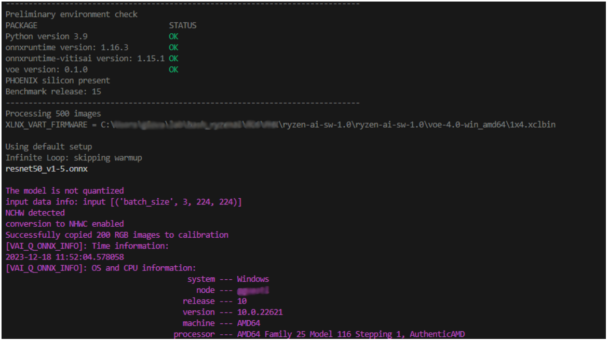

<!--
Copyright © 2023 Advanced Micro Devices, Inc. All rights reserved.
SPDX-License-Identifier: MIT

Author: AMD-Xilinx
-->

<table class="sphinxhide" width="100%">
 <tr width="100%">
    <td align="center"><h1> NPU Benchmark Tool with ONNXRT for Windows OS </h1>
    </td>
 </tr>
</table>


##  1. <a name='TableofContents'></a>Table of Contents

<!-- vscode-markdown-toc -->
* 1. [Table of Contents](#TableofContents)
* 2. [ Introduction](#Introduction)
* 3. [Setup](#Setup)
	* 3.1. [Install Procedure](#InstallProcedure)
		* 3.1.1. [Verify the EP available in the environment](#VerifytheEPavailableintheenvironment)
* 4. [ONNX Benchmark](#ONNXBenchmark)
	* 4.1. [Parameters](#Parameters)
	* 4.2. [Measurement Report](#MeasurementReport)
	* 4.3. [Example Usage](#ExampleUsage)
		* 4.3.1. [1. Performance with a single instance using a CPU](#PerformancewithasingleinstanceusingaCPU)
		* 4.3.2. [2. Performance with a single instance utilizing NPU and model quantization:](#PerformancewithasingleinstanceutilizingNPUandmodelquantization:)
		* 4.3.3. [3. Performance with single instance with NPU](#PerformancewithsingleinstancewithNPU)
		* 4.3.4. [4. Performance with four instances with NPU and force recompiling](#PerformancewithfourinstanceswithNPUandforcerecompiling)
		* 4.3.5. [5. Performance with with NPU, one instance of 4x4 core](#PerformancewithwithNPUoneinstanceof4x4core)
		* 4.3.6. [6. Performance with single instance with CPU at 30fps fixed rate](#PerformancewithsingleinstancewithCPUat30fpsfixedrate)
		* 4.3.7. [7. File of parameters](#Fileofparameters)
* 5. [Auto quantization feature](#Autoquantizationfeature)
* 6. [GUI for quantization and performance benchmarking](#GUIforquantizationandperformancebenchmarking)

<!-- vscode-markdown-toc-config
	numbering=true
	autoSave=true
	/vscode-markdown-toc-config -->
<!-- /vscode-markdown-toc -->

##  2. <a name='Introduction'></a> Introduction

The NPU benchmark tool is designed to measure the performance of ONNX-based Convolutional Neural Network (CNN) inference models when run on computers equipped with a Ryzen AI processor.  Ryzen AI processors combine Ryzen processor cores (CPU) with an AMD Radeon™ graphics engine (GPU) and a dedicated AI engine (NPU).

The 'performance_benchmark.py' tool is capable of reporting:
1. Throughput, measured in frames per second
2. Latency, measured in milliseconds

NOTE: This tool has been primarily tested on the Ryzen 9 7940HS processor.

##  3. <a name='Setup'></a>Setup
###  3.1. <a name='InstallProcedure'></a>Install Procedure
Pre requisite: have [Anaconda](https://docs.anaconda.com/free/anaconda/install/index.html) or Miniconda installed. 
It is advisable to create two separate Conda environments, one for the external GPU EP (if you have one) and another for the VitisAI EP. The following guideline allows for the creation of a Conda environment with only CPU and VitisAI Execution Providers.


| Installation steps | Notes |
| :--- | :--- |
| Install the IPU Driver | This step is detailed [here](https://ryzenai.docs.amd.com/en/latest/inst.html#prepare-client-device). Ensure that the IPU driver is installed from Device Manager -> System Devices -> AMD IPU Device 
| Install the Vitis AI EP Package in a dedicated Conda environment | This step is described [here](https://ryzenai.docs.amd.com/en/latest/inst.html#installation-steps). A new conda environment named ryzenai-\<release\> will be created.|
| Complete the benchmark setup | Once activated the conda environment with ```conda activate ryzenai-<release>```, run the batch script ```setup.bat``` : this will copy locally all xclbin files, the configuration file ```vaip_config.json``` and add additional packages to the conda environment|


####  3.1.1. <a name='VerifytheEPavailableintheenvironment'></a>Verify the EP available in the environment
The Execution Providers available in the conda environment can be visualized as follows:
```
conda activate <env name>
python
>>> import onnxruntime as ort
>>> ort.get_available_providers()
>>> quit()
```
If the environment is set up correctly, you should be able to find "VitisAIExecutionProvider" in the list of providers.

##  4. <a name='ONNXBenchmark'></a>ONNX Benchmark
The [performance_benchmark.py](performance_benchmark.py) script is the tool to measure  performance and throughput of ONNX-based CNN inference models running on the Ryzen AI device.

###  4.1. <a name='Parameters'></a>Parameters

The syntax to call the [performance_benchmark.py](performance_benchmark.py) script is the  following:

```
usage: performance_benchmark.py 
[-h] 
[--batchsize BATCHSIZE] 
[--calib CALIB] 
[--config CONFIG] 
[--core {1x4,4x4}] 
[--device {CPU,VitisAIEP}] 
[--infinite {0,1}]                                   
[--instance_count INSTANCE_COUNT] 
[--intra_op_num_threads INTRA_OP_NUM_THREADS] 
[--json JSON] 
[--log_csv LOG_CSV] 
[--log_json LOG_JSON]
[--min_interval MIN_INTERVAL] 
[--model MODEL] 
[--no_inference {0,1}] 
[--num NUM] 
[--num_calib NUM_CALIB] 
[--renew {0,1}] 
[--timelimit TIMELIMIT]
[--threads THREADS] 
[--verbose {0,1,2}] 
[--warmup WARMUP]
```

where all the parameters are checked in the [utilities.py](utilities.py) script:


```
  -h, --help            show this help message and exit
  --batchsize BATCHSIZE, -b BATCHSIZE
                        batch size: number of images processed at the same time by the model. VitisAIEP supports batchsize = 1. Default is 1
  --calib CALIB         path to Imagenet database, used for quantization with calibration. Default= .\Imagenet al
  --config CONFIG, -c CONFIG
                        path to config json file. Default=vaip_config.json
  --core {1x4,4x4}      Which core to use. Possible values are 1x4 and 4x4. Default=1x4
  --device {CPU,VitisAIEP}, -d {CPU,VitisAIEP}
                        Execution Provider selection. Default=CPU
  --infinite {0,1}      if 1: Executing an infinite loop, when combined with a time limit, enables the test to run for a specified duration. Default=1
  --instance_count INSTANCE_COUNT, -i INSTANCE_COUNT
                        This parameter governs the parallelism of job execution. When the Vitis AI EP is selected, this parameter controls the number of DPU runners. The workload is always      
                        equally divided per each instance count. Default=1
  --intra_op_num_threads INTRA_OP_NUM_THREADS
                        In general this parameter controls the total number of INTRA threads to use to run the model. INTRA = parallelize computation inside each operator. Specific for VitisAI EP: number of CPU threads enabled when an operator is resolved by the CPU. Affects the performances but also the CPU power consumption. For best performance: set intra_op_num_threads to 0: INTRA Threads Total = Number of physical CPU Cores. For best power efficiency: set intra_op_num_threads to smallest number (>0) that sustains the close to optimal performance (likely 1 for most cases of models running on DPU). Default=2   
  --json JSON           Path to the file of parameters.
  --log_csv LOG_CSV, -k LOG_CSV
                        If this option is set to 1, measurement data will appended to a CSV file. Default=0
  --log_json LOG_JSON, -j LOG_JSON
                        JSON file name where the measureemnts will be saved. Default = report_performance.json
  --min_interval MIN_INTERVAL
                        Minimum time interval (s) for running inferences. Default=0
  --model MODEL, -m MODEL
                        Path to the ONNX model
  --no_inference {0,1}  When set to 1 the benchmark runs without inference for power measurements baseline. Default=0
  --num NUM, -n NUM     The number of images loaded into memory and subsequently sent to the model. Default=100
  --num_calib NUM_CALIB
                        The number of images for calibration. Default=10
  --renew {0,1}, -r {0,1}
                        if set to 1 cancel the cache and recompile the model. Set to 0 to keep the old compiled file. Default=1
  --timelimit TIMELIMIT, -l TIMELIMIT
                        When used in conjunction with the --infinite option, it represents the maximum duration of the experiment. The default value is set to 10 seconds.
  --threads THREADS, -t THREADS
                        CPU threads. Default=1
  --verbose {0,1,2}, -v {0,1,2}
                        0 (default): no debug messages, 1: few debug messages, 2: all debug messages
  --warmup WARMUP, -w WARMUP
                        Perform warmup runs, default = 40

```

###  4.2. <a name='MeasurementReport'></a>Measurement Report
The report consolidates performance measurements along with system, resources, and environmental snapshots into either a JSON or CSV file. 
Saving as a JSON file is facilitated by using the option ```--log_json``` or ```-j```, while saving as a CSV file is enabled with the option ```--log_csv``` or ```-k```.

###  4.3. <a name='ExampleUsage'></a>Example Usage

####  4.3.1. <a name='PerformancewithasingleinstanceusingaCPU'></a>1. Performance with a single instance using a CPU
This experiment involves repeatedly performing inferences on a batch of 100 images ```-n 100```, sending one image at a time to the CPU ```-d CPU```, where a FP32 Resnet50 model is used ```-m .\models\resnet50\resnet50_fp32.onnx```
```
python performance_benchmark.py -m .\models\resnet50\resnet50_fp32.onnx -n 100 -d CPU
```
####  4.3.2. <a name='PerformancewithasingleinstanceutilizingNPUandmodelquantization:'></a>2. Performance with a single instance utilizing NPU and model quantization:
To ensure smooth execution of this example, it is advisable to download a set of Imagenet pictures in advance, typically around 100 images should suffice. When the VitisAI EP is chosen and the model is in FP32 format, the tool endeavors to quantize the model before conducting tests. It is imperative to specify the path to a folder containing images using the ```--calib ...``` parameter. Additionally, ```--num_images 10``` randomly selects and copies ten images from the dataset into a calibration folder.

```
python performance_benchmark.py -m .\models\resnet50\resnet50_fp32.onnx -n 100 -d VitisAIEP --calib .\Imagenet_small --num_calib 10
```

Please be aware that a new model with the suffix ```_int8``` will be generated in the same folder as the original FP32 model.

####  4.3.3. <a name='PerformancewithsingleinstancewithNPU'></a>3. Performance with single instance with NPU
This experiment involves repeatedly performing inferences on a batch of 100 images ```-n 100```, sending one image at a time to the NPU ```-d VitisAIEP```: most operators are processed by the NPU. When the NPU is used  a configuration file is loaded from the installation folder by default, or a custom configuration can be assigned if available: ```--config .\models\resnet50\vaip_config_custom.json```. The compiler will load the quantized model ```-m .\models\resnet50\resnet50_int8.onnx```, and store the compiled model in a cache folder. Finally, the images are sent to the compiled model to be processed. The provided information includes the ratio of operators assigned to the CPU and those assigned to the NPU.
```
python performance_benchmark.py -m .\models\resnet50\resnet50_fp32_int8.onnx -n 100 -d VitisAIEP
```


####  4.3.4. <a name='PerformancewithfourinstanceswithNPUandforcerecompiling'></a>4. Performance with four instances with NPU and force recompiling 
If the model had already been compiled before, and the cache is already present, the compiler will reuse the model in the cache to save time. However, sometimes, for instance, if configuration files, xclbin, or the Anaconda environment are changed, it is necessary to clear the cache so that the model is recompiled.
Please use the option ```-r 1``` to clear the cache.
Additionally, in this experiment, we employ four models operating in parallel, as opposed to just one as seen in previous examples. This enables us to enhance the throughput, allowing for a higher number of images processed per unit of time. The presence of four instances of the model (specified by ```-i 4```) must also be accompanied by an increased number of CPU threads (specified by ```-t 4```).

```
python performance_benchmark.py -m .\models\resnet50\resnet50_fp32_int8.onnx -n 100 -d VitisAIEP -i 4 -t 4 -r 1
```

####  4.3.5. <a name='PerformancewithwithNPUoneinstanceof4x4core'></a>5. Performance with with NPU, one instance of 4x4 core
Two cores are provided, optimized for different purposes: 1x4.xclbin, which is optimized for flexibility as more cores can operate in parallel, and 4x4.xclbin optimized for performance. In this example, the 4x4 core is used ```--core 4x4```. If you have been following the sequence of experiments, previously the model was compiled for the 1x4 core configuration. Therefore, the cache needs to be cleared using ```-r 1```, and the model needs to be recompiled for the 4x4 core configuration.
```
python performance_benchmark.py -m .\models\resnet50\resnet50_fp32_int8.onnx -n 100 -d VitisAIEP -i 1 -t 1 -r 1 --core 4x4
```

####  4.3.6. <a name='PerformancewithsingleinstancewithCPUat30fpsfixedrate'></a>6. Performance with single instance with CPU at 30fps fixed rate
In certain scenarios, it might be necessary to fine-tune the minimum latency, and this can be accomplished through the ```--min_interval``` option. For instance, adding a delay of 0.033 seconds is employed to simulate live video at a consistent 30 frames per second. Thus, we set the delay to 1/30 (0.033 s). In this context, the option is utilized alongside multithreading to ensure the CPU can maintain the desired framerate, even if the latency exceeds 33 milliseconds.
```
python performance_benchmark.py -m .\models\resnet50\resnet50_fp32.onnx -n 100 -d CPU -t 2 --min_interval 0.033
```

####  4.3.7. <a name='Fileofparameters'></a>7. File of parameters
As the number of input parameters increases, it can become convenient to supply a file containing all of them. This method aids in consistently reproducing the same experiment. For instance, the two cases below are optimized for either low latency or high throughput.
```
python performance_benchmark.py --json .\test\resnet50_latency.json
python performance_benchmark.py --json .\test\resnet50_throughput.json
```

##  5. <a name='Autoquantizationfeature'></a>Auto quantization feature
If the model benchmarked with VitisAI EP is not quantized, the benchmarking process will automatically apply quantization using the NHWC order. A notification in magenta will be displayed during the quantization process.
Prior to quantization, the user is required to download the ImageNet database and specify the path to its location. Once quantization is completed, a new model named int8.onnx will be saved in the current directory and tested.
```
python performance_benchmark.py -m "<path to the onnx model>\FP32model.onnx" -d VitisAIEP --calib "<path to images database>" --num_calib 10
```


##  6. <a name='GUIforquantizationandperformancebenchmarking'></a>GUI for quantization and performance benchmarking
These simple graphical user interface is designed to assist users in composing the command line and launching the program with all parameters pre-set.
```
python gui_pb.py
```
