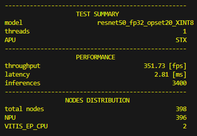
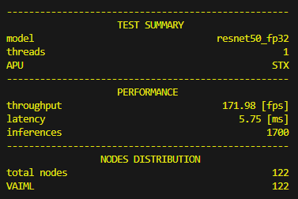
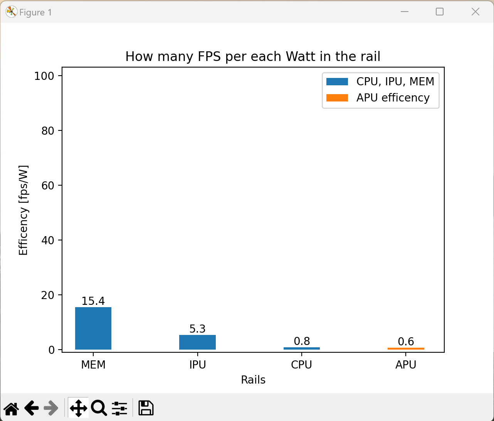
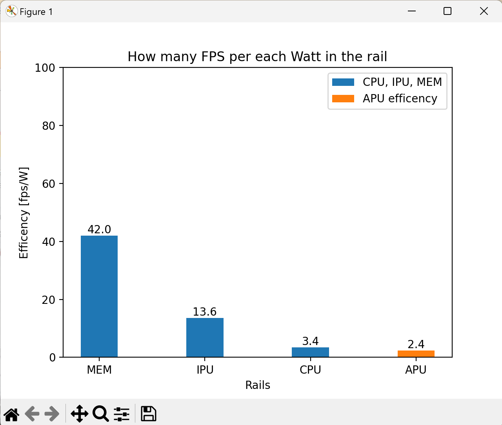
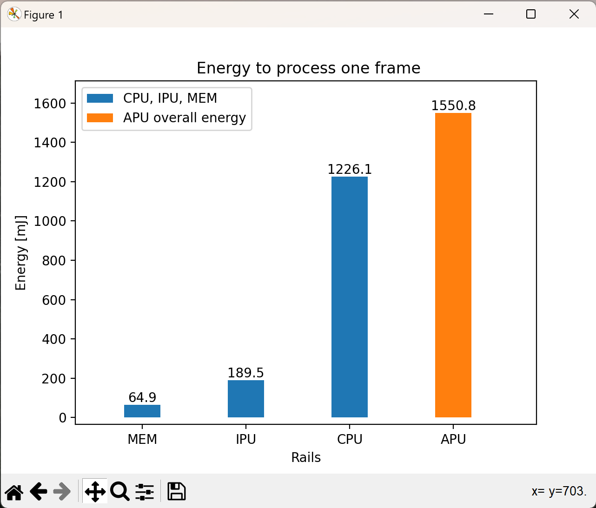
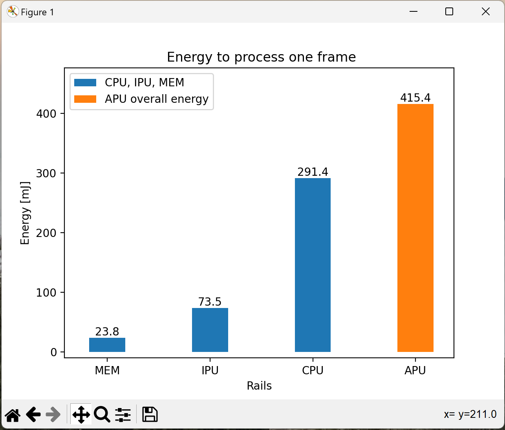
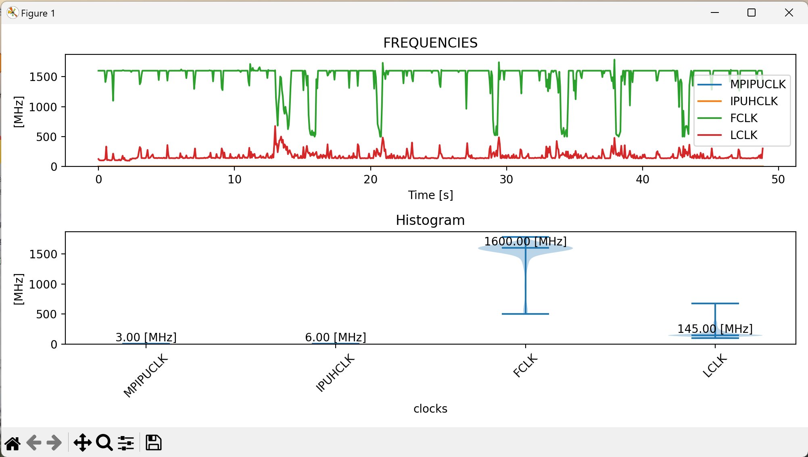
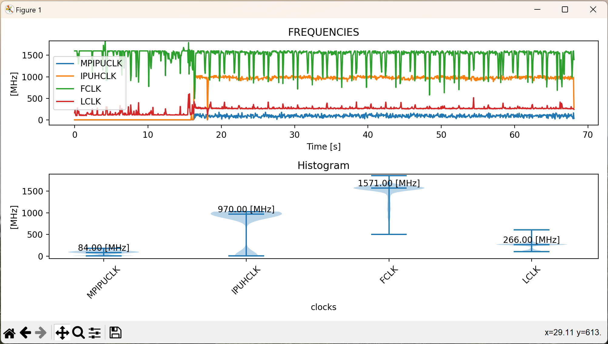
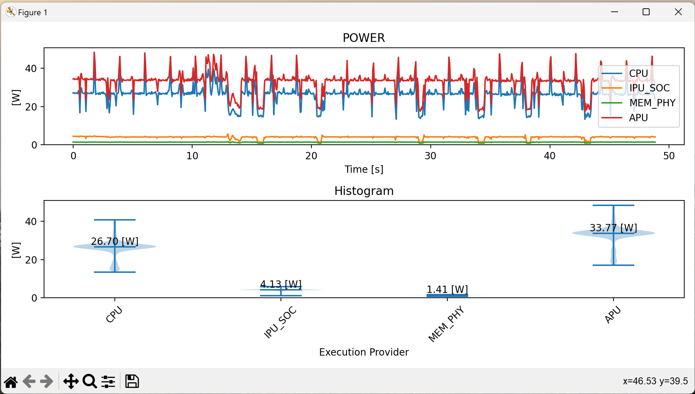
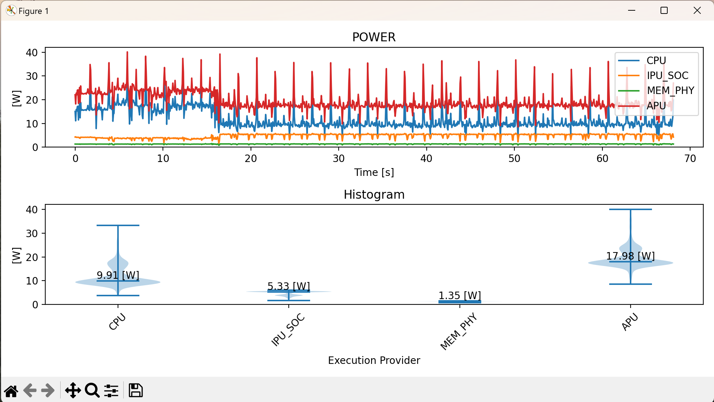

<!--
Copyright (C) 2023 Advanced Micro Devices, Inc. All rights reserved.
SPDX-License-Identifier: MIT

Author: AMD-Xilinx
-->

<table class="sphinxhide" width="100%">
 <tr width="100%">
    <td align="center"><h1> NPU Benchmark Tool with ONNXRT </h1>
    </td>
 </tr>
</table>

## Table of Contents

<!-- TOC -->

- [RYZENAI-ONNX-CNNs-BENCHMARK](#ryzenai-onnx-cnns-benchmark)
- [1 Introduction](#1-introduction)
  - [1.1 Notes for release 21](#11-notes-for-release-21)
  - [1.2 Quick start with the GUI](#12-quick-start-with-the-gui)
- [2 Setup](#2-setup)
  - [2.1 Install Procedure](#21-install-procedure)
- [3 Performance Measurement](#3-performance-measurement)
  - [3.1 Measurement Report](#31-measurement-report)
  - [3.2 Example Usage](#32-example-usage)
    - [3.2.1 GUI for performance benchmarking](#321-gui-for-performance-benchmarking)
    - [3.2.2 Performance using a CPU](#322-performance-using-a-cpu)
    - [3.2.3 Performance utilizing NPU and model quantization](#323-performance-utilizing-npu-and-model-quantization)
    - [3.2.4 NPU and model compiled with VAIML](#324-npu-and-model-compiled-with-vaiml)
    - [3.2.5 Automatic model download](#325-automatic-model-download)
    - [3.2.6 Performance with a single CPU instance at 30 fps](#326-performance-with-a-single-cpu-instance-at-30-fps)
    - [3.2.7 Parameter file](#327-parameter-file)
- [4 Power Analysis](#4-power-analysis)


# <a name='Title'></a>RYZENAI-ONNX-CNNs-BENCHMARK
This document summarizes the updates included in Release 22.

# 1 <a name='Introduction'></a>Introduction
The NPU benchmark tool measures the inference performance of ONNX-based convolutional neural network (CNN) models. Ryzen AI processors combine Ryzen CPU cores, an AMD Radeon graphics engine (GPU), and a dedicated AI engine (NPU).

The `performance_benchmark.py` tool reports the following metrics:
1. Throughput in frames per second (fps)
2. Latency in milliseconds (ms)

Note: Primary validation was performed on the Ryzen processor code-named "STRIX".

## 1.1 <a name='Notesforthisrelease'></a>Notes for release 22
* Compatible with RyzenAI 1.6.0
* Windows release supports PHOENIX and STRIX devices
* Simplified graphical user interface: only required options are shown, and controls appear or disappear dynamically
* Quark is the official quantizer
* Supports power analysis through HWINFO (if installed)
* Changes in Ryzen AI 1.6.0 parallelism may reduce throughput compared with previous versions while lowering latency. Because temporal parallelism replaces spatial parallelism, selecting multiple NPU instances is temporarily disabled
* Only the 4x4 core (latency-optimized) is supported in this release
* For FP32 models with the VitisAI execution provider, you can quantize and run on VitisAIEP or keep FP32 and run on the CPU automatically
* Automatic model resolution: known selectors such as `resnet50` or `mobilenetv2` are downloaded into `./models/` on demand. Use `--model resnet50`, or point to an existing ONNX file with `--model_path <path/to/model>.onnx`.
* Added `--force_batch` (default 1) to rewrite dynamic batch dimensions to 1, improving NPU execution and avoiding shape mismatches

## 1.2 <a name='QuickstartwiththeGUI'></a>Quick start with the GUI
The fastest way to explore the benchmark is through the graphical launcher shipped as `benchmark_gui.py`. It surfaces the most common options and reduces the need to memorize CLI flags while you learn the tool.

Launch the interface from an activated Ryzen AI environment:
```bash
python benchmark_gui.py
```

The GUI groups options into two tabs so you can dial in the right amount of control:
- **Basic Flags** keeps only the required inputs (model selection, execution provider, limits) so quick smoke tests stay simple.
- **Extended Flags** reveals every switch exposed by `performance_benchmark.py`, with sections that appear contextually when advanced features such as quantization or power logging are relevant.

Each time you start a run, the GUI prints the equivalent CLI command so you can copy it into scripts once you settle on a configuration.

# 2 <a name='Setup'></a>Setup
##  2.1 <a name='InstallProcedure'></a>Install Procedure
Prerequisite: Install [Anaconda](https://docs.anaconda.com/free/anaconda/install/index.html) or Miniconda.

1. Run the RyzenAI 1.6.0 installer.
2. Install HWINFO if you plan to capture power measurements.
3. Activate the conda environment:
```bash
conda activate ryzen-ai-1.6.0
```
4. Run `set_env.bat`. For HWINFO usage, uncomment the relevant section and adjust the installation path.
5. When the `ryzen-ai-1.6.0` environment is active, complete the setup:
```bash
python -m pip install -r requirements-win.txt
```

# 3 Performance Measurement
---

## 3.1 <a name='MeasurementReport'></a>Measurement Report
The benchmark aggregates performance metrics along with system, resource, and environment snapshots into JSON and optional CSV artifacts. Results are stored in `report_performance.json`, together with the configuration used for the test. Pass --log_csv (or -k) to append a summary row to a CSV file.

## 3.2 <a name='ExampleUsage'></a>Example Usage

###  3.2.1 <a name='AGUIforperformancebenchmarking'></a>GUI for performance benchmarking
The GUI helps compose command lines and launch runs with preset parameters. Defaults load automatically, and the interface adapts to the detected processor by enabling or hiding options as required.

###  3.2.2 <a name='PerformanceusingaCPU'></a>Performance using a CPU
Use the CPU execution provider when you want a baseline without quantization:
```bash
python performance_benchmark.py --model_path .\models\resnet50\resnet50_fp32.onnx --execution_provider CPU --num 100 --timelimit 10
```

###  3.2.3 <a name='PerformanceutilizingNPUandmodelquantization'></a>Performance utilizing NPU and model quantization
Quantize FP32 models with Quark and run them on the NPU through VitisAIEP:
```bash
python performance_benchmark.py --model_path .\models\resnet50\resnet50_fp32.onnx --timelimit 10 --num 100 --execution_provider VitisAIEP --renew 1
```

<p align="center">
  
</p>

###  3.2.4 <a name='NPUandmodelcompiledwithVAIML'></a>NPU and model compiled with VAIML
When an FP32 model is detected, the VAIML compiler automatically generates a BFP16 model:
```bash
python performance_benchmark.py --model_path ./models/resnet50/resnet50_fp32.onnx --timelimit 10 --num 100 --execution_provider VitisAIEP --renew 1
```

<p align="center">
  
</p>

###  3.2.5 <a name='AutomaticModelDownload'></a>Automatic model download
Friendly selectors let you reference common models quickly. When `--model` is provided, the benchmark searches the `./models/` directory and downloads the ONNX file from the public model zoo if it is missing. The file is cached locally, so future runs reuse it unless you delete it or pass `--renew 1`.
```bash
python performance_benchmark.py --model resnet50 --execution_provider CPU --num 10
```
Use `--model_path` to target a specific file or directory explicitly.

###  3.2.6 <a name='PerformancewithasingleCPUinstanceat30fps'></a>Performance with a single CPU instance at 30 fps
You can set a minimum latency with `--min_interval`. For example, a delay of 0.033 seconds simulates live video at 30 frames per second. Combine this with multithreading to sustain the target frame rate, even if latency exceeds 33 ms.
```bash
python performance_benchmark.py --model_path .\models\resnet50\resnet50_fp32.onnx -n 100 -e CPU --min_interval 0.033
```

###  3.2.7 <a name='Parameterfile'></a>Parameter file
Supplying parameters through a JSON file makes experiments reproducible. The JSON overrides all other options. The following example focuses on low latency or high throughput depending on the configuration in the file:
```bash
python performance_benchmark.py --json ./test/STX_resnet50_low_latency.json
```

# 4 Power Analysis
This feature requires HWINFO.

With `--power HWINFO`, the power tool runs in the background and captures power consumption and clock frequencies. Combining this data with throughput and latency metrics enables a richer efficiency analysis. The figures below compare identical tests: the left column shows results with the CPU execution provider, while the right column uses the NPU. Note how the NPU reduces the energy per image to roughly one third of the CPU's value.

Important: Start the power test only after the compiled model is ready. If `--renew 1` is set, the compilation step occurs at the beginning of the power test and skews the measurement.

```bash
python performance_benchmark.py --model_path ./models/resnet50/resnet50_fp32_opset20_XINT8.onnx --timelimit 10 --num 100 --execution_provider VitisAIEP --renew 0 --power HWINFO
```


| CPU Execution Provider | NPU Execution Provider |
|----------|----------|
|  |  |
|  |  |
|  |  |
|  |  |


