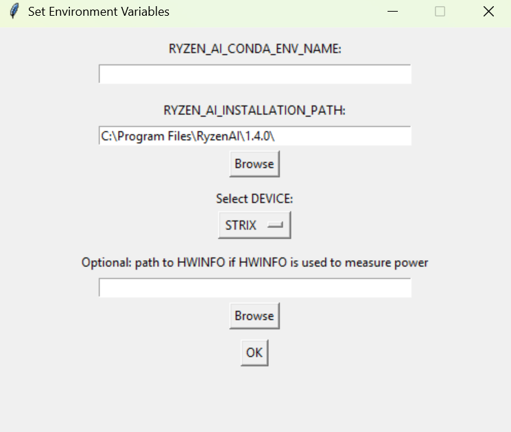
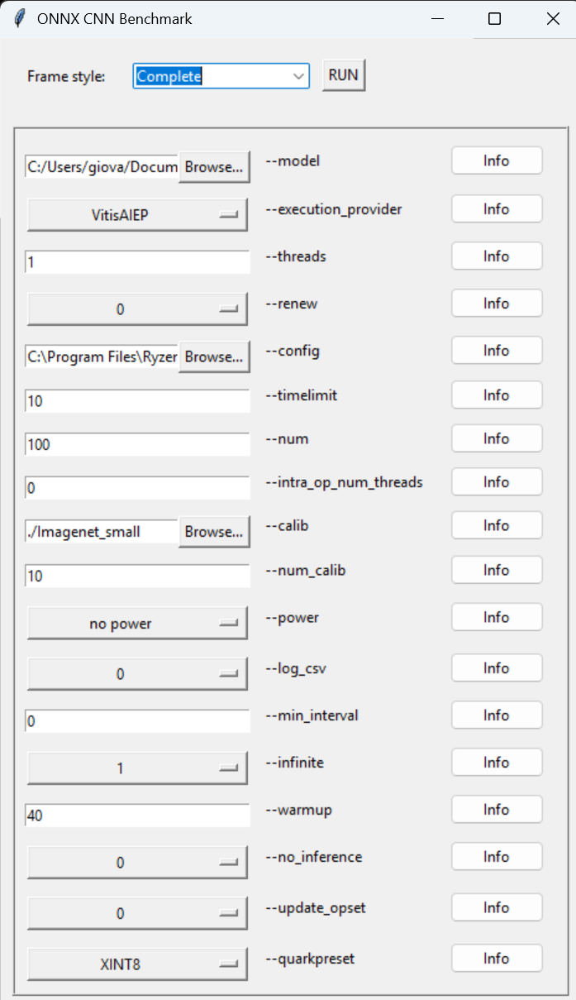
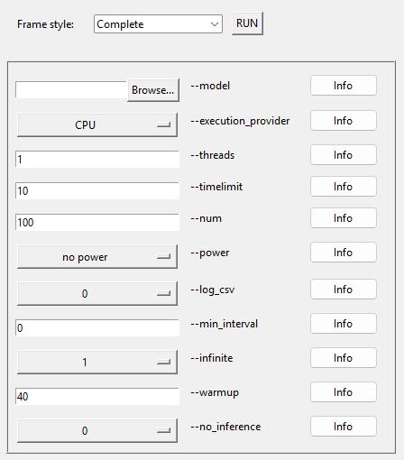
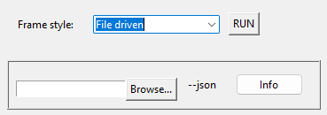
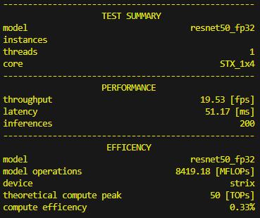
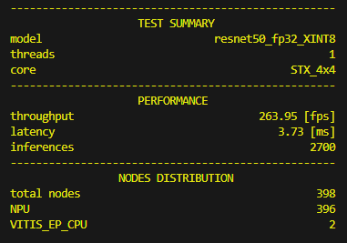
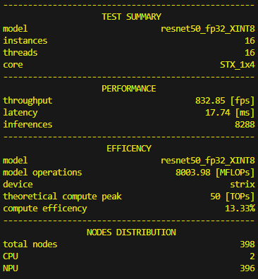
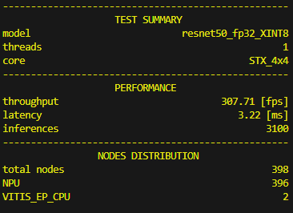

<!--
Copyright © 2023 Advanced Micro Devices, Inc. All rights reserved.
SPDX-License-Identifier: MIT

Author: AMD-Xilinx
-->

<table class="sphinxhide" width="100%">
 <tr width="100%">
    <td align="center"><h1> NPU Benchmark Tool with ONNXRT </h1>
    </td>
 </tr>
</table>

## Table of Contents

<!-- TOC -->

- [RYZENAI-ONNX-CNNs-BENCHMARK](#ryzenai-onnx-cnns-benchmark)
- [1 Introduction](#1-introduction)
  - [1.1 Notes for release 20](#11-notes-for-release-20)
- [2 Setup](#2-setup)
  - [2.1 Install Procedure](#21-install-procedure)
- [3 Performances Measurement](#3-performances-measurement)
  - [3.1 Measurement Report](#31-measurement-report)
  - [3.2 Example Usage](#32-example-usage)
    - [3.2.1 GUI for performance benchmarking](#321-gui-for-performance-benchmarking)
    - [3.2.2 Performance with a single instance using a CPU](#322-performance-with-a-single-instance-using-a-cpu)
    - [3.2.3 Performance with a single instance utilizing NPU and model quantization:](#323-performance-with-a-single-instance-utilizing-npu-and-model-quantization)
    - [3.2.4 Performance with single instance with NPU](#324-performance-with-single-instance-with-npu)
    - [3.2.5 Increase the number of instances to improve throughput.](#325-increase-the-number-of-instances-to-improve-throughput)
    - [3.2.6 Best Latency: performance with one instance of 4x4 core](#326-best-latency-performance-with-one-instance-of-4x4-core)
    - [3.2.7 Performance with single instance with CPU at 30fps fixed rate](#327-performance-with-single-instance-with-cpu-at-30fps-fixed-rate)
    - [3.2.8 File of parameters](#328-file-of-parameters)
- [4 Power analysis](#4-power-analysis)


# <a name='Title'></a>RYZENAI-ONNX-CNNs-BENCHMARK
Notes for Release 20

# 1 <a name='Introduction'></a>Introduction
The NPU benchmark tool is designed to measure the performance of ONNX-based Convolutional Neural Network (CNN) inference models. Ryzen AI processors combine Ryzen processor cores (CPU) with an AMD Radeon™ graphics engine (GPU) and a dedicated AI engine (NPU).

The 'performance_benchmark.py' tool is capable of reporting:
1. Throughput, measured in frames per second
2. Latency, measured in milliseconds

NOTE: This tool has undergone primary testing on the Ryzen processor named "STRIX". 

## 1.1 <a name='Notesforthisrelease'></a>Notes for release 20
* This release is compatible with RyzenAI 1.4.0.
* Windows release includes support for PHOENIX and STRIX devices
* Simplified graphical user interface: only necessary options are shown, which are dynamically added or removed as needed.
* Quark is now the official quantizer.
* Supports power analysis with HWINFO if installed.

# 2 <a name='Setup'></a>Setup
##  2.1 <a name='InstallProcedure'></a>Install Procedure
Run the following commands only once. For subsequent uses, the environment will be ready, and you’ll just need to activate the Conda environment and set the environment variables with `set_env.bat`.

Pre requisite: have [Anaconda](https://docs.anaconda.com/free/anaconda/install/index.html) or Miniconda installed. 

Run the RyzenAI 1.4.0 installer.

Edit the environment variables in set_env.bat, or run
```
python setupenv.py
```

<p align="center">
  
</p>


for example:
* the generated Conda environment is named `ryzen-ai-1.4.0`, 
* the installation is placed in `"C:\Program Files\ryzen-ai\1.4.0"` 
* the device is STRIX

Optional: If HWINFO is installed, the benchmark tool will run it during the test, simultaneously measuring both power consumption and performance. 

setupenv.py generates the batch file set_env.bat, which must be run once for each new terminal session.

```
set_env.bat
```

Add some needed packages:
```
conda activate %RYZEN_AI_CONDA_ENV_NAME%
python -m pip install -r requirements-win.txt
```

# 3 Performances Measurement
---

## 3.1 <a name='MeasurementReport'></a>Measurement Report
The report consolidates performance measurements along with system, resources, and environmental snapshots into either a JSON or CSV file. 
Each measurement is automatically saved in the file `report_performance.json`, along with the testing configuration. Each measurement can be appended to a CSV file with the option ```--log_csv``` or ```-k```.

## 3.2 <a name='ExampleUsage'></a>Example Usage

###  3.2.1 <a name='AGUIforperformancebenchmarking'></a>GUI for performance benchmarking
This user-friendly graphical interface is designed to assist users in composing command lines and launching programs with all parameters preset. All option defaults are preloaded. The GUI adapts and automatically updates the available options based on the detected processor (PHOENIX or STRIX) or the selected Execution Provider. 
```
python test.py
```
<p align="center">
  
</p>


<p align="center">
  
</p>


<p align="center">
  
</p>


###  3.2.2 <a name='PerformancewithasingleinstanceusingaCPU'></a>Performance with a single instance using a CPU
This experiment involves repeatedly performing inferences on a batch of 100 images ```-n 100```, sending one image at a time to the CPU ```-e CPU```, where a FP32 Resnet50 model is used ```-m .\models\resnet50\resnet50_fp32.onnx```
```
python performance_benchmark.py --model ./models/resnet50/resnet50_fp32.onnx --timelimit 10 --num 100 --execution_provider CPU 
```

<p align="center">
  
</p>

###  3.2.3 <a name='PerformancewithasingleinstanceutilizingNPUandmodelquantization:'></a>Performance with a single instance utilizing NPU and model quantization:
To ensure smooth execution of this example, it is advisable to download a set of Imagenet pictures in advance, typically around 100 images should suffice. When the VitisAI EP is chosen and the model is in FP32 format, the tool endeavors to quantize the model before conducting tests. It is imperative to specify the path to a folder containing images using the ```--calib ...``` parameter. Additionally, ```--num_images 10``` randomly selects and copies ten images from the dataset into a calibration folder.

```
python performance_benchmark.py --model ./models/resnet50/resnet50_fp32.onnx --config "C:\Program Files\RyzenAI\1.4.0\voe-4.0-win_amd64\vaip_config.json" --timelimit 10 --num 100 --calib ./Imagenet_small --num_calib 10 --execution_provider VitisAIEP --core STX_1x4 --renew 1 --infinite 1 --quarkpreset XINT8
```

A new model will be generated in the same folder as the original FP32 model and then used for inference.

<p align="center">
  
</p>


###  3.2.4 <a name='PerformancewithsingleinstancewithNPU'></a>Performance with single instance with NPU
This experiment involves repeatedly performing inferences on a batch of 100 images ```-n 100```, sending one image at a time to the NPU ```-e VitisAIEP```: most operators are processed by the NPU. When the NPU is used  a configuration file is loaded from the installation folder by default, or a custom configuration can be assigned if available: ```--config .\models\resnet50\vaip_config_custom.json```. The compiler will load the quantized model ```-m .\models\resnet50\resnet50_fp32_qdq.onnx```, and store the compiled model in a cache folder. Finally, the images are sent to the compiled model to be processed. The provided information includes the ratio of operators assigned to the CPU and those assigned to the NPU.
```
python performance_benchmark.py -m .\models\resnet50\resnet50_fp32_qdq.onnx -n 100 -e VitisAIEP
```

###  3.2.5 <a name='PerformancewithfourinstanceswithNPUandforcerecompiling'></a>Increase the number of instances to improve throughput. 
The NPU 4 rows x 4 columns core is optimized for latency. The 1 row x 4 columns core is optimized for throughput and flexibility.
The best throughput is achieved when 16 instances of 1x4 are used. It is recommended to use at least 16 threads for optimal performance. Fore PHOENIX, no more than 4 instances can be used.
In this STRIX experiment, we employ 16 models operating in parallel, as opposed to just one as seen in previous examples.
Force recompiling: if the model has already been compiled and the cache is present, the compiler will reuse the cached model to save time. However, if configuration files, xclbin, or the Anaconda environment have changed, it is necessary to clear the cache to recompile the model.
Please use the option ```-renew 1``` to clear the cache.
```
python performance_benchmark.py --model ./models/resnet50/resnet50_fp32_XINT8.onnx --instance_count 16 --threads 16 --config "C:\Program Files\RyzenAI\1.4.0\voe-4.0-win_amd64\vaip_config.json" --timelimit 10 --num 100 --execution_provider VitisAIEP --core STX_1x4 --renew 1
```

<p align="center">
  
</p>

###  3.2.6 <a name='PerformancewithwithNPUoneinstanceof4x4core'></a>Best Latency: performance with one instance of 4x4 core
The NPU four rows x four columns core is optimized for latency. The one row x four columns core is optimized for throughput and flexibility.
In this STRIX example, the 4x4 core is used ```--core STX_4x4```. If you have been following the sequence of experiments, previously the model was compiled for the default STX_1x4 core configuration. Therefore, the cache needs to be cleared using ```-r 1```, and the model needs to be recompiled for the new core configuration.
```
python performance_benchmark.py --model ./models/resnet50/resnet50_fp32_XINT8.onnx --instance_count 1 --threads 1 --config "C:\Program Files\RyzenAI\1.4.0\voe-4.0-win_amd64\vaip_config.json" --timelimit 10 --num 100 --execution_provider VitisAIEP --core STX_4x4 --renew 1
```

<p align="center">
  
</p>

###  3.2.7 <a name='PerformancewithsingleinstancewithCPUat30fpsfixedrate'></a>Performance with single instance with CPU at 30fps fixed rate
In certain scenarios, it might be necessary to fine-tune the minimum latency, and this can be accomplished through the ```--min_interval``` option. For instance, adding a delay of 0.033 seconds is employed to simulate live video at a consistent 30 frames per second. Thus, we set the delay to 1/30 (0.033 s). In this context, the option is utilized alongside multithreading to ensure the CPU can maintain the desired framerate, even if the latency exceeds 33 milliseconds.
```
python performance_benchmark.py -m .\models\resnet50\resnet50_fp32.onnx -n 100 -e CPU --min_interval 0.033
```

###  3.2.8 <a name='Fileofparameters'></a>File of parameters
As the number of input parameters increases, it can become convenient to supply a file containing all of them. This method aids in consistently reproducing the same experiment. For instance, the two cases below are optimized for either low latency or high throughput. The file of parameters overrides all other parameters.
```
python performance_benchmark.py --json ./test/STX_resnet50_high_throughput.json
```

# 4 Power analysis
This feature needs HWINFO installed.

By enabling the option ```--power```, the power tool starts in the background and records details about power consumption and clock frequencies. This information, combined with measured throughput and latency, allows for a set of more sophisticated analyses regarding the efficiency of the process. Below, some images from the power analysis are provided. The same test is repeated twice: on the left side are the results where the CPU is the Execution Provider, and on the right column are the results where the NPU is the Execution Provider.In addition to the performance improvement enabled by the NPU, please note that the energy required to process one image is reduced to one-third compared to when the CPU is used.Important note: When estimating power with VitisAI EP, it is crucial to initiate the power test once the compiled model is prepared. If the ```--renew``` option is set to 1, the initial portion of the power test will include the compilation step and this will affect the measurement.

| CPU Execution Provider | NPU Execution Provider |
|----------|----------|
|  |  |
|  |  |
|  |  |
|  |  |

