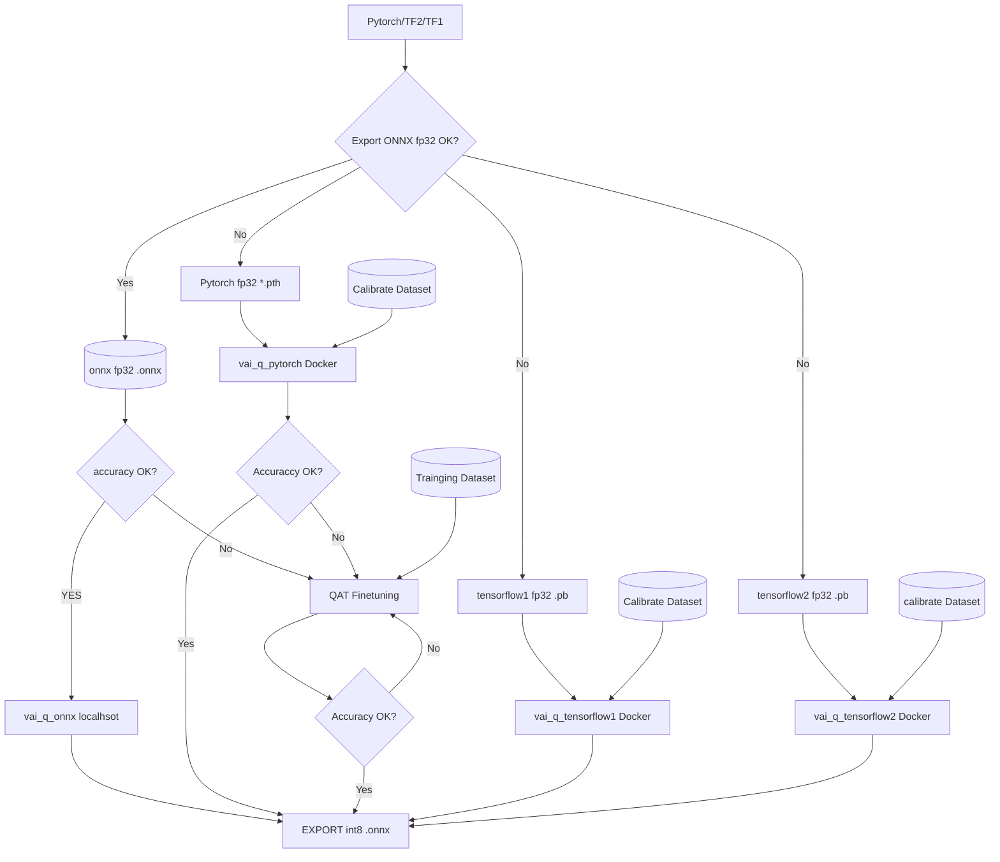

<table style="width:100%">
  <tr>

<th width="100%" colspan="6"><h1>Ryzen AI Quantization Tutorial</h1>
</th>

  </tr>
  <tr>
    <td width="17%" align="center">1. Introduction</td>
    <td width="17%" align="center"><a href="Docs/ONNX_README.md">2.ONNX QuantizatioTutorial</a>  </td>
    <td width="16%" align="center"><a href="./Docs/PT_README.md">3. Pytorch Quantization Tutorial</a></td>
    <td width="17%" align="center"><a href="./Docs/TF_README.md">4.Tensorflow1.x quantization tutorial</a></td>
    <td width="17%" align="center"><a href="./Docs/TF2_README.md"> 5.Tensorflow2.x quantization tutorial<a></td>

</tr>

</table>

## Tutorial:  Ryzen AI Model Quantization and Deployment

Welcome to the Ryzen AI Model Quantization  tutorial. In this guide, you'll learn how to use Ryzen AI to optimize your deep learning models for efficient deployment on embedded devices.

Tutorial Flowchart

### Introduction
The provided flowchart outlines a process of model quantization and optimization, involving various deep learning frameworks and steps. Here's the logical breakdown:

- The process begins with different source model formats: PyTorch fp32, TensorFlow 1 fp32, TensorFlow 2 fp32, and ONNX fp32. These source models could originate from training and inference datasets.

- For the PyTorch source model, the first step involves using the PyTorch fp32 *.pth model for inference, following the guidance provided in PT_README.md. The model is then converted using the vai_q_xir Docker tool to obtain the vai_q_xir formatted model.

- The converted model proceeds to the "Accuracy OK?" decision point. If the model's accuracy meets expectations, it can be directly exported as an int8 format ONNX model (EXPORT int8 .onnx) for subsequent inference.

- If the model's accuracy falls short, the "Accuracy OK?" decision leads to the "No" branch, indicating the need for Quantization-Aware Training (QAT) fine-tuning. The objective is to optimize the model to maintain good accuracy after quantization.

- For TensorFlow 1 and TensorFlow 2 source models, a similar process unfolds. The models are converted using the vai_q_tensorflow1 and vai_q_tensorflow2 Docker tools, respectively. 

- In the case of the ONNX source model, local quantization-aware calibration is performed using the vai_q_onnx tool, followed by direct export (EXPORT).

- During the QAT fine-tuning phase, the "Calibrate Dataset" is prepared as calibration data. The source model is then fed into the QAT stage to refine its accuracy under quantization conditions.

- Ultimately, the model that undergoes QAT fine-tuning is evaluated again at the "Accuracy OK?" decision point. If the desired accuracy is achieved, the model can be exported as an int8 format ONNX model (EXPORT int8 .onnx).

In summary, the flowchart illustrates the quantization and optimization process for different source models, involving model conversion, accuracy assessment, quantization-aware training, and final model export. The goal is to optimize source models to maintain high accuracy during low-precision inference scenarios.

:arrow_forward:**Next Topic:**  [2. ONNX Quantization Tutorial](./Docs/ONNX_README.md)