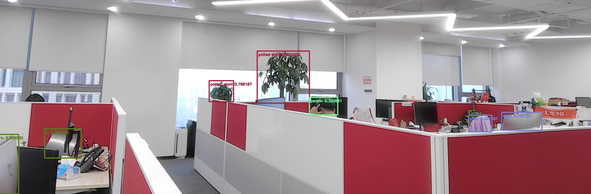

<table class="sphinxhide" width="100%">
 <tr width="100%">
    <td align="center"><h1>Ryzen™ AI Tutorials</h1>
    </td>
 </tr>
</table>

#  Yolov8 cpp flow on Ryzen AI


- Version:      Ryzen AI Software v1.2 
- Support:      AMD Ryzen™ 7940HS, 7840HS, 7640HS, 7840U, 7640U, 8640U, 8640HS, 8645H, 8840U, 8840HS, 8845H, 8945H with Windows 11 OS.
- Last update:  29 Jul. 2024


## Table of Contents

[1 Introduction](#1-introduction)

[2 Prerequisites](#2-prerequisites)

[3 Installation](#3-installation)

[4 Implementation](#4-implementation)

[License](#license)


## 1 Introduction

[Ryzen™ AI](https://ryzenai.docs.amd.com/en/latest/index.html) is a dedicated AI accelerator integrated on-chip with the CPU cores. The AMD Ryzen™ AI SDK enables developers to take machine learning models trained in PyTorch or TensorFlow and run them on laptops powered by Ryzen AI which can intelligently optimizes tasks and workloads, freeing-up CPU and GPU resources, and ensuring optimal performance at lower power.

In this Deep Learning(DL) tutorial, you will see how to deploy the Yolov8 detection model with ONNX framework on Ryzen AI laptop.

## 2 Prerequisites

- AMD Ryzen AI Laptop with Windows 11 OS
- Visual Studio 2022 (with Desktop dev c++ & MSVC v143-vs2022 x64/x86 Spectre-mitigated libs)
- Anaconda or Miniconda
- Git
- openCV (version = 4.6.0)
- cmake (version >= 3.26)
- python (version = 3.10)
- NPU driver & NPU xclbin = 1.2 release 
- voe package = 1.2 release

## 3 Installation

Please refer to the [installation instructions](https://ryzenai.docs.amd.com/en/latest/inst.html#) to properlly install the Ryzen AI software.

### Denpendencies of Yolov8

There are some more libraries you need to install for the Yolov8 inference.

#### Cmake

```Anaconda Prompt
# pip install cmake
```

Output:

```
Collecting cmake
  Obtaining dependency information for cmake from https://files.pythonhosted.org/packages/e0/67/3cc8ccb0cebac463033e1f8588328de32f8f85cfd9d3150c05b57b827893/cmake-3.27.4.1-py2.py3-none-win_amd64.whl.metadata
  Downloading cmake-3.27.4.1-py2.py3-none-win_amd64.whl.metadata (6.8 kB)
Downloading cmake-3.27.4.1-py2.py3-none-win_amd64.whl (34.6 MB)
   ━━━━━━━━━━━━━━━━━━━━━━━━━━━━━━━━━━━━━━━━ 34.6/34.6 MB 147.5 kB/s eta 0:00:00
Installing collected packages: cmake
Successfully installed cmake-3.27.4.1
```

#### OpenCV

It is recommended to build OpenCV form source code and use static build. [Git](https://git-scm.com/download/win) is required to clone the repository.

Start a `Anaconda Prompt`. In your workspace, clone the repository

```Anaconda Prompt
# git clone https://github.com/opencv/opencv.git -b 4.6.0
```

Then compile the OpenCV source code with cmake.

```Anaconda Prompt
# cd opencv
# mkdir mybuild
# cd mybuild
# cmake -DCMAKE_EXPORT_COMPILE_COMMANDS=ON -DBUILD_SHARED_LIBS=OFF -DCMAKE_POSITION_INDEPENDENT_CODE=ON -DCMAKE_CONFIGURATION_TYPES=Release -A x64 -T host=x64 -G "Visual Studio 17 2022" '-DCMAKE_INSTALL_PREFIX=C:\Program Files\opencv' '-DCMAKE_PREFIX_PATH=.\opencv' -DCMAKE_BUILD_TYPE=Release -DBUILD_opencv_python2=OFF -DBUILD_opencv_python3=OFF -DBUILD_WITH_STATIC_CRT=OFF -B build -S ../
# cmake --build build --config Release
# cmake --install build --config Release
# cd ../..
```

All the dependencies on the Ryzen AI laptop are installed completely. User could run a Yolov8 deplomyment progress in cpp with int8 Yolov8 pre-quantized model in the following ***Section 4***,

## 4 Implementation

### Compilation

In the `Anaconda Prompt`, clone the repository

```Anaconda Prompt
# git clone https://github.com/amd/RyzenAI-SW.git
```

Then compile the Yolov8 source code.

```Anaconda Prompt
# cd RyzenAI-SW/tutorial/yolov8_cpp/implement
# build.bat
```

The output will be generated as below.

```
......
    -- Installing: C:/Users/fanz/Documents/Workspace/RyzenAI-SW/tutorial/yolov8_cpp/bin/camera_yolov8.exe
    -- Installing: C:/Users/fanz/Documents/Workspace/RyzenAI-SW/tutorial/yolov8_cpp/bin/camera_yolov8_nx1x4.exe
    -- Installing: C:/Users/fanz/Documents/Workspace/RyzenAI-SW/tutorial/yolov8_cpp/bin/test_jpeg_yolov8.exe
```

### Run with Image

To validate your setup, the following command will do the inference with single image.

Please modify the ***conda env path*** in the batch file before execution.

```
# run_jpeg.bat DetectionModel_int.onnx sample_yolov8.jpg
```

The output will be generated as below.

```
result: 0       person  490.38498       85.79535        640.00488       475.18262       0.932453     
result: 0       person  65.96048        97.76373        320.66068       473.83783       0.924142   
result: 0       person  182.15485       306.91266       445.14795       475.26132       0.893309   
result: 27      tie     584.48022       221.15732       632.27008       244.21243       0.851953   
result: 27      tie     175.62622       224.15210       235.84900       248.83557       0.651355    
```

### Run with Live Camera

To run with live camera, user needs to change the display and camera settings manually as below.

Please modify the ***conda env name*** in the batch file before execution.

- Go to `Display settings`, change Scale to ***100%*** in the `Scale & layout` section.
- Go to `Bluetooth & devices` -> `Cameras` -> `USB2.0 FHD UVC WebCam`, turn off the Background effects in the `Windows Studio Effects` section.

```
camera.bat
```

<p align="left">

</p>

Possible options to run the yolov8 demo.

```
# camera.bat -h

Options:
      -c [parallel runs]: Specifies the (max) number of runs to invoke simultaneously. Default:1.
      -s [input_stream] set input stream, E.g. set 0 to use default camera.
      -x [intra_op_num_threads]: Sets the number of threads used to parallelize the execution within nodes, A value of 0 means ORT will pick a default. Must >=0.
      -y [inter_op_num_threads]: Sets the number of threads used to parallelize the execution of the graph (across nodes), A value of 0 means ORT will pick a default. Must >=0.    
      -D [Disable thread spinning]: disable spinning entirely for thread owned by onnxruntime intra-op thread pool.
      -Z [Force thread to stop spinning between runs]: disallow thread from spinning during runs to reduce cpu usage.
      -T [Set intra op thread affinities]: Specify intra op thread affinity string.
         [Example]: -T 1,2;3,4;5,6 or -T 1-2;3-4;5-6
         Use semicolon to separate configuration between threads.
         E.g. 1,2;3,4;5,6 specifies affinities for three threads, the first thread will be attached to the first and second logical processor.
      -R [Set camera resolution]: Specify the camera resolution by string.
         [Example]: -R 1280x720
         Default:1920x1080.
      -r [Set Display resolution]: Specify the display resolution by string.
         [Example]: -r 1280x720
         Default:1920x1080.
      -L Print detection log when turning on.
      -h: help
```

## License

The MIT License (MIT)

Copyright (c) 2022 Advanced Micro Devices, Inc.

Permission is hereby granted, free of charge, to any person obtaining a copy of this software and associated documentation files (the "Software"), to deal in the Software without restriction, including without limitation the rights to use, copy, modify, merge, publish, distribute, sublicense, and/or sell copies of the Software, and to permit persons to whom the Software is furnished to do so, subject to the following conditions:

The above copyright notice and this permission notice shall be included in all copies or substantial portions of the Software.

THE SOFTWARE IS PROVIDED "AS IS", WITHOUT WARRANTY OF ANY KIND, EXPRESS OR IMPLIED, INCLUDING BUT NOT LIMITED TO THE WARRANTIES OF MERCHANTABILITY, FITNESS FOR A PARTICULAR PURPOSE AND NONINFRINGEMENT. IN NO EVENT SHALL THE AUTHORS OR COPYRIGHT HOLDERS BE LIABLE FOR ANY CLAIM, DAMAGES OR OTHER LIABILITY, WHETHER IN AN ACTION OF CONTRACT, TORT OR OTHERWISE, ARISING FROM, OUT OF OR IN CONNECTION WITH THE SOFTWARE OR THE USE OR OTHER DEALINGS IN THE SOFTWARE.
