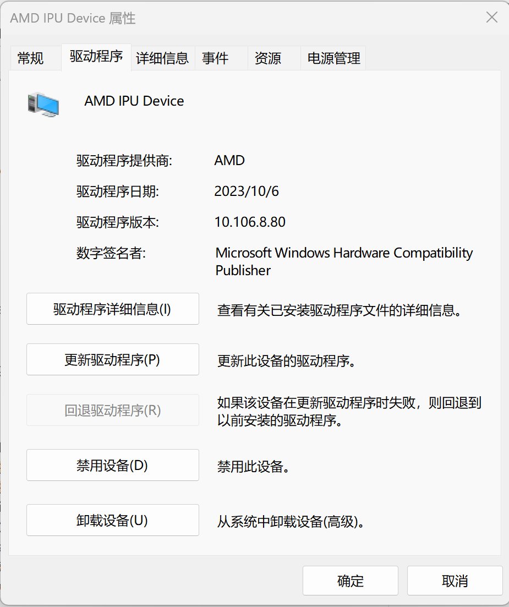
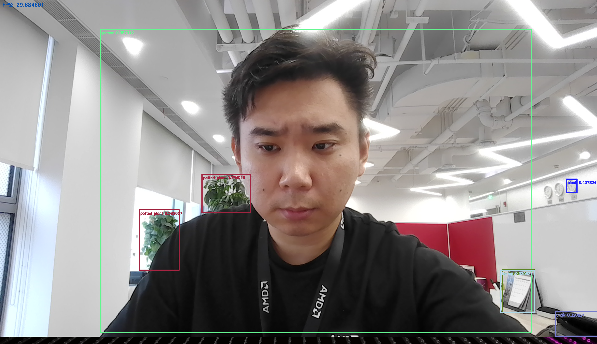

<table class="sphinxhide" width="100%">
 <tr width="100%">
    <td align="center"><h1>Ryzen™ AI Tutorials</h1>
    </td>
 </tr>
</table>

#  Yolov8 on Ryzen AI Software Platform


- Version:      Ryzen AI Software Platform v0.8 
- Support:      AMD Ryzen 7040U, 7040HS series mobile processors with Windows 11 OS.
- Last update:  27 Sep. 2023


## Table of Contents

[1 Introduction](#1-introduction)

[2 Prerequisites](#2-prerequisites)

[3 Installation](#3-installation)

[4 Quantization](#4-quantization)

[5 Implementation](#5-implementation)

[License](#license)


## 1 Introduction

[Ryzen™ AI](https://ryzenai.docs.amd.com/en/latest/index.html) is a dedicated AI accelerator integrated on-chip with the CPU cores. The AMD Ryzen™ AI SDK enables developers to take machine learning models trained in PyTorch or TensorFlow and run them on laptops powered by Ryzen AI which can intelligently optimizes tasks and workloads, freeing-up CPU and GPU resources, and ensuring optimal performance at lower power.

In this Deep Learning(DL) tutorial, you will see how to deploy the Yolov8 detection model with ONNX framework on Ryzen AI laptop.

## 2 Prerequisites

- Linux server (GPU is preferred)
- AMD Ryzen AI Laptop with Windows 11 OS
- Visual Studio 2019 (with Desktop dev c++ & MSVC v142-vs2019 x64/x86 Spectre-mitigated libs)
- Anaconda or Miniconda
- Git
- openCV (version = 4.6.0)
- glog
- gflags
- cmake (version >= 3.26)
- python (version >= 3.9) (Recommended for python 3.9.13 64bit)
- IPU driver & IPU xclbin release >= 20230726
- voe package >= (jenkins-nightly-build-id==205)

## 3 Installation

### Visual Studio 2019

The [Visual Studio](https://my.visualstudio.com/Downloads?q=visual%20studio%202019&wt.mc_id=o~msft~vscom~older-downloads) is required to compile the related source code.

:exclamation: The Yolov8 demo in this tutorial may not be compatible with other Visual Studio version.

### IPU Driver

Please download the Adrenalin IPU driver from the Link below and install it on your laptop.

[Adrenalin IPU Driver](https://amdcloud-my.sharepoint.com/:u:/g/personal/anluo_amd_com/EaZ7iksQO2xKs7efI-zZ8BgBZo0wwEyQo91v8xa3br3wNw?e=gA2jTF)

Ensure that the IPU driver is installed from `Device Manager` -> `System Devices` -> `AMD IPU Device` as shown in the following image. The version is expected to be 10.106.6.52

<p align="left">

</p>

### Denpendencies

The Ryzen AI Software Platform requires using a [Conda](https://docs.anaconda.com/free/anaconda/install/windows/) environment for the installation process.

Start a `Conda Prompt`. In the Conda Prompt, create and activate an environment for the rest of the installation process. We will use ***ryzen_test*** here as an example.

```Conda Prompt
# conda create --name ryzen_test python=3.9
# conda activate ryzen_test
```

Output:

```
## Package Plan ##

  environment location: C:\Users\AMD\anaconda3\envs\yolov8

  added / updated specs:
    - python=3.9


The following NEW packages will be INSTALLED:

  ca-certificates    pkgs/main/win-64::ca-certificates-2023.05.30-haa95532_0
  openssl            pkgs/main/win-64::openssl-3.0.10-h2bbff1b_2
  pip                pkgs/main/win-64::pip-23.2.1-py39haa95532_0
  python             pkgs/main/win-64::python-3.9.17-h1aa4202_0
  setuptools         pkgs/main/win-64::setuptools-68.0.0-py39haa95532_0
  sqlite             pkgs/main/win-64::sqlite-3.41.2-h2bbff1b_0
  tzdata             pkgs/main/noarch::tzdata-2023c-h04d1e81_0
  vc                 pkgs/main/win-64::vc-14.2-h21ff451_1
  vs2015_runtime     pkgs/main/win-64::vs2015_runtime-14.27.29016-h5e58377_2
  wheel              pkgs/main/win-64::wheel-0.38.4-py39haa95532_0


Proceed ([y]/n)? y


Downloading and Extracting Packages

Preparing transaction: done
Verifying transaction: done
Executing transaction: done
#
# To activate this environment, use
#
#     $ conda activate yolov8
#
# To deactivate an active environment, use
#
#     $ conda deactivate

C:\Users\AMD>conda activate yolov8

(yolov8) C:\Users\AMD>
```

#### ONNX Runtime

```Conda Prompt
# pip install onnxruntime
```

Output:

```
Collecting onnxruntime
  Obtaining dependency information for onnxruntime from https://files.pythonhosted.org/packages/6a/fb/99bc0e75f3d23eab0dda640acaf23d0a3a68c3949a56ac5c25698eab4958/onnxruntime-1.15.1-cp39-cp39-win_amd64.whl.metadata
  Using cached onnxruntime-1.15.1-cp39-cp39-win_amd64.whl.metadata (4.1 kB)
Collecting coloredlogs (from onnxruntime)
  Using cached coloredlogs-15.0.1-py2.py3-none-any.whl (46 kB)
Collecting flatbuffers (from onnxruntime)
  Obtaining dependency information for flatbuffers from https://files.pythonhosted.org/packages/6f/12/d5c79ee252793ffe845d58a913197bfa02ae9a0b5c9bc3dc4b58d477b9e7/flatbuffers-23.5.26-py2.py3-none-any.whl.metadata
  Using cached flatbuffers-23.5.26-py2.py3-none-any.whl.metadata (850 bytes)
Collecting numpy>=1.21.6 (from onnxruntime)
  Obtaining dependency information for numpy>=1.21.6 from https://files.pythonhosted.org/packages/df/18/181fb40f03090c6fbd061bb8b1f4c32453f7c602b0dc7c08b307baca7cd7/numpy-1.25.2-cp39-cp39-win_amd64.whl.metadata
  Using cached numpy-1.25.2-cp39-cp39-win_amd64.whl.metadata (5.7 kB)
Collecting packaging (from onnxruntime)
  Using cached packaging-23.1-py3-none-any.whl (48 kB)
Collecting protobuf (from onnxruntime)
  Obtaining dependency information for protobuf from https://files.pythonhosted.org/packages/20/26/343db129c96d93a9d0820319a6beba4497aced1b0cd4b6051b0e4e1fd100/protobuf-4.24.2-cp39-cp39-win_amd64.whl.metadata
  Using cached protobuf-4.24.2-cp39-cp39-win_amd64.whl.metadata (540 bytes)
Collecting sympy (from onnxruntime)
  Using cached sympy-1.12-py3-none-any.whl (5.7 MB)
Collecting humanfriendly>=9.1 (from coloredlogs->onnxruntime)
  Using cached humanfriendly-10.0-py2.py3-none-any.whl (86 kB)
Collecting mpmath>=0.19 (from sympy->onnxruntime)
  Using cached mpmath-1.3.0-py3-none-any.whl (536 kB)
Collecting pyreadline3 (from humanfriendly>=9.1->coloredlogs->onnxruntime)
  Using cached pyreadline3-3.4.1-py3-none-any.whl (95 kB)
Using cached onnxruntime-1.15.1-cp39-cp39-win_amd64.whl (6.7 MB)
Using cached numpy-1.25.2-cp39-cp39-win_amd64.whl (15.6 MB)
Using cached flatbuffers-23.5.26-py2.py3-none-any.whl (26 kB)
Using cached protobuf-4.24.2-cp39-cp39-win_amd64.whl (430 kB)
Installing collected packages: pyreadline3, mpmath, flatbuffers, sympy, protobuf, packaging, numpy, humanfriendly, coloredlogs, onnxruntime
Successfully installed coloredlogs-15.0.1 flatbuffers-23.5.26 humanfriendly-10.0 mpmath-1.3.0 numpy-1.25.2 onnxruntime-1.15.1 packaging-23.1 protobuf-4.24.2 pyreadline3-3.4.1 sympy-1.12
```

#### Cmake

```Conda Prompt
# pip install cmake
```

Output:

```
Collecting cmake
  Obtaining dependency information for cmake from https://files.pythonhosted.org/packages/e0/67/3cc8ccb0cebac463033e1f8588328de32f8f85cfd9d3150c05b57b827893/cmake-3.27.4.1-py2.py3-none-win_amd64.whl.metadata
  Downloading cmake-3.27.4.1-py2.py3-none-win_amd64.whl.metadata (6.8 kB)
Downloading cmake-3.27.4.1-py2.py3-none-win_amd64.whl (34.6 MB)
   ━━━━━━━━━━━━━━━━━━━━━━━━━━━━━━━━━━━━━━━━ 34.6/34.6 MB 147.5 kB/s eta 0:00:00
Installing collected packages: cmake
Successfully installed cmake-3.27.4.1
```

#### Vitis AI ONNX Runtime Execution Provider

Download the Execution Provider setup package with the link below:

[Vitis AI ONNX Runtime EP](https://account.amd.com/en/forms/downloads/ryzen-ai-software-platform-xef.html?filename=voe-3.5-win_amd64.zip)

Change the directory to the extracted Execution Provider setup package directory and install the necessary packages:

```Conda Prompt
# cd voe-3.5-win_amd64\voe-3.5-win_amd64
# python installer.py
# pip install voe-0.1.0-cp39-cp39-win_amd64.whl
# pip install onnxruntime_vitisai-1.15.1-cp39-cp39-win_amd64.whl
```

Output:

```
2023-09-06 00:22:16,344 - INFO - copying C:\Windows\System32\AMD\xrt_core.dll to C:\Users\AMD\anaconda3\envs\yolov8\lib\site-packages\onnxruntime\capi
2023-09-06 00:22:16,373 - INFO - copying C:\Windows\System32\AMD\xrt_coreutil.dll to C:\Users\AMD\anaconda3\envs\yolov8\lib\site-packages\onnxruntime\capi
2023-09-06 00:22:16,405 - INFO - copying C:\Windows\System32\AMD\xrt_phxcore.dll to C:\Users\AMD\anaconda3\envs\yolov8\lib\site-packages\onnxruntime\capi
2023-09-06 00:22:16,428 - INFO - copying C:\Users\AMD\Downloads\IPU_Dependency\voe-3.5-win_amd64\voe-0.1.0-cp39-cp39-win_amd64\onnxruntime.dll to C:\Users\AMD\anaconda3\envs\yolov8\lib\site-packages\onnxruntime\capi

Processing c:\users\amd\downloads\ipu_dependency\voe-3.5-win_amd64\voe-0.1.0-cp39-cp39-win_amd64.whl
Collecting glog==0.3.1 (from voe==0.1.0)
  Using cached glog-0.3.1-py2.py3-none-any.whl (7.8 kB)
Collecting python-gflags>=3.1 (from glog==0.3.1->voe==0.1.0)
  Using cached python_gflags-3.1.2-py3-none-any.whl
Collecting six (from glog==0.3.1->voe==0.1.0)
  Using cached six-1.16.0-py2.py3-none-any.whl (11 kB)
Installing collected packages: python-gflags, six, glog, voe
Successfully installed glog-0.3.1 python-gflags-3.1.2 six-1.16.0 voe-0.1.0

Processing c:\users\amd\downloads\ipu_dependency\voe-3.5-win_amd64\onnxruntime_vitisai-1.15.1-cp39-cp39-win_amd64.whl
Requirement already satisfied: coloredlogs in c:\users\amd\anaconda3\envs\yolov8\lib\site-packages (from onnxruntime-vitisai==1.15.1) (15.0.1)
Requirement already satisfied: flatbuffers in c:\users\amd\anaconda3\envs\yolov8\lib\site-packages (from onnxruntime-vitisai==1.15.1) (23.5.26)
Requirement already satisfied: numpy>=1.25.1 in c:\users\amd\anaconda3\envs\yolov8\lib\site-packages (from onnxruntime-vitisai==1.15.1) (1.25.2)
Requirement already satisfied: packaging in c:\users\amd\anaconda3\envs\yolov8\lib\site-packages (from onnxruntime-vitisai==1.15.1) (23.1)
Requirement already satisfied: protobuf in c:\users\amd\anaconda3\envs\yolov8\lib\site-packages (from onnxruntime-vitisai==1.15.1) (4.24.2)
Requirement already satisfied: sympy in c:\users\amd\anaconda3\envs\yolov8\lib\site-packages (from onnxruntime-vitisai==1.15.1) (1.12)
Requirement already satisfied: humanfriendly>=9.1 in c:\users\amd\anaconda3\envs\yolov8\lib\site-packages (from coloredlogs->onnxruntime-vitisai==1.15.1) (10.0)
Requirement already satisfied: mpmath>=0.19 in c:\users\amd\anaconda3\envs\yolov8\lib\site-packages (from sympy->onnxruntime-vitisai==1.15.1) (1.3.0)
Requirement already satisfied: pyreadline3 in c:\users\amd\anaconda3\envs\yolov8\lib\site-packages (from humanfriendly>=9.1->coloredlogs->onnxruntime-vitisai==1.15.1) (3.4.1)
Installing collected packages: onnxruntime-vitisai
Successfully installed onnxruntime-vitisai-1.15.1
```

#### OpenCV

It is recommended to build OpenCV form source code and use static build. [Git](https://git-scm.com/download/win) is required to clone the repository.

Start a `Git Bash`. In the Git Bash, clone the repository

```Git Bash
# git clone https://github.com/opencv/opencv.git -b 4.6.0
```

Switch back to the `Conda Prompt`, and compile the OpenCV source code with cmake.

```Conda Prompt
# cmake -DCMAKE_EXPORT_COMPILE_COMMANDS=ON -DBUILD_SHARED_LIBS=OFF -DCMAKE_POSITION_INDEPENDENT_CODE=ON -DCMAKE_CONFIGURATION_TYPES=Release -A x64 -T host=x64 -G "Visual Studio 16 2019" '-DCMAKE_INSTALL_PREFIX=C:\Program Files\opencv' '-DCMAKE_PREFIX_PATH=.\opencv' -DCMAKE_BUILD_TYPE=Release -DBUILD_opencv_python2=OFF -DBUILD_opencv_python3=OFF -DBUILD_WITH_STATIC_CRT=OFF -B build -S opencv
# cmake --build build --config Release
# cmake --install build --config Release
```

#### gflags

In the Git Bash, clone the repository

```Git Bash
# git clone https://github.com/gflags/gflags.git
```

Switch back to the `Conda Prompt`, and compile the gflags source code with cmake.

```Conda Prompt
# cd gflags
# mkdir mybuild
# cd mybuild
# cmake .. -DCMAKE_EXPORT_COMPILE_COMMANDS=ON -DBUILD_SHARED_LIBS=ON -DCMAKE_POSITION_INDEPENDENT_CODE=ON -DCMAKE_CONFIGURATION_TYPES=Release -A x64 -T host=x64 -G "Visual Studio 16 2019" '-DCMAKE_INSTALL_PREFIX=C:\Program Files\gflag'  -B build -S ../
# cmake --build build --config Release
# cmake --install build --config Release
# cd ../..
```

#### glog

In the Git Bash, clone the repository

```Git Bash
# git clone https://github.com/google/glog.git
```

Switch back to the `Conda Prompt`, and compile the glog source code with cmake.

```Conda Prompt
# cd glog
# mkdir mybuild
# cd mybuild
# cmake .. -DCMAKE_EXPORT_COMPILE_COMMANDS=ON -DBUILD_SHARED_LIBS=ON -DCMAKE_POSITION_INDEPENDENT_CODE=ON -DCMAKE_CONFIGURATION_TYPES=Release -A x64 -T host=x64 -G "Visual Studio 16 2019" '-DCMAKE_INSTALL_PREFIX=C:\Program Files\glog'  -B build -S ../
# cmake --build build --config Release
# cmake --install build --config Release
# cd ../..
```

All the dependencies on the Ryzen AI laptop are installed completely. User could run a end to end Yolov8 deplomyment progress with the following ***Section 4***, which will start from the FP32 Yolov8 model. The whole progress will last for several hours or one day depending on the hardware computing ability. 

Alternatively, user who wants a quick benchmark could skip ***Section 4*** and start from ***Section 5*** with pre-quantized model.

## 4 Quantization

In this section, we will leverage the Vitis AI docker container on Linux GPU server for a quantized awared training(QAT).

Please follow the instrucion [here](https://xilinx.github.io/Vitis-AI/3.5/html/docs/install/install.html#leverage-vitis-ai-containers)  to build your docker container or pull prebuild docker from docker hub.

This tutorial will take GPU docker as a reference.

### Build Vitis AI GPU Docker

```Bash
$ git clone https://github.com/Xilinx/Vitis-AI.git
$ cd <Vitis-AI-Home>/docker
$ ./docker_build.sh -t gpu -f pytorch
```

### Prepare Coco Dataset

Download the COCO dataset from https://cocodataset.org/#download following the instruction and make sure the dataset structure is restored as below.
Please also update variable "DATA_PATH" in "coco.yaml" to point to the correct location.

```markdown
+ datasets/
    + coco/
        + labels/
        + annotations/
        + images/
        + test-dev2017.txt 
        + train2017.txt
        + val2017.txt
```

### Quantization
Environment setup

```Bash
$ cd <Vitis-AI-Home>
$ git clone https://github.com/amd/RyzenAI-SW.git
$ ./docker_run.sh xilinx/vitis-ai-pytorch-gpu:<Your-Image-Tag>
$ cd RyzenAI-SW/tutorial/yolov8_e2e
$ bash env_setup.sh
```

User could use the ***run_test.sh*** script to validate the float point model first before the quantization.

```Bash
$ bash run_test.sh
```

Then Quantize the model with following script.

```Bash
$ bash run_ptq.sh
```

Then quantize the model with QAT technique.

```Bash
$ bash run_qat.sh
```

Copy the quantized model to Ryzen AI laptop for the following deployment.

## 5 Implementation

### Compilation

If the ***section 4*** is skiped, please start a `Git Bash`. In the Git Bash, clone the repository

```Git Bash
# git clone https://github.com/amd/RyzenAI-SW.git
```

Switch back to the `Conda Prompt`, and compile the Yolov8 source code.

```Conda Prompt
# cd RyzenAI-SW/tutorial/yolov8_e2e/implement
# build.bat
```

The output will be generated as below.

```
......
    -- Installing: C:/Users/ibane/Desktop/voe-win_amd64-with_xcompiler_on-c07e419-latest/bin/camera_yolov8.exe
    -- Installing: C:/Users/ibane/Desktop/voe-win_amd64-with_xcompiler_on-c07e419-latest/bin/camera_yolov8_nx1x4.exe
    -- Installing: C:/Users/ibane/Desktop/voe-win_amd64-with_xcompiler_on-c07e419-latest/bin/test_jpeg_yolov8.exe
```

### Run with Image

To validate your setup, the following command will do the inference with single image.

```
# run_jpeg.bat DetectionModel_int.onnx sample_yolov8.jpg
```

The output will be generated as below.

```
result: 0       person  490.38498       85.79535        640.00488       475.18262       0.932453     
result: 0       person  65.96048        97.76373        320.66068       473.83783       0.924142   
result: 0       person  182.15485       306.91266       445.14795       475.26132       0.893309   
result: 27      tie     584.48022       221.15732       632.27008       244.21243       0.851953   
result: 27      tie     175.62622       224.15210       235.84900       248.83557       0.651355    
```

### Run with Live Camera

To run with live camera, user needs to change the display and camera settings manually as below.

- Go to `Display settings`, change Scale to ***100%*** in the `Scale & layout` section.
- Go to `Bluetooth & devices` -> `Cameras` -> `USB2.0 FHD UVC WebCam`, turn off the Background effects in the `Windows Studio Effects` section.

```
camera_nx.bat
```

<p align="left">

</p>

Possible options to run the yolov8 demo.

```
# camera_nx.bat -h

Options:
      -c [parallel runs]: Specifies the (max) number of runs to invoke simultaneously. Default:1.
      -s [input_stream] set input stream, E.g. set 0 to use default camera.
      -x [intra_op_num_threads]: Sets the number of threads used to parallelize the execution within nodes, A value of 0 means ORT will pick a default. Must >=0.
      -y [inter_op_num_threads]: Sets the number of threads used to parallelize the execution of the graph (across nodes), A value of 0 means ORT will pick a default. Must >=0.    
      -D [Disable thread spinning]: disable spinning entirely for thread owned by onnxruntime intra-op thread pool.
      -Z [Force thread to stop spinning between runs]: disallow thread from spinning during runs to reduce cpu usage.
      -T [Set intra op thread affinities]: Specify intra op thread affinity string.
         [Example]: -T 1,2;3,4;5,6 or -T 1-2;3-4;5-6
         Use semicolon to separate configuration between threads.
         E.g. 1,2;3,4;5,6 specifies affinities for three threads, the first thread will be attached to the first and second logical processor.
      -R [Set camera resolution]: Specify the camera resolution by string.
         [Example]: -R 1280x720
         Default:1920x1080.
      -r [Set Display resolution]: Specify the display resolution by string.
         [Example]: -r 1280x720
         Default:1920x1080.
      -L Print detection log when turning on.
      -h: help
```

## License

The MIT License (MIT)

Copyright (c) 2022 Advanced Micro Devices, Inc.

Permission is hereby granted, free of charge, to any person obtaining a copy of this software and associated documentation files (the "Software"), to deal in the Software without restriction, including without limitation the rights to use, copy, modify, merge, publish, distribute, sublicense, and/or sell copies of the Software, and to permit persons to whom the Software is furnished to do so, subject to the following conditions:

The above copyright notice and this permission notice shall be included in all copies or substantial portions of the Software.

THE SOFTWARE IS PROVIDED "AS IS", WITHOUT WARRANTY OF ANY KIND, EXPRESS OR IMPLIED, INCLUDING BUT NOT LIMITED TO THE WARRANTIES OF MERCHANTABILITY, FITNESS FOR A PARTICULAR PURPOSE AND NONINFRINGEMENT. IN NO EVENT SHALL THE AUTHORS OR COPYRIGHT HOLDERS BE LIABLE FOR ANY CLAIM, DAMAGES OR OTHER LIABILITY, WHETHER IN AN ACTION OF CONTRACT, TORT OR OTHERWISE, ARISING FROM, OUT OF OR IN CONNECTION WITH THE SOFTWARE OR THE USE OR OTHER DEALINGS IN THE SOFTWARE.
