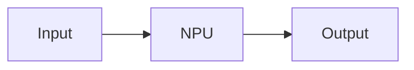

# Ryzen AI Documentation

Production-grade documentation site for AMD Ryzen AI Software, built with [Docusaurus 3.9](https://docusaurus.io/).

## Quick Start (Local Development)

### Prerequisites

- **Node.js** 20+ (check: `node --version`)
- **npm** 10+ (check: `npm --version`)

### Start the dev server

```bash
cd website/
npm install
npm start
```

The site opens automatically at **http://localhost:3000** with hot reload -- every file save updates the browser instantly. Edit any MDX file in `docs/` and the browser refreshes automatically.

### Build for production

```bash
cd website/
npm run build
```

The static site is output to `website/build/`. To preview the production build locally:

```bash
npm run serve
```

## Project Structure

```
RyzenAI-SW/
  docs/                          # MDX content pages (documentation only)
    getting-started/             #   Installation, quickstart, overview
    applications/                #   Pre-built AI PC applications
    models-tutorials/            #   Per-domain model tables and tutorials
      audio/
      llms/
      multimodal/
      vision/
    develop/                     #   SDK docs (Python, C++, CVML, REST)
    tools/                       #   AI Analyzer, xrt-smi
    reference/                   #   Changelog, operators, model list
  website/                       # Docusaurus project (build infrastructure)
    docusaurus.config.ts         #   Main config (theme, plugins, navbar, footer)
    sidebars.ts                  #   Sidebar navigation structure
    package.json                 #   Dependencies and scripts
    code-samples/                #   Testable source files imported into MDX
    src/
      css/custom.scss            #   AMD-branded theme (dark mode default)
      components/                #   Custom React components
    ci/                          #   CI/CD scripts (model validation, code extraction)
    static/img/                  #   Logos, favicons, images
```

## Key Conventions

### Code-from-source pattern

All code shown in docs lives in real files under `code-samples/` and is imported via `raw-loader`:

```mdx
import CodeBlock from '@theme/CodeBlock';
import MyScript from '!!raw-loader!@site/code-samples/my_script.py';

<CodeBlock language="python" title="my_script.py">{MyScript}</CodeBlock>
```

This ensures every code snippet in docs is independently testable in CI.

### OS and language tabs

Use tab groups for Windows/Linux and Python/C++:

```mdx
import Tabs from '@theme/Tabs';
import TabItem from '@theme/TabItem';

<Tabs groupId="os">
  <TabItem value="windows" label="Windows">

    ```powershell
    uv pip install ryzenai-oga
    ```

  </TabItem>
  <TabItem value="linux" label="Linux">

    ```bash
    uv pip install ryzenai-oga
    ```

  </TabItem>
</Tabs>
```

### Admonitions

```mdx
:::tip
Helpful advice here.
:::

:::warning
Important caveat here.
:::

:::danger
Critical warning here.
:::
```

### Custom components

```mdx
import FeatureState from '@site/src/components/FeatureState';
import TutorialDifficulty from '@site/src/components/TutorialDifficulty';
import ExpectedOutput from '@site/src/components/ExpectedOutput';
import ExpandableCode from '@site/src/components/ExpandableCode';

<FeatureState level="stable" />     {/* stable | beta | alpha | deprecated */}
<TutorialDifficulty level="beginner" />  {/* beginner | intermediate | advanced */}

<ExpectedOutput>
{`command output here`}
</ExpectedOutput>

<ExpandableCode title="View full implementation" lineCount={87}>
  {/* code block here */}
</ExpandableCode>
```

### Mermaid diagrams

````mdx

````

## CI/CD Workflows

| Workflow | Trigger | Description |
|----------|---------|-------------|
| `docs-build.yml` | Push to main/docs, PRs | Build site, deploy to GitHub Pages |
| `docs-lint.yml` | Push/PR to docs/** | Vale prose lint, cspell, lychee link check |
| `test-code-samples.yml` | Push/PR to code-samples or docs | Extract inline code, test on NPU |
| `validate-models.yml` | Weekly + manual | 3-stage model validation pipeline |
| `pr-checks.yml` | PRs to main | MDX syntax check, build verification |

## Content Stats

- **35 pages** across 6 sections
- **26 URL redirects** from old Sphinx site
- **38 models** tracked with verification status
- **`llms.txt`** generated automatically for LLM consumption

## Contributing

1. Create a branch from `main`
2. Edit MDX files in `docs/`
3. Preview locally with `npm start`
4. Submit a PR -- CI will check links, lint, build, and run code tests
5. Use the `notest` meta tag on code blocks that should not be tested in CI
